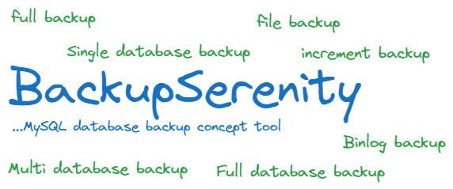
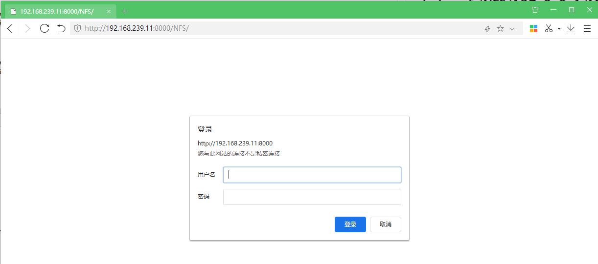
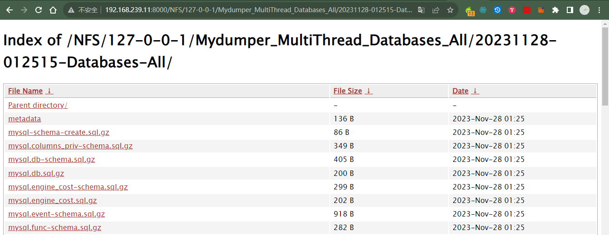

# Quick start 快速开始

> 开源软件 BackupSerenity MySQL 数据库备份工具 <br/>
核心原理：通过 go 封装的一套基于 MySQL 备份的思路工具…… <br/>
作者： heike07

## 1. Docker method（Docker 方式）

**Step 1：**
Create a temporary container and obtain the files inside the container
创建一个临时容器并获取容器内的文件

```
cd /opt
docker pull heike07/backupserenity:2.0
docker run -d --name backupserenity-temp heike07/backupserenity:2.0
mkdir Backupserenity-EDR
cd Backupserenity-EDR
docker cp backupserenity-temp:/Backup-tools/conf .
docker stop backupserenity-temp
docker rm backupserenity-temp
```

**Step 2.A：**
Mount and open container
docker run 方式安装并打开容器

```
cd Backupserenity-EDR
docker run -v /opt/Backupserenity-EDR/conf:/Backup-tools/conf -v /opt/Backupserenity-EDR/NFS_LINK_DISK:/NFS_LINK_DISK -itd --privileged=true --name backupserenity backupserenity:2.0 /usr/sbin/init
ll
```

**Step 2.B：**
Mount and open container
docker-compose  方式构建并运行容器

```shell
[root@nginx Backupserenity-EDR]# docker-compose up -d
[+] Running 3/3
 ✔ Network backupserenity-Network  Created                                                                                                                                                                                                                                                                                                                      0.0s 
 ✔ Container backupserenity-nginx  Started                                                                                                                                                                                                                                                                                                                      0.0s 
 ✔ Container backupserenity        Started                                                                                                                                                                                                                                                                                                                      0.0s 
[root@nginx Backupserenity-EDR]# docker-compose ps
NAME                   IMAGE                              COMMAND                  SERVICE                CREATED         STATUS         PORTS
backupserenity         heike07/backupserenity:2.0         "/usr/sbin/init"         backupserenity         9 seconds ago   Up 8 seconds   0.0.0.0:3336->3306/tcp, :::3336->3306/tcp
backupserenity-nginx   heike07/backupserenity-nginx:2.1   "/bin/sh -c 'nginx -…"   backupserenity-nginx   9 seconds ago   Up 8 seconds   0.0.0.0:8000->80/tcp, :::8000->80/tcp
[root@nginx Backupserenity-EDR]# ll
total 20
drwxr-xr-x 2 root root  212 Nov 28 09:32 conf
-rw-r--r-- 1 root root  843 Nov 28 14:03 docker-compose.yml
-rw-r--r-- 1 root root   44 Nov 28 11:43 htpasswd
drwxr-xr-x 6 root root   77 Nov 28 09:25 NFS_LINK_DISK
-rw-r--r-- 1 root root 1387 Nov 28 13:53 nginx.conf
[root@nginx Backupserenity-EDR]# 
```
注：Nginx 相关配置文件容器内没有，做的文件映射，demo参考 docker-compose 文件夹下对应内容！

**Step 3：**
Check if the service inside the container is normal
检查容器内的服务是否正常

```
docker exec -it backupserenity /bin/bash
[root@f1cb51c9196e /]# ps -aux
USER PID %CPU %MEM VSZ RSS TTY STAT START TIME COMMAND
root 1 0.2 0.1 43124 3344 ? Ss 02:52 0:00 /usr/sbin/init
root 18 0.2 0.1 39060 3172 ? Ss 02:52 0:00 /usr/lib/systemd/systemd-journald
root 28 1.1 0.0 35056 1816 ? Ss 02:52 0:00 /usr/lib/systemd/systemd-udevd
dbus 44 0.0 0.1 58088 2112 ? Ss 02:53 0:00 /usr/bin/dbus-daemon --system --address=systemd: --nofork
root 47 0.0 0.0 24260 1556 ? Ss 02:53 0:00 /usr/lib/systemd/systemd-logind
root 49 0.0 0.0 24268 1572 ? Ss 02:53 0:00 /usr/sbin/crond -n
mysql 67 7.9 9.0 1124088 169428 ? Sl 02:53 0:02 /usr/sbin/mysqld --daemonize --pid-file=/var/run/mysqld/m
root 109 0.0 0.0 8088 860 tty1 Ss+ 02:53 0:00 /sbin/agetty --noclear tty1 linux
root 110 0.0 0.0 11828 1812 pts/1 Ss 02:53 0:00 /bin/bash
root 126 0.0 0.0 51732 1724 pts/1 R+ 02:53 0:00 ps -aux
[root@f1cb51c9196e /]#
```

**Step 4：**
Container usage
开始使用容器 

```
[root@localhost Backupserenity-EDR]# docker exec backupserenity /Backup-tools/backupserenity
Usage: /Backup-tools/backupserenity <program_name>
```
注：如果想设置定时任务，在crontab 中进行设置即可 命令就执行对应的程序 触发时间自行设置

> For specific usage, please refer to the Quick Start section in the Github project
[https://github.com/heike-07/Backup-tools.git](https://github.com/heike-07/Backup-tools.git)

> 有关具体用法，请参阅Github项目中的“快速入门”部分
[https://github.com/heike-07/Backup-tools.git](https://github.com/heike-07/Backup-tools.git)

> Wishing you a pleasant use! Heike07
祝你使用愉快！Heike07

### A. 程序使用

```powershell
# 程序使用方式
通过主函数调用模块实现程序调用，调用后可以在容器挂载卷查看结果，日志在容器内查看。
```

#### A.1 Backup_Mysqldump_All

```powershell
[root@localhost Backupserenity-EDR]# docker exec backupserenity /Backup-tools/backupserenity Backup_Mysqldump_All
```

需要在容器配置挂载卷conf 中配置相应的数据库参数，否则执行容器内默认的参数，通过执行容器指向函数命令可以执行对应程序，然后在容器挂载卷查看结果即可。

#### A.2 Backup_Mysqldump_One

```powershell
[root@localhost Backupserenity-EDR]# docker exec backupserenity /Backup-tools/backupserenity Backup_Mysqldump_One
```

需要在容器配置挂载卷conf 中配置相应的数据库参数，否则执行容器内默认的参数，通过执行容器指向函数命令可以执行对应程序，然后在容器挂载卷查看结果即可。

#### A.3 Backup_Mydumper_MultiThread_Database_All

```powershell
[root@localhost Backupserenity-EDR]# docker exec backupserenity /Backup-tools/backupserenity Backup_Mydumper_MultiThread_Database_All
```

前置条件：待处理数据库binlog开启

需要在容器配置挂载卷conf 中配置相应的数据库参数，否则执行容器内默认的参数，通过执行容器指向函数命令可以执行对应程序，然后在容器挂载卷查看结果即可。

#### A.4 Backup_Mydumper_MultiThread_Database_One

```powershell
[root@localhost Backupserenity-EDR]# docker exec backupserenity /Backup-tools/backupserenity Backup_Mydumper_MultiThread_Dtabase_One
```

前置条件：待处理数据库binlog开启

需要在容器配置挂载卷conf 中配置相应的数据库参数，否则执行容器内默认的参数，通过执行容器指向函数命令可以执行对应程序，然后在容器挂载卷查看结果即可。

#### A.5 Backup_XtraBackup_add

```powershell
[root@localhost Backupserenity-EDR]# docker exec backupserenity /Backup-tools/backupserenity Backup_XtraBackup_add
```

前置条件：待处理数据库binlog开启，且通过slave 在容器中执行相应的master节点，通过主从指向的方式接入binlog数据流后，conf配置容器内数据库参数（默认）即可进行数据库文件备份，首次备份为FULL全量备份，N+1次备份为Add增量备份

需要在容器配置挂载卷conf 中配置相应的数据库参数，否则执行容器内默认的参数，通过执行容器指向函数命令可以执行对应程序，然后在容器挂载卷查看结果即可。

### B. 结果查看

```powershell
# 备份结果查看
在V2.1 以后的版本已经支持Nginx结果查看通过访问对应路径http://<your_host>:8000/NFS/ 即可查看
考虑安全问题，设置了basic的密码，可根据需求修改htpasswd文件修改自己的密码 默认密码为 admin BackupSerenity123
```



## 2. Bin method（二进制方式）

Refer to the readme.md document (III., IV.) section
请参阅Doc/Building-the-underlying-environment.md文档（III、IV）部分

## 3. Development mode（开发方式）

Refer to the readme.md document ( Ⅴ.) section
请参阅Doc/Building-the-underlying-environment.md文档（Ⅴ.）部分