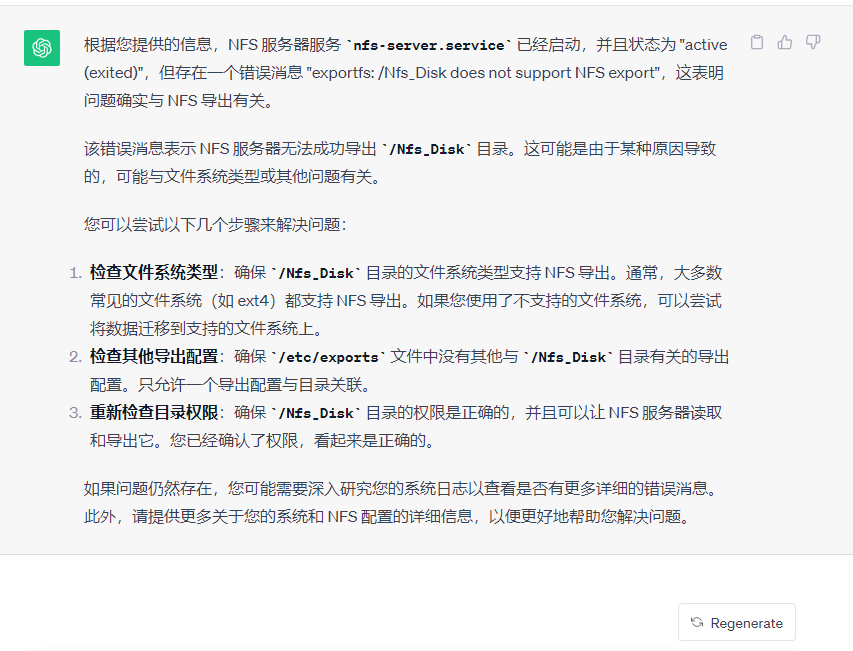

# BackupSerenity


## Ⅰ. 1. 程序说明

**开源软件 BackupSerenity MySQL 数据库备份工具** 

核心原理：通过 go 封装的一套基于 MySQL 备份的思路工具……

作者： heike07 

开源中国收录软件链接：https://www.oschina.net/p/backupserenity 

Github：https://github.com/heike-07/Backup-tools 

Gitee(码云)：https://gitee.com/heike07code/Backup-tools 

B站视频讲解：https://space.bilibili.com/7152549/channel/collectiondetail?sid=1636805


欢迎大家star ⭐ 谢谢！ thanks~

## Ⅰ. 2. 开发流程说明


## Ⅱ V1.1 开发进度

### 开发任务

1. _`OK.`_ - 思路建设 
2. _`OK.`_ - 编写readme-doc文档
3. _`OK.`_ - 核心代码开发Mysqldump备份架构
4. _`OK.`_ - 核心代码开发Mydumper备份架构
5. _`OK.`_ - 核心代码开发Xtrabackup备份架构
6. _`OK.`_ - 使用GO封装
7. _`OK.`_ - 主程序和配置文件分离
8. _`OK.`_ - 合并主分支发布Releases
9. _`OK.`_ - 文档细化

### 版本说明

1.核心底层代码开发  
2.使用GO方式封装

## Ⅱ V2.0 开发进度

### 开发任务

1. _`ING.`_ - 思路建设
2. _`ING.`_ - 编写readme-doc文档
3. _`ING.`_ - docker images 镜像封装
4. _`ING.`_ - 研究dokcer run 启动方式
5. _`ING.`_ - 研究dokcer 变量参数调用、以及文件映射
6. _`ING.`_ - 研究dockercompose 启动方式
7. _`ING.`_ - 封装镜像 发布至docker hub
8. _`ING.`_ - Write quick-use documentation
9. _`ING.`_ - 测试
10. _`ING.`_ - 打tag version 发布 releases

### 版本说明

1. 新增判断当前环境是否为docker的逻辑和函数
2. 新增backupserenity 控制主程序
3. 去除容器内crontab 定期任务逻辑
4. 修复docker exec 无法调度 提示exit 1的问题

---


## Ⅲ. 底层环境构建

### 1. 操作系统适用

适用于Centos7、Redhat7 操作系统，支持X86_64 架构，可以运行GO,shell的操作系统，其他系统适配中……

### 2. mysql或mariadb数据库

--（因为本机为实验环境没有MySQL则需要安装）

####  2/0 查询相关服务是否安装

```shell
[root@localhost mysql]# rpm -qa | grep mariadb
[root@localhost mysql]# rpm -qa | grep mysql
```

#### 2/1 下载MysqlRPM包

```shell
## 1:下载MysqlRPM包
[root@localhost soft]# wget https://dev.mysql.com/get/Downloads/MySQL-5.7/mysql-5.7.42-1.el7.x86_64.rpm-bundle.tar
[root@localhost soft]# mkdir ./mysql_5.7.42
[root@localhost soft]# tar -xvf mysql-5.7.42-1.el7.x86_64.rpm-bundle.tar -C ./mysql_5.7.42/
mysql-community-client-5.7.42-1.el7.x86_64.rpm
mysql-community-common-5.7.42-1.el7.x86_64.rpm
mysql-community-devel-5.7.42-1.el7.x86_64.rpm
mysql-community-embedded-5.7.42-1.el7.x86_64.rpm
mysql-community-embedded-compat-5.7.42-1.el7.x86_64.rpm
mysql-community-embedded-devel-5.7.42-1.el7.x86_64.rpm
mysql-community-libs-5.7.42-1.el7.x86_64.rpm
mysql-community-libs-compat-5.7.42-1.el7.x86_64.rpm
mysql-community-server-5.7.42-1.el7.x86_64.rpm
mysql-community-test-5.7.42-1.el7.x86_64.rpm
[root@localhost soft]# cd ./mysql_5.7.42/
```

#### 2/2 检查mariadb依赖

```shell
## 2:检查mariadb依赖 
--（默认安装的系统都有）
[root@localhost mysql_5.7.42]# rpm -qa | grep mariadb
mariadb-libs-5.5.68-1.el7.x86_64
[root@localhost mysql_5.7.42]# rpm -e --nodeps mariadb-libs-5.5.68-1.el7.x86_64
[root@localhost mysql_5.7.42]# rpm -qa | grep mariadb
[root@localhost mysql_5.7.42]# 
```

#### 2/3 安装MySQL

```shell
## 3:安装MySQL
[root@localhost mysql_5.7.42]# rpm -ivh mysql-community-common-5.7.42-1.el7.x86_64.rpm 
warning: mysql-community-common-5.7.42-1.el7.x86_64.rpm: Header V4 RSA/SHA256 Signature, key ID 3a79bd29: NOKEY
Preparing...                          ################################# [100%]
Updating / installing...
   1:mysql-community-common-5.7.42-1.e################################# [100%]
[root@localhost mysql_5.7.42]# rpm -ivh mysql-community-libs-5.7.42-1.el7.x86_64.rpm 
warning: mysql-community-libs-5.7.42-1.el7.x86_64.rpm: Header V4 RSA/SHA256 Signature, key ID 3a79bd29: NOKEY
Preparing...                          ################################# [100%]
Updating / installing...
   1:mysql-community-libs-5.7.42-1.el7################################# [100%]
[root@localhost mysql_5.7.42]# rpm -ivh mysql-community-client-5.7.42-1.el7.x86_64.rpm 
warning: mysql-community-client-5.7.42-1.el7.x86_64.rpm: Header V4 RSA/SHA256 Signature, key ID 3a79bd29: NOKEY
Preparing...                          ################################# [100%]
Updating / installing...
   1:mysql-community-client-5.7.42-1.e################################# [100%]
[root@localhost mysql_5.7.42]# rpm -ivh mysql-community-server-5.7.42-1.el7.x86_64.rpm 
warning: mysql-community-server-5.7.42-1.el7.x86_64.rpm: Header V4 RSA/SHA256 Signature, key ID 3a79bd29: NOKEY
Preparing...                          ################################# [100%]
Updating / installing...
   1:mysql-community-server-5.7.42-1.e################################# [100%]
[root@localhost mysql_5.7.42]# rpm -ivh mysql-community-devel-5.7.42-1.el7.x86_64.rpm 
warning: mysql-community-devel-5.7.42-1.el7.x86_64.rpm: Header V4 RSA/SHA256 Signature, key ID 3a79bd29: NOKEY
Preparing...                          ################################# [100%]
Updating / installing...
   1:mysql-community-devel-5.7.42-1.el################################# [100%]
[root@localhost mysql_5.7.42]# rpm -qa | grep mysql
mysql-community-server-5.7.42-1.el7.x86_64
mysql-community-common-5.7.42-1.el7.x86_64
mysql-community-devel-5.7.42-1.el7.x86_64
mysql-community-libs-5.7.42-1.el7.x86_64
mysql-community-client-5.7.42-1.el7.x86_64
[root@localhost mysql_5.7.42]# 
```

#### 2/4 自定义data存储路径

```shell
## 4:自定义data存储路径
[root@localhost mysql_5.7.42]# mkdir -p /data/mysql
[root@localhost mysql_5.7.42]# chown -R mysql:mysql /data/mysql
[root@localhost mysql_5.7.42]# vim /etc/my.cnf
[root@localhost mysql_5.7.42]# cat /etc/my.cnf
# For advice on how to change settings please see
# http://dev.mysql.com/doc/refman/5.7/en/server-configuration-defaults.html

[mysqld]
#
# Remove leading # and set to the amount of RAM for the most important data
# cache in MySQL. Start at 70% of total RAM for dedicated server, else 10%.
# innodb_buffer_pool_size = 128M
#
# Remove leading # to turn on a very important data integrity option: logging
# changes to the binary log between backups.
# log_bin
#
# Remove leading # to set options mainly useful for reporting servers.
# The server defaults are faster for transactions and fast SELECTs.
# Adjust sizes as needed, experiment to find the optimal values.
# join_buffer_size = 128M
# sort_buffer_size = 2M
# read_rnd_buffer_size = 2M
datadir=/data/mysql
socket=/data/mysql/mysql.sock

# Disabling symbolic-links is recommended to prevent assorted security risks
symbolic-links=0

log-error=/var/log/mysqld.log
pid-file=/var/run/mysqld/mysqld.pid

lower_case_table_names=1
max_connections=500
init_connect='SET NAMES utf8'

[client]
socket=/data/mysql/mysql.sock

[mysql]
socket=/data/mysql/mysql.sock
[root@localhost mysql_5.7.42]# 
```

#### 2/5 开启MySQL服务并设置密码以及权限

```shell
## 5:开启MySQL服务并设置密码以及权限
[root@localhost mysql_5.7.42]# systemctl start mysqld
[root@localhost mysql_5.7.42]# grep 'temporary password' /var/log/mysqld.log
2023-07-06T06:59:55.413788Z 1 [Note] A temporary password is generated for root@localhost: #Sb)2-w6yhd,
[root@localhost mysql_5.7.42]# mysql -uroot -p
Enter password: 
ERROR 1045 (28000): Access denied for user 'root'@'localhost' (using password: YES)
[root@localhost mysql_5.7.42]# mysql -uroot -p
Enter password: 
Welcome to the MySQL monitor.  Commands end with ; or \g.
Your MySQL connection id is 3
Server version: 5.7.42

Copyright (c) 2000, 2023, Oracle and/or its affiliates.

Oracle is a registered trademark of Oracle Corporation and/or its
affiliates. Other names may be trademarks of their respective
owners.

Type 'help;' or '\h' for help. Type '\c' to clear the current input statement.

mysql> ALTER USER 'root'@'localhost' IDENTIFIED BY 'A16&b36@@';
Query OK, 0 rows affected (0.01 sec)

mysql> GRANT ALL PRIVILEGES ON *.* TO 'root'@'%' IDENTIFIED BY 'A16&b36@@' WITH GRANT OPTION;
Query OK, 0 rows affected, 1 warning (0.00 sec)

mysql> flush privileges;
Query OK, 0 rows affected (0.00 sec)

mysql> exit
Bye
[root@localhost mysql_5.7.42]#
```

#### 2/6 开启binlog

```shell
## 6:开启binlog
[root@localhost mysql_5.7.42]# head -n 35 /etc/my.cnf
# For advice on how to change settings please see
# http://dev.mysql.com/doc/refman/5.7/en/server-configuration-defaults.html

[mysqld]
#
# Remove leading # and set to the amount of RAM for the most important data
# cache in MySQL. Start at 70% of total RAM for dedicated server, else 10%.
# innodb_buffer_pool_size = 128M
#
# Remove leading # to turn on a very important data integrity option: logging
# changes to the binary log between backups.
# log_bin
#
# Remove leading # to set options mainly useful for reporting servers.
# The server defaults are faster for transactions and fast SELECTs.
# Adjust sizes as needed, experiment to find the optimal values.
# join_buffer_size = 128M
# sort_buffer_size = 2M
# read_rnd_buffer_size = 2M
datadir=/data/mysql
socket=/data/mysql/mysql.sock

# Disabling symbolic-links is recommended to prevent assorted security risks
symbolic-links=0

log-error=/var/log/mysqld.log
pid-file=/var/run/mysqld/mysqld.pid

lower_case_table_names=1
max_connections=500
init_connect='SET NAMES utf8'

log-bin=mysql-bin
server-id=1

[root@localhost mysql_5.7.42]# 
[root@localhost mysql_5.7.42]# systemctl restart mysqld
[root@localhost mysql_5.7.42]# cd /data/
[root@localhost data]# ll
total 4
drwxr-xr-x 5 mysql mysql 4096 Jul  6 15:08 mysql
[root@localhost data]# cd mysql/
[root@localhost mysql]# ll
total 122960
-rw-r----- 1 mysql mysql       56 Jul  6 14:59 auto.cnf
-rw------- 1 mysql mysql     1676 Jul  6 14:59 ca-key.pem
-rw-r--r-- 1 mysql mysql     1112 Jul  6 14:59 ca.pem
-rw-r--r-- 1 mysql mysql     1112 Jul  6 14:59 client-cert.pem
-rw------- 1 mysql mysql     1676 Jul  6 14:59 client-key.pem
-rw-r----- 1 mysql mysql      350 Jul  6 15:08 ib_buffer_pool
-rw-r----- 1 mysql mysql 12582912 Jul  6 15:08 ibdata1
-rw-r----- 1 mysql mysql 50331648 Jul  6 15:08 ib_logfile0
-rw-r----- 1 mysql mysql 50331648 Jul  6 14:59 ib_logfile1
-rw-r----- 1 mysql mysql 12582912 Jul  6 15:08 ibtmp1
drwxr-x--- 2 mysql mysql     4096 Jul  6 14:59 mysql
-rw-r----- 1 mysql mysql      154 Jul  6 15:08 mysql-bin.000001
-rw-r----- 1 mysql mysql       19 Jul  6 15:08 mysql-bin.index
srwxrwxrwx 1 mysql mysql        0 Jul  6 15:08 mysql.sock
-rw------- 1 mysql mysql        5 Jul  6 15:08 mysql.sock.lock
drwxr-x--- 2 mysql mysql     8192 Jul  6 14:59 performance_schema
-rw------- 1 mysql mysql     1680 Jul  6 14:59 private_key.pem
-rw-r--r-- 1 mysql mysql      452 Jul  6 14:59 public_key.pem
-rw-r--r-- 1 mysql mysql     1112 Jul  6 14:59 server-cert.pem
-rw------- 1 mysql mysql     1680 Jul  6 14:59 server-key.pem
drwxr-x--- 2 mysql mysql     8192 Jul  6 14:59 sys
[root@localhost mysql]# 
[root@localhost mysql]# firewall-cmd --permanent --zone=public --add-port=3306/tcp
success
[root@localhost mysql]# firewall-cmd --reload
success
[root@localhost mysql]# ss -lnpt | grep 3306
LISTEN     0      128       [::]:3306                  [::]:*                   users:(("mysqld",pid=3399,fd=30))
[root@localhost mysql]# firewall-cmd --list-all
public (active)
  target: default
  icmp-block-inversion: no
  interfaces: ens33
  sources: 
  services: dhcpv6-client mountd nfs rpc-bind ssh
  ports: 3306/tcp
  protocols: 
  masquerade: no
  forward-ports: 
  source-ports: 
  icmp-blocks: 
  rich rules: 
        
[root@localhost mysql]# 
```

### 3. NFS环境安装

#### 3/0 查询相关服务

```shell
# 查询相关服务
[root@localhost ~]# systemctl status nfs*
如果没有则需要安装
```

#### 3/1 SELiunx 关闭

```shell
## 1:SELiunx 关闭
[root@localhost ~]# getsebool 
getsebool:  SELinux is disabled
```

#### 3/2 安装NFS

```shell
## 2:安装NFS
[root@localhost ~]# yum install nfs-utils
```

#### 3/3 查看rpcbind监听以及服务

```shell
## 3:查看rpcbind监听以及服务
[root@localhost ~]# ss -tnulp | grep 111
udp    UNCONN     0      0         *:111                   *:*                   users:(("rpcbind",pid=720,fd=6))
udp    UNCONN     0      0      [::]:111                [::]:*                   users:(("rpcbind",pid=720,fd=9))
tcp    LISTEN     0      128       *:111                   *:*                   users:(("rpcbind",pid=720,fd=8))
tcp    LISTEN     0      128    [::]:111                [::]:*                   users:(("rpcbind",pid=720,fd=11))
[root@localhost ~]# systemctl status rpcbind
● rpcbind.service - RPC bind service
   Loaded: loaded (/usr/lib/systemd/system/rpcbind.service; enabled; vendor preset: enabled)
   Active: active (running) since Thu 2023-07-06 13:26:29 CST; 34min ago
 Main PID: 720 (rpcbind)
   CGroup: /system.slice/rpcbind.service
           └─720 /sbin/rpcbind -w

Jul 06 13:26:28 localhost.localdomain systemd[1]: Starting RPC bind service...
Jul 06 13:26:29 localhost.localdomain systemd[1]: Started RPC bind service.
[root@localhost ~]# 
```

#### 3/4 防火墙开通端口

```shell
## 4:防火墙开通端口
[root@localhost ~]# firewall-cmd --permanent --add-service=rpc-bind
FirewallD is not running
[root@localhost ~]# systemctl status firewalld
● firewalld.service - firewalld - dynamic firewall daemon
   Loaded: loaded (/usr/lib/systemd/system/firewalld.service; disabled; vendor preset: enabled)
   Active: inactive (dead)
     Docs: man:firewalld(1)
[root@localhost ~]# systemctl start firewalld
[root@localhost ~]# systemctl enable firewalld
Created symlink from /etc/systemd/system/dbus-org.fedoraproject.FirewallD1.service to /usr/lib/systemd/system/firewalld.service.
Created symlink from /etc/systemd/system/multi-user.target.wants/firewalld.service to /usr/lib/systemd/system/firewalld.service.
[root@localhost ~]# firewall-cmd --permanent --add-service=rpc-bind
success
[root@localhost ~]# firewall-cmd --permanent --add-service=nfs
success
[root@localhost ~]# firewall-cmd --permanent --add-service=mountd
success
[root@localhost ~]# firewall-cmd --reload
success
[root@localhost ~]# firewall-cmd --list-all
public (active)
  target: default
  icmp-block-inversion: no
  interfaces: ens33
  sources: 
  services: dhcpv6-client mountd nfs rpc-bind ssh
  ports: 
  protocols: 
  masquerade: no
  forward-ports: 
  source-ports: 
  icmp-blocks: 
  rich rules: 
        
[root@localhost ~]# 
```

#### 3/5 创建路径编写可读可写权限

```shell
## 5:创建路径编写可读可写权限
[root@localhost ~]# mkdir /Nfs_Disk
[root@localhost ~]# echo "/Nfs_Disk 127.0.0.1/24(rw,async)" >> /etc/exports
[root@localhost ~]# cat /etc/exports
/Nfs_Disk 127.0.0.1/24(rw,async)
[root@localhost ~]# 
```

#### 3/6 添加NFS硬盘

```shell
## 6:添加NFS硬盘
--（可以做RAID硬件组保证数据高可用）
[root@localhost ~]# blkid
/dev/sda1: UUID="3ae6a4b1-0140-4d7d-b8fb-ecb18e1243f4" TYPE="xfs" 
/dev/sda2: UUID="pJ8unY-dS8y-vV14-YX2A-dFEg-WwST-TriV8T" TYPE="LVM2_member" 
/dev/mapper/centos-root: UUID="3295f8fa-8559-47a9-a5f7-0c092f3a04e1" TYPE="xfs" 
/dev/mapper/centos-swap: UUID="25b0bcea-10c9-4808-a75a-2f9626c05c66" TYPE="swap" 
/dev/mapper/centos-home: UUID="5ca451c5-f185-4a5c-a107-d2bc81a97392" TYPE="xfs" 
/dev/sdb: UUID="1d82c5ef-6439-4a98-9eda-eee42d88ecd4" TYPE="ext4" 
[root@localhost ~]# 
[root@localhost ~]# echo "UUID=1d82c5ef-6439-4a98-9eda-eee42d88ecd4 /Nfs_Disk ext4 defaults 0 0" >> /etc/fstab 
[root@localhost ~]# cat /etc/fstab 

#
# /etc/fstab
# Created by anaconda on Wed Jul  5 01:09:00 2023
#
# Accessible filesystems, by reference, are maintained under '/dev/disk'
# See man pages fstab(5), findfs(8), mount(8) and/or blkid(8) for more info
#
/dev/mapper/centos-root /                       xfs     defaults        0 0
UUID=3ae6a4b1-0140-4d7d-b8fb-ecb18e1243f4 /boot                   xfs     defaults        0 0
/dev/mapper/centos-home /home                   xfs     defaults        0 0
/dev/mapper/centos-swap swap                    swap    defaults        0 0
UUID=1d82c5ef-6439-4a98-9eda-eee42d88ecd4 /Nfs_Disk ext4 defaults 0 0
[root@localhost ~]# 
[root@localhost ~]# mount -a
[root@localhost ~]# df -h
Filesystem               Size  Used Avail Use% Mounted on
devtmpfs                 894M     0  894M   0% /dev
tmpfs                    910M     0  910M   0% /dev/shm
tmpfs                    910M   11M  900M   2% /run
tmpfs                    910M     0  910M   0% /sys/fs/cgroup
/dev/mapper/centos-root   50G   20G   31G  39% /
/dev/sda1               1014M  185M  830M  19% /boot
/dev/mapper/centos-home  147G  135M  147G   1% /home
tmpfs                    182M  8.0K  182M   1% /run/user/42
tmpfs                    182M     0  182M   0% /run/user/0
/dev/sdb                  99G   61M   94G   1% /Nfs_Disk
[root@localhost ~]# 
```

#### 3/7 启动服务并进行挂载

```shell
## 7:启动服务并进行挂载
[root@localhost ~]# systemctl start nfs
[root@localhost ~]# systemctl status nfs
● nfs-server.service - NFS server and services
   Loaded: loaded (/usr/lib/systemd/system/nfs-server.service; disabled; vendor preset: disabled)
  Drop-In: /run/systemd/generator/nfs-server.service.d
           └─order-with-mounts.conf
   Active: active (exited) since Thu 2023-07-06 14:20:02 CST; 7s ago
  Process: 2373 ExecStartPost=/bin/sh -c if systemctl -q is-active gssproxy; then systemctl reload gssproxy ; fi (code=exited, status=0/SUCCESS)
  Process: 2357 ExecStart=/usr/sbin/rpc.nfsd $RPCNFSDARGS (code=exited, status=0/SUCCESS)
  Process: 2356 ExecStartPre=/usr/sbin/exportfs -r (code=exited, status=0/SUCCESS)
 Main PID: 2357 (code=exited, status=0/SUCCESS)
    Tasks: 0
   CGroup: /system.slice/nfs-server.service

Jul 06 14:20:02 localhost.localdomain systemd[1]: Starting NFS server and services...
Jul 06 14:20:02 localhost.localdomain systemd[1]: Started NFS server and services.
[root@localhost ~]# showmount -e 127.0.0.1
Export list for 127.0.0.1:
/Nfs_Disk 127.0.0.1/24
[root@localhost ~]# 
```

#### 3/8 授权

```shell
## 8:授权
--（也可以不授权这个和规划有关系，不授权后面的权限调整就可以不做）
[root@localhost /]# id nfsnobody
uid=65534(nfsnobody) gid=65534(nfsnobody) groups=65534(nfsnobody)
[root@localhost /]# chown -R nfsnobody.nfsnobody /Nfs_Disk
[root@localhost /]# cd Nfs_Disk/
[root@localhost Nfs_Disk]# mkdir test_mulu
[root@localhost Nfs_Disk]# touch test_file
[root@localhost Nfs_Disk]# echo 'test' >> test_file 
[root@localhost Nfs_Disk]# touch test_mulu/test2
[root@localhost Nfs_Disk]# echo 'test2' >> test_mulu/test2 
[root@localhost Nfs_Disk]# ll
total 24
drwx------ 2 nfsnobody nfsnobody 16384 Jul  6 14:15 lost+found
-rw-r--r-- 1 root      root          5 Jul  6 14:24 test_file
drwxr-xr-x 2 root      root       4096 Jul  6 14:24 test_mulu
```

#### 3/9 创建NFS协议挂载

```shell
## 9:创建NFS协议挂载
--（因为默认权限设置为rw,async所以创建出为ROOT权限，且走文件存储权限非NFS）
[root@localhost /]# mkdir NFS_LINK_DISK
[root@localhost /]# echo "127.0.0.1:/Nfs_Disk /NFS_LINK_DISK nfs defaults,_netdev 0 0" >> /etc/fstab 
[root@localhost /]# cat /etc/fstab 

#
# /etc/fstab
# Created by anaconda on Wed Jul  5 01:09:00 2023
#
# Accessible filesystems, by reference, are maintained under '/dev/disk'
# See man pages fstab(5), findfs(8), mount(8) and/or blkid(8) for more info
#
/dev/mapper/centos-root /                       xfs     defaults        0 0
UUID=3ae6a4b1-0140-4d7d-b8fb-ecb18e1243f4 /boot                   xfs     defaults        0 0
/dev/mapper/centos-home /home                   xfs     defaults        0 0
/dev/mapper/centos-swap swap                    swap    defaults        0 0
UUID=1d82c5ef-6439-4a98-9eda-eee42d88ecd4 /Nfs_Disk ext4 defaults 0 0
127.0.0.1:/Nfs_Disk /NFS_LINK_DISK nfs defaults,_netdev 0 0
[root@localhost /]# mount -a
[root@localhost /]# df -h
Filesystem               Size  Used Avail Use% Mounted on
devtmpfs                 894M     0  894M   0% /dev
tmpfs                    910M     0  910M   0% /dev/shm
tmpfs                    910M   11M  900M   2% /run
tmpfs                    910M     0  910M   0% /sys/fs/cgroup
/dev/mapper/centos-root   50G   20G   31G  39% /
/dev/sda1               1014M  185M  830M  19% /boot
/dev/mapper/centos-home  147G  135M  147G   1% /home
tmpfs                    182M   12K  182M   1% /run/user/42
tmpfs                    182M     0  182M   0% /run/user/0
/dev/sdb                  99G   61M   94G   1% /Nfs_Disk
127.0.0.1:/Nfs_Disk       99G   60M   94G   1% /NFS_LINK_DISK
[root@localhost /]# 
```

#### 3/10 测试文件创建权限

```shell
## 10:测试文件创建权限
[root@localhost /]# cd /NFS_LINK_DISK/
[root@localhost NFS_LINK_DISK]# ls
lost+found  test_file  test_mulu
[root@localhost NFS_LINK_DISK]# ll
total 24
drwx------ 2 nfsnobody nfsnobody 16384 Jul  6 14:15 lost+found
-rw-r--r-- 1 root      root          5 Jul  6 14:24 test_file
drwxr-xr-x 2 root      root       4096 Jul  6 14:24 test_mulu
[root@localhost NFS_LINK_DISK]# mkdir test2_mulu
[root@localhost NFS_LINK_DISK]# touch test2_mulu/test3_file
[root@localhost NFS_LINK_DISK]# echo 'test3' >> test2_mulu/test3_file 
[root@localhost NFS_LINK_DISK]# ll
total 28
drwx------ 2 nfsnobody nfsnobody 16384 Jul  6 14:15 lost+found
drwxr-xr-x 2 nfsnobody nfsnobody  4096 Jul  6 14:34 test2_mulu
-rw-r--r-- 1 root      root          5 Jul  6 14:24 test_file
drwxr-xr-x 2 root      root       4096 Jul  6 14:24 test_mulu
[root@localhost NFS_LINK_DISK]# cd test2_mulu/
[root@localhost test2_mulu]# ll
total 4
-rw-r--r-- 1 nfsnobody nfsnobody 6 Jul  6 14:34 test3_file
[root@localhost test2_mulu]# 
```

#### 3/11 修改权限

```shell
## 11:修改权限
[root@localhost test2_mulu]# vim /etc/exports
[root@localhost test2_mulu]# cat /etc/exports
# /Nfs_Disk 127.0.0.1/24(rw,async)
/Nfs_Disk 127.0.0.1/24(rw,sync,root_squash)
[root@localhost test2_mulu]# 
权限说明：
rw 可读可写
sync 写入内存同时写入硬盘 保证数据不丢失 但是会导致IO增大
root_sqush 当NFS客户端以root管理员访问时，映射为NFS服务器的匿名用户（比较安全）
网络根据实际情况填写
/Nfs_Disk 为server主机对应的共享磁盘标识 为了保证数据一致性这里设置一个总的共享。
```

#### 3/12 重启服务使修改生效

```shell
## 12:重启服务使修改生效
[root@localhost test2_mulu]# systemctl restart nfs*
[root@localhost test2_mulu]# systemctl status nfs*
● nfs-mountd.service - NFS Mount Daemon
   Loaded: loaded (/usr/lib/systemd/system/nfs-mountd.service; static; vendor preset: disabled)
   Active: active (running) since Thu 2023-07-06 14:38:55 CST; 10s ago
  Process: 2746 ExecStart=/usr/sbin/rpc.mountd $RPCMOUNTDARGS (code=exited, status=0/SUCCESS)
 Main PID: 2748 (rpc.mountd)
    Tasks: 1
   CGroup: /system.slice/nfs-mountd.service
           └─2748 /usr/sbin/rpc.mountd

Jul 06 14:38:55 localhost.localdomain systemd[1]: Starting NFS Mount Daemon...
Jul 06 14:38:55 localhost.localdomain rpc.mountd[2748]: Version 1.3.0 starting
Jul 06 14:38:55 localhost.localdomain systemd[1]: Started NFS Mount Daemon.

● nfs-idmapd.service - NFSv4 ID-name mapping service
   Loaded: loaded (/usr/lib/systemd/system/nfs-idmapd.service; static; vendor preset: disabled)
   Active: active (running) since Thu 2023-07-06 14:38:55 CST; 10s ago
  Process: 2745 ExecStart=/usr/sbin/rpc.idmapd $RPCIDMAPDARGS (code=exited, status=0/SUCCESS)
 Main PID: 2747 (rpc.idmapd)
    Tasks: 1
   CGroup: /system.slice/nfs-idmapd.service
           └─2747 /usr/sbin/rpc.idmapd

Jul 06 14:38:55 localhost.localdomain systemd[1]: Starting NFSv4 ID-name mapping service...
Jul 06 14:38:55 localhost.localdomain systemd[1]: Started NFSv4 ID-name mapping service.

● nfs-server.service - NFS server and services
   Loaded: loaded (/usr/lib/systemd/system/nfs-server.service; disabled; vendor preset: disabled)
  Drop-In: /run/systemd/generator/nfs-server.service.d
           └─order-with-mounts.conf
   Active: active (exited) since Thu 2023-07-06 14:38:55 CST; 10s ago
  Process: 2738 ExecStopPost=/usr/sbin/exportfs -f (code=exited, status=0/SUCCESS)
  Process: 2733 ExecStopPost=/usr/sbin/exportfs -au (code=exited, status=0/SUCCESS)
  Process: 2730 ExecStop=/usr/sbin/rpc.nfsd 0 (code=exited, status=0/SUCCESS)
  Process: 2766 ExecStartPost=/bin/sh -c if systemctl -q is-active gssproxy; then systemctl reload gssproxy ; fi (code=exited, status=0/SUCCESS)
  Process: 2751 ExecStart=/usr/sbin/rpc.nfsd $RPCNFSDARGS (code=exited, status=0/SUCCESS)
  Process: 2749 ExecStartPre=/usr/sbin/exportfs -r (code=exited, status=0/SUCCESS)
 Main PID: 2751 (code=exited, status=0/SUCCESS)
    Tasks: 0
   CGroup: /system.slice/nfs-server.service

Jul 06 14:38:55 localhost.localdomain systemd[1]: Starting NFS server and services...
Jul 06 14:38:55 localhost.localdomain systemd[1]: Started NFS server and services.
[root@localhost test2_mulu]# 
```

> *-- > 进行到这里的时候MYSQLdump相关架构程序已经可以使用，请确保系统可以运行mysqldump测试方法执行mysqldump*，关于程序运行请跳转到-Ⅳ程序运行mysqldump部分

```shell
[root@localhost mysql]# mysqldump
Usage: mysqldump [OPTIONS] database [tables]
OR     mysqldump [OPTIONS] --databases [OPTIONS] DB1 [DB2 DB3...]
OR     mysqldump [OPTIONS] --all-databases [OPTIONS]
For more options, use mysqldump --help
[root@localhost mysql]# 
```

### 4. Mydumper 依赖安装

```shell
# 说明
--（项目lib文件夹中，mydumper-0.9.3-41.el7.x86_64.rpm 进行安装）
[root@localhost lib]# cd /root/IdeaProjects/Backup-tools/lib
[root@localhost lib]# rpm -qa | grep mydumper
[root@localhost lib]# rpm -ivh mydumper-0.9.3-41.el7.x86_64.rpm 
Preparing...                          ################################# [100%]
Updating / installing...
   1:mydumper-0.9.3-41                ################################# [100%]
[root@localhost lib]# rpm -qa | grep mydumper
mydumper-0.9.3-41.x86_64
[root@localhost lib]# mydumper
# 测试依赖
** (mydumper:5063): CRITICAL **: 13:58:22.089: Error connecting to database: Access denied for user 'root'@'localhost' (using password: NO)
[root@localhost lib]# 
```

> *-- > 进行到这里的时候MYdumper相关架构程序已经可以使用，请确保系统可以运行mydumper测试方法执行mydumper*，关于程序运行请跳转到-Ⅳ程序运行mydumper部分

### 5.xtrabackup 依赖安装

```shell
# 安装依赖
[root@localhost ~]# cd /root/IdeaProjects/Backup-tools/lib/
[root@localhost lib]# 
[root@localhost lib]# whereis innobackupex
innobackupex:[root@localhost lib]# innobackupex
bash: innobackupex: command not found...
[root@localhost lib]# 
[root@localhost lib]# rpm -ivh  percona-xtrabackup-*
warning: percona-xtrabackup-24-2.4.26-1.el7.x86_64.rpm: Header V4 RSA/SHA256 Signature, key ID 8507efa5: NOKEY
error: Failed dependencies:
        libev.so.4()(64bit) is needed by percona-xtrabackup-24-2.4.26-1.el7.x86_64
        perl(DBD::mysql) is needed by percona-xtrabackup-24-2.4.26-1.el7.x86_64
        perl(Digest::MD5) is needed by percona-xtrabackup-24-2.4.26-1.el7.x86_64
# 解决依赖冲突
[root@localhost lib]# cd /opt/soft/mysql_5.7.42
[root@localhost mysql_5.7.42]# rpm -ivh mysql-community-libs-compat-5.7.42-1.el7.x86_64.rpm
[root@localhost mysql_5.7.42]# yum install perl-DBD-MySQL
[root@localhost lib]# rpm -ivh percona-xtrabackup-*
warning: percona-xtrabackup-24-2.4.26-1.el7.x86_64.rpm: Header V4 RSA/SHA256 Signature, key ID 8507efa5: NOKEY
error: Failed dependencies:
        perl(Digest::MD5) is needed by percona-xtrabackup-24-2.4.26-1.el7.x86_64
[root@localhost lib]# 
[root@localhost lib]# yum install perl-Digest-MD5
# 安装成功，依赖解决每个系统不一样根据实际环境处理，最终RPM包安装成功即可。
[root@localhost lib]# rpm -ivh percona-xtrabackup-*
warning: percona-xtrabackup-24-2.4.26-1.el7.x86_64.rpm: Header V4 RSA/SHA256 Signature, key ID 8507efa5: NOKEY
Preparing...                          ################################# [100%]
Updating / installing...
   1:percona-xtrabackup-24-2.4.26-1.el################################# [ 33%]
   2:percona-xtrabackup-test-24-2.4.26################################# [ 67%]
   3:percona-xtrabackup-24-debuginfo-2################################# [100%]
[root@localhost lib]# 
# 测试
[root@localhost lib]# innobackupex
xtrabackup: recognized server arguments: --datadir=/data/mysql --log_bin=mysql-bin --server-id=1 
230710 13:30:24 innobackupex: Missing argument
[root@localhost lib]# 
```

> -- > 进行到这里的时候xtrabackup相关架构程序已经可以使用，请确保系统可以运行xtrabackup测试方法执行innobackupex，关于程序运行请跳转到-Ⅳ程序运行xtrabackup部分

## Ⅳ. 程序运行

### 1. Backup_Mysqldump_All

> 该程序为mysqldump原生的全库数据库备份程序。

#### 1/1 配置文件修改

```shell
## default_config
--（主程序配置）
NetworkSegment=127.0.0.1
--（监听网卡地址配置）
Date=$(date +%Y%m%d-%H%M%S)
--（日期参数）
Base_IP=$(ip addr | awk '/^[0-9]+: / {}; /inet.*global/ {print gensub(/(.*)\/(.*)/, "\\1", "g", $2)}' | grep ${NetworkSegment})
--（获取IP参数配置）
Script_Dir=/root/IdeaProjects/Backup-tools/mysqldump
--（本程序绝对路径）
Script_Log=Backup_Mysqldump_All.log
--（程序生成日志文件名称）
Data_Storage_Save=/NFS_LINK_DISK/127.0.0.1/Mysqldump_Databases_All
--（备份文件生成文件路径配置）

## database_config
--（数据库程序配置）
MYSQL_Host=127.0.0.1
--（数据库主机地址）
MYSQL_Username=root
--（数据库用户名）
MYSQL_Password='A16&b36@@'
--（数据库密码）
MYSQL_Port=3306
--（数据库监听端口号）
MYSQL_Chara=default-character-set=utf8
--（数据库字符集）
MYSQL_Nfs_DiskDir="NFS_LINK_DISK"
--（数据库与NFS关联指针）
```

#### 1/2 程序启动

```shell
[root@localhost mysqldump]# cd /root/IdeaProjects/Backup-tools/mysqldump
[root@localhost mysqldump]# chmod +x Backup_Mysqldump_All.sh
[root@localhost mysqldump]# ./Backup_Mysqldump_All.sh 
mysqldump: [Warning] Using a password on the command line interface can be insecure.
```

#### 1/3 查看结果

```shell
# 文件查看
cd /NFS_LINK_DISK/127.0.0.1/Mysqldump_Databases_All
[root@localhost Mysqldump_Databases_All]# ll
total 576
-rw-r--r-- 1 nfsnobody nfsnobody 195751 Jul  7 10:10 20230707-101039-AllDatabases-backup.sql.gz
-rw-r--r-- 1 nfsnobody nfsnobody 195753 Jul  7 10:12 20230707-101244-AllDatabases-backup.sql.gz
-rw-r--r-- 1 nfsnobody nfsnobody 195753 Jul  7 10:28 20230707-102830-AllDatabases-backup.sql.gz
# 日志查看
[root@localhost mysqldump]# tail Backup_Mysqldump_All.log 
发现NFS挂载点 NFS_LINK_DISK，正在继续执行脚本……
正在判断是否有/NFS_LINK_DISK/127.0.0.1/Mysqldump_Databases_All,存储路径……
已发现存储路径/NFS_LINK_DISK/127.0.0.1/Mysqldump_Databases_All,正在继续执行……
正在执行备份……
备份开始时间:20230707-102830
备份方式:全库备份-mysqldump官方单线程
备份数据库IP:127.0.0.1
备份存储路径:/NFS_LINK_DISK/127.0.0.1/Mysqldump_Databases_All/对应时间-AllDatabases-backup.sql.gz
备份结束时间:20230707-102830
END 20230707-102830
[root@localhost mysqldump]# 
```

#### 1/4 结果说明

``` shell
# 用VIM 查看文件内容 （片段）
...
) ENGINE=MyISAM DEFAULT CHARSET=utf8 COLLATE=utf8_bin COMMENT='Database privileges';
/*!40101 SET character_set_client = @saved_cs_client */;

--
-- Dumping data for table `db`
--

LOCK TABLES `db` WRITE;
/*!40000 ALTER TABLE `db` DISABLE KEYS */;
INSERT INTO `db` VALUES ('localhost','performance_schema','mysql.session','Y','N','N','N','N','N','N','N','N','N','N','N','N','N','N','N','N','N','N'),('localhost','sys','mysql.sys','N','N','N','N','N','N','N','N','N','N','N','N','N','N','N','N','N','N','Y');
/*!40000 ALTER TABLE `db` ENABLE KEYS */;
UNLOCK TABLES;
...

说明：程序执行为MySQL全量备份，输出的文件为全量的结构+数据一个的SQL文件且通过Gzip进行压缩后存储，满足预期。
```

### 2. Backup_Mysqldump_One

> 该程序为mysqldump原生的单个数据库备份程序。

#### 2/1 配置文件修改

```shell
## Default_config
NetworkSegment=127.0.0.1
Date=$(date +%Y%m%d-%H%M%S)
Base_IP=$(ip addr | awk '/^[0-9]+: / {}; /inet.*global/ {print gensub(/(.*)\/(.*)/, "\\1", "g", $2)}' | grep ${NetworkSegment})
Script_Dir=/root/IdeaProjects/Backup-tools/mysqldump
Script_Log=Backup_Mysqldump_One.log
Data_Storage_Save=/NFS_LINK_DISK/127.0.0.1/Mysqldump_Save

## database_config
MYSQL_Host=1
MYSQL_Username=root
MYSQL_Password='A16&b36@@'
MYSQL_Port=3306
MYSQL_Chara=default-character-set=utf8
MYSQL_Database_Name=mysql
--（单个备份数据库名称）
MYSQL_Nfs_DiskDir="NFS_LINK_DISK"
```

#### 2/2 程序启动

```shell
[root@localhost mysqldump]# chmod +x Backup_Mysqldump_One.sh
[root@localhost mysqldump]# ./Backup_Mysqldump_One.sh 
mysqldump: [Warning] Using a password on the command line interface can be insecure.
[root@localhost mysqldump]# 
```

#### 2/3 查看结果

```SHELL
# 生成文件
[root@localhost 127.0.0.1]# tree
.
├── Mysqldump_Databases_All
│   ├── 20230707-101039-AllDatabases-backup.sql.gz
│   ├── 20230707-101244-AllDatabases-backup.sql.gz
│   └── 20230707-102830-AllDatabases-backup.sql.gz
└── Mysqldump_Save
    └── mysql
        └── 20230707-132623-mysql-backup.sql.gz

3 directories, 4 files
[root@localhost 127.0.0.1]# 

# 日志查看
[root@localhost mysqldump]# tail Backup_Mysqldump_One.log 
正在判断是否有对应数据库mysql,MYSQL_SAVE存储路径……
没有发现对应MYSQL_SAVE-mysql,对应数据库,正在创建……
正在执行备份……
备份开始时间:20230707-132623
备份方式:mysqldump官方单线程
备份数据库:mysql
备份数据库IP:127.0.0.1
备份存储路径:/NFS_LINK_DISK/127.0.0.1/Mysqldump_Save/mysql/对应时间-数据库名称-backup.sql.gz
备份结束时间:20230707-132623
END 20230707-132623
[root@localhost mysqldump]# 
```

#### 2/4 结果说明

``` shell
# 用VIM 查看文件内容 （片段）
...
-- Dumping data for table `db`
--

LOCK TABLES `db` WRITE;
/*!40000 ALTER TABLE `db` DISABLE KEYS */;
INSERT INTO `db` VALUES ('localhost','performance_schema','mysql.session','Y','N','N','N','N','N','N','N','N','N','N','N','N','N','N','N','N','N','N'),('localhost','sys','mysql.sys','N','N','N','N','N','N','N','N','N','N','N','N','N','N','N','N','N','N','Y');
/*!40000 ALTER TABLE `db` ENABLE KEYS */;
UNLOCK TABLES;

--
-- Table structure for table `engine_cost`
--

DROP TABLE IF EXISTS `engine_cost`;
...

说明：程序执行为MySQL单库备份，输出的文件为全量的结构+数据一个的SQL文件且通过Gzip进行压缩后存储，满足预期。
```

### 3. Backup_Mydumper_MultiThread_Database_All

> 该程序为多线程全量数据库备份程序

#### 3/1 配置文件修改

```shell
## Default_config
--（主要配置）
NetworkSegment=127.0.0.1
--（网络IP配置）
Date=$(date +%Y%m%d-%H%M%S)
--（日期格式配置）
Base_IP=$(ip addr | awk '/^[0-9]+: / {}; /inet.*global/ {print gensub(/(.*)\/(.*)/, "\\1", "g", $2)}' | grep ${NetworkSegment})
--（IP获取配置）
Script_Dir=/root/IdeaProjects/Backup-tools/mydumper
--（脚本路劲配置）
Script_Log=Backup_Mydumper_MultiThread_Database_All.log
--（脚本日志配置）
Data_Storage_Save=/NFS_LINK_DISK/127.0.0.1/Mydumper_MultiThread_Databases_All
--（备份生成文件存储位置配置）

## Database_config
MYSQL_Host=127.0.0.1
--（数据库主机名）
MYSQL_Username=root
--（数据库账户名）
MYSQL_Password='A16&b36@@'
--（数据库密码）
MYSQL_Port=3306
--（数据库端口）
MYSQL_Chara=default-character-set=utf8
--（数据库字符集）
#MYSQL_Database_Name=sakila_b
MYSQL_Nfs_DiskDir="NFS_LINK_DISK"
--（数据库NFS指针）

# 是否开启压缩存储  压缩.SQL.GZ 占用空间小 不压缩.SQL 占用空间大
DUMPER_COMPERSS=-c
--（默认开启压缩）
# dumper信息展示级别,最详细级别
DUMPER_INFO_LAVEL=3
--（信息级别展示INFO）
# 备份线程数 根据实际情况调整
DUMPER_THREADS_NUMBER=32
--（备份线程数，根据主机实际情况）
# dumper信息展示存储日志位置
DUMPER_BACKINFO_LOG=${Script_Dir}/DUMPER_Backup_info.log
--（程序运行过程记录日志文件）
```

#### 3/2 程序启动

```shell
[root@localhost mydumper]# chmod +x Backup_Mydumper_MultiThread_Database_All.sh 
[root@localhost mydumper]# ./Backup_Mydumper_MultiThread_Database_All.sh 
[root@localhost mydumper]# tail DUMPER_Backup_info.log 
** Message: 14:10:34.013: Thread 21 shutting down
** Message: 14:10:34.017: Thread 20 shutting down
** Message: 14:10:34.019: Thread 18 shutting down
** Message: 14:10:34.024: Thread 5 shutting down
** Message: 14:10:34.025: Thread 1 shutting down
** Message: 14:10:34.032: Finished dump at: 2023-07-07 14:10:34
```

#### 3/3 查看结果

```SHELL
# 生成文件
[root@localhost mydumper]# cd /NFS_LINK_DISK/127.0.0.1/
[root@localhost 127.0.0.1]# tree
.
├── Mydumper_MultiThread_Databases_All
│   └── 20230707-141032-Databases-All
│       ├── metadata
│       ├── mysql.columns_priv-schema.sql.gz
│       ├── mysql.db-schema.sql.gz
```

#### 3/4 结果说明

``` shell
[root@localhost 20230707-141032-Databases-All]# vim mysql.proxies_priv.sql.gz
[root@localhost 20230707-141032-Databases-All]# ll | grep proxies
-rw-r--r-- 1 nfsnobody nfsnobody    338 Jul  7 14:10 mysql.proxies_priv-schema.sql.gz
-rw-r--r-- 1 nfsnobody nfsnobody    187 Jul  7 14:10 mysql.proxies_priv.sql.gz
[root@localhost 20230707-141032-Databases-All]# 

# 说明
可以看到全库多线程备份会在NFS路径下生成对应时间的文件夹并有schema结构文件，正常的数据文件，也就是会生成结构和数据分开的文件，满足预期。
```

### 4. Backup_Mydumper_MultiThread_Database_One

> 该程序为多线程单库全量数据库备份程序

#### 4/1 配置文件修改

```shell
MYSQL_Database_Name=sakila_b
--（其他配置和全量备份一致，只涉及数据库名称）
```

#### 4/2 程序启动

```shell
[root@localhost mydumper]# chmod +x Backup_Mydumper_MultiThread_Database_One.sh 
[root@localhost mydumper]# ./Backup_Mydumper_MultiThread_Database_One.sh 
```

#### 4/3 查看结果

```SHELL
# 文件结构
├── Mydumper_MultiThread_Save
│   └── mysql
│       └── 20230707-145056-mysql
│           ├── metadata
│           ├── mysql.columns_priv-schema.sql.gz
│           ├── mysql.db-schema.sql.gz
│           ├── mysql.db.sql.gz
```

#### 4/4 结果说明

``` shell
[root@localhost 20230707-145056-mysql]# ll | grep mysql.db
-rw-r--r-- 1 nfsnobody nfsnobody    405 Jul  7 14:50 mysql.db-schema.sql.gz
-rw-r--r-- 1 nfsnobody nfsnobody    200 Jul  7 14:50 mysql.db.sql.gz
[root@localhost 20230707-145056-mysql]# ll | grep -v mysql
total 384
-rw-r--r-- 1 nfsnobody nfsnobody    136 Jul  7 14:50 metadata
[root@localhost 20230707-145056-mysql]# 
# 说明
可以看到 此文件下只有mysql数据库得内容，包含结构和数据，其他数据库 grep -v mysql发现只有有个配置文件所以满足预期。
```

### 5. Backup_XtraBackup_add

> 该程序为XtraBackup增量备份程序，用于提供MySQL数据库的全量+增量备份程序

#### 5/1 配置文件修改

```shell
## Default_config
NetworkSegment=127.0.0.1
--（网络配置）
Date=$(date +%Y%m%d-%H%M%S)
--（日期设置）
Base_IP=$(ip addr | awk '/^[0-9]+: / {}; /inet.*global/ {print gensub(/(.*)\/(.*)/, "\\1", "g", $2)}' | grep ${NetworkSegment})
--（网络配置参数）
Script_Dir=/root/IdeaProjects/Backup-tools/xtrabackup
--（脚本位置）
Script_Log=Backup_XtraBackup_Add.log
--（日志文件配置）
Data_Storage_Full=/NFS_LINK_DISK/127.0.0.1/XtraBackup/Full
--（全量备份存储位置）
Data_Storage_Add=/NFS_LINK_DISK/127.0.0.1/XtraBackup/Add
--（增量备份存储位置）

## Database_config
MYSQL_Username=root
--（数据库账户）
MYSQL_Password='A16&b36@@'
--（数据库密码）
MYSQL_Default=/etc/my.cnf
--（配置文件位置，需要判断binlog相关函数内容使用）
MYSQL_Port=3306
--（数据库端口）
MYSQL_Nfs_DiskDir="NFS_LINK_DISK"
--（NFS关联指针）
```

#### 5/2 程序启动

```shell
[root@localhost xtrabackup]# chmod +x Backup_XtraBackup_add.sh 
[root@localhost xtrabackup]# ll
total 8
-rwxr-xr-x 1 root root 4396 Jul 10 13:37 Backup_XtraBackup_add.sh
[root@localhost xtrabackup]# 
# 首次执行全量备份
[root@localhost xtrabackup]# ./Backup_XtraBackup_add.sh 
...
xtrabackup: The latest check point (for incremental): '2767189'
xtrabackup: Stopping log copying thread.
.230710 13:42:59 >> log scanned up to (2767198)

230710 13:42:59 Executing UNLOCK TABLES
230710 13:42:59 All tables unlocked
230710 13:42:59 [00] Copying ib_buffer_pool to /NFS_LINK_DISK/127.0.0.1/XtraBackup/Full/ib_buffer_pool
230710 13:42:59 [00]        ...done
230710 13:42:59 Backup created in directory '/NFS_LINK_DISK/127.0.0.1/XtraBackup/Full/'
MySQL binlog position: filename 'mysql-bin.000004', position '154'
230710 13:42:59 [00] Writing /NFS_LINK_DISK/127.0.0.1/XtraBackup/Full/backup-my.cnf
230710 13:42:59 [00]        ...done
230710 13:42:59 [00] Writing /NFS_LINK_DISK/127.0.0.1/XtraBackup/Full/xtrabackup_info
230710 13:42:59 [00]        ...done
xtrabackup: Transaction log of lsn (2767189) to (2767198) was copied.
230710 13:43:00 completed OK!
...
[root@localhost xtrabackup]# tail Backup_XtraBackup_Add.log 
START 20230710-134256
正在进行MySQL-binlog判断……
已发现mysqlbinlog相关配置，正在继续执行脚本……
发现NFS挂载点 NFS_LINK_DISK，正在继续执行脚本……
正在判断是否有FULL指针，请稍后……
没有找到全量备份FULL的指针，正在执行全量备份FULL
END 20230710-134256
```

#### 5/3 制作增量数据

```shell
# 读数据库进行查询、创建数据库、创建表、插入数据、查询操作
[root@localhost xtrabackup]# mysql -uroot -p
Enter password: 
Welcome to the MySQL monitor.  Commands end with ; or \g.
Your MySQL connection id is 4
Server version: 5.7.42-log MySQL Community Server (GPL)

Copyright (c) 2000, 2023, Oracle and/or its affiliates.

Oracle is a registered trademark of Oracle Corporation and/or its
affiliates. Other names may be trademarks of their respective
owners.

Type 'help;' or '\h' for help. Type '\c' to clear the current input statement.

mysql> show databases;
+--------------------+
| Database           |
+--------------------+
| information_schema |
| mysql              |
| performance_schema |
| sys                |
+--------------------+
4 rows in set (0.01 sec)

mysql> CREATE DATABASE menagerie;
Query OK, 1 row affected (0.01 sec)

mysql> CREATE TABLE pet (name VARCHAR(20), owner VARCHAR(20),species VARCHAR(20), sex CHAR(1), birth DATE, death DATE);
ERROR 1046 (3D000): No database selected
mysql> use  menagerie;
Database changed
mysql> CREATE TABLE pet (name VARCHAR(20), owner VARCHAR(20),species VARCHAR(20), sex CHAR(1), birth DATE, death DATE);
Query OK, 0 rows affected (0.05 sec)

mysql> SHOW TABLES;
+---------------------+
| Tables_in_menagerie |
+---------------------+
| pet                 |
+---------------------+
1 row in set (0.00 sec)

mysql> DESCRIBE pet;
+---------+-------------+------+-----+---------+-------+
| Field   | Type        | Null | Key | Default | Extra |
+---------+-------------+------+-----+---------+-------+
| name    | varchar(20) | YES  |     | NULL    |       |
| owner   | varchar(20) | YES  |     | NULL    |       |
| species | varchar(20) | YES  |     | NULL    |       |
| sex     | char(1)     | YES  |     | NULL    |       |
| birth   | date        | YES  |     | NULL    |       |
| death   | date        | YES  |     | NULL    |       |
+---------+-------------+------+-----+---------+-------+
6 rows in set (0.01 sec)

mysql> INSERT INTO pet VALUES ('Puffball','Diane','hamster','f','1999-03-30',NULL);
Query OK, 1 row affected (0.00 sec)

mysql> select * from pet where name = 'Puffball';
+----------+-------+---------+------+------------+-------+
| name     | owner | species | sex  | birth      | death |
+----------+-------+---------+------+------------+-------+
| Puffball | Diane | hamster | f    | 1999-03-30 | NULL  |
+----------+-------+---------+------+------------+-------+
1 row in set (0.00 sec)

mysql> exit
Bye
# 查看binlog 是否记录 （片段）
[root@localhost mysql]# mysqlbinlog  -vv mysql-bin.000004
——> 可以看到创建数据库
CREATE DATABASE menagerie
/*!*/;
# at 328
#230710 13:53:24 server id 1  end_log_pos 393 CRC32 0x61986ec2  Anonymous_GTID  last_committed=1        sequence_number=2       rbr_only=no
SET @@SESSION.GTID_NEXT= 'ANONYMOUS'/*!*/;
# at 393
#230710 13:53:24 server id 1  end_log_pos 588 CRC32 0x9179e5d5  Query   thread_id=4     exec_time=0     error_code=0
use `menagerie`/*!*/;
SET TIMESTAMP=1688968404/*!*/;
CREATE TABLE pet (name VARCHAR(20), owner VARCHAR(20),species VARCHAR(20), sex CHAR(1), birth DATE, death DATE)
/*!*/;
——> 可以看到创建表并插入了数据
### INSERT INTO `menagerie`.`pet`
### SET
###   @1='Puffball' /* VARSTRING(20) meta=20 nullable=1 is_null=0 */
###   @2='Diane' /* VARSTRING(20) meta=20 nullable=1 is_null=0 */
###   @3='hamster' /* VARSTRING(20) meta=20 nullable=1 is_null=0 */
###   @4='f' /* STRING(1) meta=65025 nullable=1 is_null=0 */
###   @5='1999:03:30' /* DATE meta=0 nullable=1 is_null=0 */
###   @6=NULL /* DATE meta=0 nullable=1 is_null=1 */
# at 858
#230710 13:54:08 server id 1  end_log_pos 889 CRC32 0xcd0a44dd  Xid = 33
COMMIT/*!*/;
# at 889
#230710 14:02:55 server id 1  end_log_pos 912 CRC32 0x30331055  Stop
SET @@SESSION.GTID_NEXT= 'AUTOMATIC' /* added by mysqlbinlog */ /*!*/;
DELIMITER ;

```

#### 5/4 程序启动第N次

```shell
# 执行第二次启动并触发增量函数
[root@localhost xtrabackup]# ./Backup_XtraBackup_add.sh 
...
xtrabackup: The latest check point (for incremental): '2772290'
xtrabackup: Stopping log copying thread.
.230710 14:21:41 >> log scanned up to (2772299)

230710 14:21:41 Executing UNLOCK TABLES
230710 14:21:41 All tables unlocked
230710 14:21:41 [00] Copying ib_buffer_pool to /NFS_LINK_DISK/127.0.0.1/XtraBackup/Add/2023-07-10_14-21-37/ib_buffer_pool
230710 14:21:41 [00]        ...done
230710 14:21:41 Backup created in directory '/NFS_LINK_DISK/127.0.0.1/XtraBackup/Add/2023-07-10_14-21-37/'
MySQL binlog position: filename 'mysql-bin.000007', position '154'
230710 14:21:41 [00] Writing /NFS_LINK_DISK/127.0.0.1/XtraBackup/Add/2023-07-10_14-21-37/backup-my.cnf
230710 14:21:41 [00]        ...done
230710 14:21:41 [00] Writing /NFS_LINK_DISK/127.0.0.1/XtraBackup/Add/2023-07-10_14-21-37/xtrabackup_info
230710 14:21:41 [00]        ...done
xtrabackup: Transaction log of lsn (2772290) to (2772299) was copied.
230710 14:21:42 completed OK!
...
[root@localhost xtrabackup]# tail Backup_XtraBackup_Add.log 
END 20230710-134256
START 20230710-142137
正在进行MySQL-binlog判断……
已发现mysqlbinlog相关配置，正在继续执行脚本……
发现NFS挂载点 NFS_LINK_DISK，正在继续执行脚本……
正在判断是否有FULL指针，请稍后……
已经找到全量备份FULL的指针，正在执行增量判断，请稍后……
正在判断是否有增量ADD的指针，请稍后……
首次增量备份已完成
END 20230710-142137
[root@localhost xtrabackup]# 
```

#### 5/5 查看结果

```SHELL
# 首次执行全量备份查看文件
[root@localhost 127.0.0.1]# tree -L 2 XtraBackup/
XtraBackup/
└── Full
    ├── backup-my.cnf
    ├── ib_buffer_pool
    ├── ibdata1
    ├── mysql
    ├── performance_schema
    ├── sys
    ├── xtrabackup_binlog_info
    ├── xtrabackup_checkpoints
    ├── xtrabackup_info
    └── xtrabackup_logfile

4 directories, 7 files
[root@localhost 127.0.0.1]# pwd
/NFS_LINK_DISK/127.0.0.1
[root@localhost 127.0.0.1]# 
# 第二次执行增量备份查看文件
[root@localhost XtraBackup]# tree -L 2 .
.
├── Add
│   └── 2023-07-10_14-21-37
└── Full
    ├── backup-my.cnf
    ├── ib_buffer_pool
    ├── ibdata1
    ├── mysql
    ├── performance_schema
    ├── sys
    ├── xtrabackup_binlog_info
    ├── xtrabackup_checkpoints
    ├── xtrabackup_info
    └── xtrabackup_logfile

6 directories, 7 files
[root@localhost XtraBackup]# pwd
/NFS_LINK_DISK/127.0.0.1/XtraBackup
[root@localhost XtraBackup]# 
[root@localhost Add]# du -h .
1.1M    ./2023-07-10_14-21-37/performance_schema
1.2M    ./2023-07-10_14-21-37/mysql
104K    ./2023-07-10_14-21-37/menagerie
604K    ./2023-07-10_14-21-37/sys
3.4M    ./2023-07-10_14-21-37
3.4M    .
[root@localhost Add]# cd ..
[root@localhost XtraBackup]# ls
Add  Full
[root@localhost XtraBackup]# cd Full/
[root@localhost Full]# ls
backup-my.cnf  ib_buffer_pool  ibdata1  mysql  performance_schema  sys  xtrabackup_binlog_info  xtrabackup_checkpoints  xtrabackup_info  xtrabackup_logfile
[root@localhost Full]# du -h .
1.1M    ./performance_schema
12M     ./mysql
680K    ./sys
26M     .
[root@localhost Full]# 

```

#### 5/6 结果说明

```shell
[root@localhost Add]# du -h .
1.1M    ./2023-07-10_14-21-37/performance_schema
1.2M    ./2023-07-10_14-21-37/mysql
104K    ./2023-07-10_14-21-37/menagerie
604K    ./2023-07-10_14-21-37/sys
3.4M    ./2023-07-10_14-21-37
3.4M    .
[root@localhost Add]# cd ..
[root@localhost XtraBackup]# ls
Add  Full
[root@localhost XtraBackup]# cd Full/
[root@localhost Full]# ls
backup-my.cnf  ib_buffer_pool  ibdata1  mysql  performance_schema  sys  xtrabackup_binlog_info  xtrabackup_checkpoints  xtrabackup_info  xtrabackup_logfile
[root@localhost Full]# du -h .
1.1M    ./performance_schema
12M     ./mysql
680K    ./sys
26M     .
[root@localhost Full]# 
# 说明
可以看到 第一次程序执行获取了全量的mysql数据文件，存储在nfs的full位置上，第二次程序执行前进行了数据库操作，且重启了2次mysql，所以生成了2个全新的binlog文件，查询之前的binlog看到了相关的创建数据库、创建数据表相关操作，然后进行第二次程序执行，文件存储在nfs的add位置上，可以看到大小完全不一致，也就是说只存储了增量的数据，满足预期。
```

## Ⅴ. 开发

### 1. 构建开发环境

```shell
# GO环境搭建
[root@localhost soft]# wget https://go.dev/dl/go1.20.5.linux-amd64.tar.gz
[root@localhost soft]# tar xzvf go1.20.5.linux-amd64.tar.gz -C /usr/local/
[root@localhost go]# cd /usr/local/go/
[root@localhost go]# ll bin/go
-rwxr-xr-x 1 root root 15657886 Jun  2 01:04 bin/go
[root@localhost go]# bin/go version
go version go1.20.5 linux/amd64
[root@localhost go]# 
# 环境变量设置
[root@localhost go]# vim /etc/profile.d/go.sh
[root@localhost go]# cat /etc/profile.d/go.sh 
export GOROOT=/usr/local/go
export GOPATH=/root/go
export PATH=$PATH:$GOROOT/bin
[root@localhost go]# source /etc/profile
# 测试环境生效查看版本
[root@localhost go]# go version
go version go1.20.5 linux/amd64
[root@localhost go]# mkdir -p /root/go
[root@localhost go]# cd /root/go
[root@localhost go]# 
# 编译第一个程序
[root@localhost go]# vim hell.go
[root@localhost go]# cat hell.go 
package main
import "fmt"

func main(){
        fmt.Printf("Hello World")
}
[root@localhost go]# 
[root@localhost go]# go run hell.go 
Hello World[root@localhost go]# ls
hell.go  pkg
# 移动go程序
[root@localhost obj]# mv ~/go/hell.go .
[root@localhost obj]# ls
hell.go
# 初始化项目
[root@localhost obj]# go mod init example.com/hello
go: creating new go.mod: module example.com/hello
go: to add module requirements and sums:
        go mod tidy
[root@localhost obj]# ls
go.mod  hell.go
# 编译程序
[root@localhost obj]# go build hell.go 
[root@localhost obj]# ls
go.mod  hell  hell.go
[root@localhost obj]# ./hell 
Hello World[root@localhost obj]# 
--（至此环境测试成功）
```

### 2. 程序编译

```SHELL
  993  go mod init github.com/heike-07/Backup-tools
  994  go build
  995  go build Backup_Mydumper_MultiThread_Database_All.go
  996  go build Backup_Mydumper_MultiThread_Database_One.go
  997  go build Backup_Mysqldump_All.go
  998  go build Backup_Mysqldump_One.go
  999  go build Backup_XtraBackup_add.go

```

## Ⅵ. 容器封装

## 研究

```powershell
# 下载封装所需底层容器 选用cnetos7.9.2009 基础镜像
docker pull centos:centos7.9.2009
# 封装容器采用2种方式，一种为dockerfile的方式进行层级封装，一种为在容器内封装处理后进行打包镜像
# 这里选择第二种

# 创建一个测试容器，测试容器停止后是否还可以继续数据是否丢失
docker run -it --name backcode-test centos:centos7.9.2009 /bin/bash
# 退出容器后
[root@localhost ~]# docker ps -a
CONTAINER ID   IMAGE                   COMMAND       CREATED         STATUS                       PORTS     NAMES
cc181ecc6aca   centos:centos7.9.2009   "/bin/bash"   9 minutes ago   Exited (127) 4 minutes ago             backcode-test
[root@localhost ~]# 
# 二次进入容器 （发现之前的数据还在 - 先不考虑持久化）
[root@localhost ~]# docker start -ai backcode-test
[root@cc181ecc6aca /]# cat 123 
123
[root@cc181ecc6aca /]# 

# 测试持久化卷
[root@cc181ecc6aca app]# pwd
/app
[root@cc181ecc6aca app]# 
# 进行打包
[root@localhost ~]# docker commit backcode-test rel-backcode:1.0
sha256:55857379519f5e81c2fbbd8383f8469f3e6c2f196ab21d443facb5fb2c758b7e
[root@localhost ~]# docker images
REPOSITORY     TAG              IMAGE ID       CREATED         SIZE
rel-backcode   1.0              55857379519f   5 seconds ago   204MB
centos         centos7.9.2009   eeb6ee3f44bd   2 years ago     204MB
[root@localhost ~]# 
# 测试持久化卷
[root@localhost ~]# docker run -v "$(pwd)/app:/app" --name rel-backcode-test rel-backcode:1.0
[root@localhost ~]# docker ps -a
CONTAINER ID   IMAGE                   COMMAND                  CREATED              STATUS                          PORTS     NAMES
9baf335d8cf4   rel-backcode:1.0        "/bin/bash"              7 seconds ago        Exited (0) 7 seconds ago                  rel-backcode-test

[root@localhost app]# docker start -ai backcode-test 
[root@cc181ecc6aca /]# exit    
exit
[root@localhost app]# docker exec -it rel-backcode-test /bin/bash
Error response from daemon: Container 9baf335d8cf45b24eb620a0b37153ddce5613cead1d20b59cf3232f830b8da7e is not running
[root@localhost app]# 

研究关键的语句
    1  ip a
    2  docker ps -a
    3  systemctl start docker
    4  docker ps
    5  docker -ps -a
    6  docker ps -a
    7  docker ps -a
    8  \
    9  docker run hello-world
   10  docker search centos
   11  docker pull centos
   12  ls
   13  docker run -v os:/home/os --privileged=true --name centos-test itd -p 80:80 33e204441716 /usr/sbin/init
   14  docker run -v os:/home/os --privileged=true --name centos-test itd -p 80:80 centos /usr/sbin/init
   15  docker run -v os:/home/os --privileged=true --name centos-test -itd -p 80:80 33e204441716 /usr/sbin/init
   16  docker ps -a
   17  docker images
   18  docker run -v os:/home/os --privileged=true --name centos-test -itd -p 80:80 centos /usr/sbin/init
   19  ls
   20  docker rm d6
   21  docker ps -a
   22  docker stop d6
   23  docker rm d6
   24  ls
   25  cd /
   26  ls
   27  ll
   28  cd ~
   29  ls
   30  pwd
   31  docker run -v /root/os:/home/os --privileged=true --name centos-test -itd -p 80:80 centos /usr/sbin/init
   32  ls
   33  ll
   34  cd os/
   35  ls
   36  cd ..
   37  ls
   38  docker ps -a
   39  docker exec -it centos-test /bin/bash
   40  docker search centos7.9
   41  docker search centos7.9.2009
   42  docker search centos7.9
   43  docker pull centos:centos7.9.2009
   44  docker run -v /root/os7.9:/home/os --privileged=true --name centos-test -itd -p 80:80 centos:centos7.9.2009 /usr/sbin/init
   45  docker run -v /root/os7.9:/home/os --privileged=true --name centos-t-7.9 -itd -p 80:80 centos:centos7.9.2009 /usr/sbin/init
   46  docker ps
   47  docker stop 33b
   48  docker rm 33b
   49  docker run -v /root/os7.9:/home/os --privileged=true --name centos-t-7.9 -itd -p 80:80 centos:centos7.9.2009 /usr/sbin/init
   50  docker ps -a
   51  docker rm f9bf905b32e5
   52  docker run -v /root/os7.9:/home/os --privileged=true --name centos-t-7.9 -itd -p 80:80 centos:centos7.9.2009 /usr/sbin/init
   53  docker exec -it centos-t-7.9 /bin/bash
   54  cd /
   55  ls
   56  docker exec -it centos-t-7.9 /bin/bash
   57  docker ps -a
   58  docker ps
   59  docker stop centos-t-7.9
   60  docker commit centos-t-7.9 rel-centos-t-7.9
   61  docker images
   62  ls
   63  cd /root/
   64  ls
   65  cd os7.9/
   66  ls
   67  cd ..
   68  ls
   69  docker run -v /root/os7.9:/os --privileged=true --name os7.9-t
   70  docker run -v /root/os7.9:/os --privileged=true --name os7.9-t rel-centos-t-7.9
   71  docker ps -a
   72  docker rm da417b3107d7
   73  docker ps -a
   74  docker run -d -v /root/os7.9:/os --privileged=true --name os7.9-t rel-centos-t-7.9
   75  docker ps -a
   76  docker exec -it da417b3107d7 /bin/bash
   77  docker ps -a
   78  docker exec -it 3fd908c0ded2 /bin/bash
   79  history
   
封装研究结果：

[root@localhost ~]# docker ps
CONTAINER ID   IMAGE              COMMAND            CREATED          STATUS          PORTS     NAMES
3fd908c0ded2   rel-centos-t-7.9   "/usr/sbin/init"   15 minutes ago   Up 15 minutes   80/tcp    os7.9-t
[root@localhost ~]# docker ps -a
CONTAINER ID   IMAGE                                                   COMMAND                  CREATED          STATUS                        PORTS                                                                                  NAMES
3fd908c0ded2   rel-centos-t-7.9                                        "/usr/sbin/init"         15 minutes ago   Up 15 minutes                 80/tcp                                                                                 os7.9-t
7c0afe15dcfc   centos:centos7.9.2009                                   "/usr/sbin/init"         4 hours ago      Exited (137) 23 minutes ago                                                                                          centos-t-7.9
80431fe6d1be   hello-world                                             "/hello"                 4 hours ago      Exited (0) 4 hours ago                                                                                               gifted_dirac
1efd32c63113   registry.cn-hangzhou.aliyuncs.com/zhuyijun/oracle:19c   "/bin/sh -c 'exec $O…"   3 days ago       Exited (255) 4 hours ago      0.0.0.0:2521->1521/tcp, :::2521->1521/tcp, 0.0.0.0:2500->5500/tcp, :::2500->5500/tcp   oracle19c-1
88dec91f6dd8   registry.cn-hangzhou.aliyuncs.com/zhuyijun/oracle:19c   "/bin/sh -c 'exec $O…"   3 days ago       Exited (255) 4 hours ago      0.0.0.0:1521->1521/tcp, :::1521->1521/tcp, 0.0.0.0:5500->5500/tcp, :::5500->5500/tcp   oracle19c
[root@localhost ~]# docker images
REPOSITORY                                          TAG              IMAGE ID       CREATED          SIZE
rel-centos-t-7.9                                    latest           221b2761befd   20 minutes ago   3.03GB
hello-world                                         latest           9c7a54a9a43c   5 months ago     13.3kB
centos                                              centos7.9.2009   eeb6ee3f44bd   2 years ago      204MB
centos                                              latest           5d0da3dc9764   2 years ago      231MB
registry.cn-hangzhou.aliyuncs.com/zhuyijun/oracle   19c              7b5eb4597688   3 years ago      6.61GB
[root@localhost ~]#

[root@localhost ~]# docker history centos:centos7.9.2009
IMAGE          CREATED       CREATED BY                                      SIZE      COMMENT
eeb6ee3f44bd   2 years ago   /bin/sh -c #(nop)  CMD ["/bin/bash"]            0B
<missing>      2 years ago   /bin/sh -c #(nop)  LABEL org.label-schema.sc…   0B
<missing>      2 years ago   /bin/sh -c #(nop) ADD file:b3ebbe8bd304723d4…   204MB
[root@localhost ~]# docker history centos:rel-centos-t-7.9
Error response from daemon: No such image: centos:rel-centos-t-7.9
[root@localhost ~]# docker history rel-centos-t-7.9
IMAGE          CREATED          CREATED BY                                      SIZE      COMMENT
221b2761befd   23 minutes ago   /usr/sbin/init                                  2.83GB
eeb6ee3f44bd   2 years ago      /bin/sh -c #(nop)  CMD ["/bin/bash"]            0B
<missing>      2 years ago      /bin/sh -c #(nop)  LABEL org.label-schema.sc…   0B
<missing>      2 years ago      /bin/sh -c #(nop) ADD file:b3ebbe8bd304723d4…   204MB
[root@localhost ~]#

====

参考文章：https://blog.csdn.net/pinkman147834/article/details/130736842

|-研究攻克结论：
1.容器如何保持Up的状态，不通过CMD或Dockerfile的方式处理？
答：需要systemd的原生服务，启动方式为 /usr/sbin/init
2.在研究的过程中，发现映射的卷文件丢失并没有同步到宿主机
答：那是因为只有在容器运行的时候产生的A类和U类文件才可以同步映射到持久化卷
3.多服务启动如何在容器化内os运行
答：多服务如果是应用类的可以参考gitlab的方式通过celery来进行管理协调，如果是系统组件类的服务则可以通过systemd的方式写入至systemctl enable 加载文件中
4.docker中涉及到root权限的操作如何在容器中运行
答：这个并不难，只需要在启动容器，也就是构建容器之前通过增加参数--privileged=true使用root权限运行容器看即可
5.在docker容器中，会提示sudo命令不存在
答：这个很简单，只需要在yum源构建时增加 sudo的包即可
6.参数如何传递
答：关于这个问题，可以在镜像发布之前研究，因为镜像可以增加参数，而非Dockerfile的方式，也可以通过dockerfile的方式指定位置，但是在此之前必须要完成整个镜像的封装以及规则
7.下一步规划
答：下一步就可以将BackupSerenity1.1版本的相关依赖封装至docker镜像中，可能会遇到问题，但是这不就是研究挑战的正确路线吗
```

## 封装

```powershell
# 封装MYSQL
[root@localhost ~]# docker pull centos:centos7.9.2009
centos7.9.2009: Pulling from library/centos
Digest: sha256:be65f488b7764ad3638f236b7b515b3678369a5124c47b8d32916d6487418ea4
Status: Image is up to date for centos:centos7.9.2009
docker.io/library/centos:centos7.9.2009
[root@localhost ~]#

[root@localhost ~]# docker run --privileged=true --name backupserenity-2.0-t1 -itd -p 80:80 centos:centos7.9.2009 /usr/sbin/init
ff42e837f1432249edc18f891522d53be38fcdd348a3a67950068cf52325f0ab
[root@localhost ~]# docker ps
CONTAINER ID   IMAGE                   COMMAND            CREATED          STATUS          PORTS                               NAMES
ff42e837f143   centos:centos7.9.2009   "/usr/sbin/init"   11 seconds ago   Up 10 seconds   0.0.0.0:80->80/tcp, :::80->80/tcp   backupserenity-2.0-t1
[root@localhost ~]#

[root@localhost ~]# docker exec -it ff42e837f143 /bin/bash
[root@ff42e837f143 /]# cat /etc/hostname
ff42e837f143
[root@ff42e837f143 /]#

# 容器内封装
 4  yum update
 5  yum install wget sudo
[root@ff42e837f143 /]# rpm -qa |grep mariadb
[root@ff42e837f143 /]# rpm -qa | grep mysql
[root@ff42e837f143 /]#

[root@ff42e837f143 /]# cd /opt/
[root@ff42e837f143 opt]# wget https://dev.mysql.com/get/Downloads/MySQL-5.7/mysql-5.7.44-1.el7.x86_64.rpm-bundle.tar
--2023-10-30 06:56:06--  https://dev.mysql.com/get/Downloads/MySQL-5.7/mysql-5.7.44-1.el7.x86_64.rpm-bundle.tar
Resolving dev.mysql.com (dev.mysql.com)... 69.192.12.46, 2600:140b:2:190::2e31, 2600:140b:2:18a::2e31
Connecting to dev.mysql.com (dev.mysql.com)|69.192.12.46|:443... connected.
HTTP request sent, awaiting response... 302 Moved Temporarily
Location: https://cdn.mysql.com//Downloads/MySQL-5.7/mysql-5.7.44-1.el7.x86_64.rpm-bundle.tar [following]
--2023-10-30 06:56:06--  https://cdn.mysql.com//Downloads/MySQL-5.7/mysql-5.7.44-1.el7.x86_64.rpm-bundle.tar
Resolving cdn.mysql.com (cdn.mysql.com)... 23.77.214.217, 2600:140b:2:18f::1d68, 2600:140b:2:187::1d68
Connecting to cdn.mysql.com (cdn.mysql.com)|23.77.214.217|:443... connected.
HTTP request sent, awaiting response... 200 OK
Length: 570705920 (544M) [application/x-tar]
Saving to: 'mysql-5.7.44-1.el7.x86_64.rpm-bundle.tar'

100%[===================================================================================================================>] 570,705,920 33.6MB/s   in 18s

2023-10-30 06:56:24 (30.5 MB/s) - 'mysql-5.7.44-1.el7.x86_64.rpm-bundle.tar' saved [570705920/570705920]

[root@ff42e837f143 opt]# mkdir ./mysql_5.7.44
[root@ff42e837f143 opt]# tar -xf mysql-5.7.44-1.el7.x86_64.rpm-bundle.tar -C ./mysql_5.7.44/
[root@ff42e837f143 opt]# cd mysql_5.7.44/
[root@ff42e837f143 mysql_5.7.44]# ll
total 557340
-rw-r--r-- 1 7155 31415  32675564 Oct 12 12:14 mysql-community-client-5.7.44-1.el7.x86_64.rpm
-rw-r--r-- 1 7155 31415    320884 Oct 12 12:14 mysql-community-common-5.7.44-1.el7.x86_64.rpm
-rw-r--r-- 1 7155 31415   4969564 Oct 12 12:15 mysql-community-devel-5.7.44-1.el7.x86_64.rpm
-rw-r--r-- 1 7155 31415  48598388 Oct 12 12:15 mysql-community-embedded-5.7.44-1.el7.x86_64.rpm
-rw-r--r-- 1 7155 31415  23315956 Oct 12 12:15 mysql-community-embedded-compat-5.7.44-1.el7.x86_64.rpm
-rw-r--r-- 1 7155 31415 134443120 Oct 12 12:15 mysql-community-embedded-devel-5.7.44-1.el7.x86_64.rpm
-rw-r--r-- 1 7155 31415   3093304 Oct 12 12:15 mysql-community-libs-5.7.44-1.el7.x86_64.rpm
-rw-r--r-- 1 7155 31415   1266600 Oct 12 12:15 mysql-community-libs-compat-5.7.44-1.el7.x86_64.rpm
-rw-r--r-- 1 7155 31415 193071528 Oct 12 12:15 mysql-community-server-5.7.44-1.el7.x86_64.rpm
-rw-r--r-- 1 7155 31415 128934768 Oct 12 12:15 mysql-community-test-5.7.44-1.el7.x86_64.rpm
[root@ff42e837f143 mysql_5.7.44]#

[root@ff42e837f143 mysql_5.7.44]# rpm -qa | grep mariadb
[root@ff42e837f143 mysql_5.7.44]# rpm -ivh mysql-community-common-5.7.44-1.el7.x86_64.rpm
warning: mysql-community-common-5.7.44-1.el7.x86_64.rpm: Header V4 RSA/SHA256 Signature, key ID 3a79bd29: NOKEY
Preparing...                          ################################# [100%]
Updating / installing...
   1:mysql-community-common-5.7.44-1.e################################# [100%]
[root@ff42e837f143 mysql_5.7.44]# rpm -ivh mysql-community-libs-5.7.44-1.el7.x86_64.rpm
warning: mysql-community-libs-5.7.44-1.el7.x86_64.rpm: Header V4 RSA/SHA256 Signature, key ID 3a79bd29: NOKEY
Preparing...                          ################################# [100%]
Updating / installing...
   1:mysql-community-libs-5.7.44-1.el7################################# [100%]
[root@ff42e837f143 mysql_5.7.44]# rpm -ivh mysql-community-client-5.7.44-1.el7.x86_64.rpm
warning: mysql-community-client-5.7.44-1.el7.x86_64.rpm: Header V4 RSA/SHA256 Signature, key ID 3a79bd29: NOKEY
Preparing...                          ################################# [100%]
Updating / installing...
   1:mysql-community-client-5.7.44-1.e################################# [100%]
[root@ff42e837f143 mysql_5.7.44]# rpm -ivh mysql-community-server-5.7.44-1.el7.x86_64.rpm
warning: mysql-community-server-5.7.44-1.el7.x86_64.rpm: Header V4 RSA/SHA256 Signature, key ID 3a79bd29: NOKEY
error: Failed dependencies:
        /usr/bin/perl is needed by mysql-community-server-5.7.44-1.el7.x86_64
        libaio.so.1()(64bit) is needed by mysql-community-server-5.7.44-1.el7.x86_64
        libaio.so.1(LIBAIO_0.1)(64bit) is needed by mysql-community-server-5.7.44-1.el7.x86_64
        libaio.so.1(LIBAIO_0.4)(64bit) is needed by mysql-community-server-5.7.44-1.el7.x86_64
        libnuma.so.1()(64bit) is needed by mysql-community-server-5.7.44-1.el7.x86_64
        libnuma.so.1(libnuma_1.1)(64bit) is needed by mysql-community-server-5.7.44-1.el7.x86_64
        libnuma.so.1(libnuma_1.2)(64bit) is needed by mysql-community-server-5.7.44-1.el7.x86_64
        net-tools is needed by mysql-community-server-5.7.44-1.el7.x86_64
        perl(Getopt::Long) is needed by mysql-community-server-5.7.44-1.el7.x86_64
        perl(strict) is needed by mysql-community-server-5.7.44-1.el7.x86_64
[root@ff42e837f143 mysql_5.7.44]#

20  yum install perl perl-devel net-tools libaio libaio-devel

[root@ff42e837f143 mysql_5.7.44]# rpm -ivh mysql-community-server-5.7.44-1.el7.x86_64.rpm
warning: mysql-community-server-5.7.44-1.el7.x86_64.rpm: Header V4 RSA/SHA256 Signature, key ID 3a79bd29: NOKEY
error: Failed dependencies:
        libnuma.so.1()(64bit) is needed by mysql-community-server-5.7.44-1.el7.x86_64
        libnuma.so.1(libnuma_1.1)(64bit) is needed by mysql-community-server-5.7.44-1.el7.x86_64
        libnuma.so.1(libnuma_1.2)(64bit) is needed by mysql-community-server-5.7.44-1.el7.x86_64
[root@ff42e837f143 mysql_5.7.44]#

   24  yum install numactl
   
[root@ff42e837f143 mysql_5.7.44]# rpm -ivh mysql-community-server-5.7.44-1.el7.x86_64.rpm
warning: mysql-community-server-5.7.44-1.el7.x86_64.rpm: Header V4 RSA/SHA256 Signature, key ID 3a79bd29: NOKEY
Preparing...                          ################################# [100%]
Updating / installing...
   1:mysql-community-server-5.7.44-1.e################################# [100%]
[root@ff42e837f143 mysql_5.7.44]# rpm -ivh mysql-community-devel-5.7.44-1.el7.x86_64.rpm
warning: mysql-community-devel-5.7.44-1.el7.x86_64.rpm: Header V4 RSA/SHA256 Signature, key ID 3a79bd29: NOKEY
Preparing...                          ################################# [100%]
Updating / installing...
   1:mysql-community-devel-5.7.44-1.el################################# [100%]
[root@ff42e837f143 mysql_5.7.44]# rpm -qa | grep mysql
mysql-community-devel-5.7.44-1.el7.x86_64
mysql-community-libs-5.7.44-1.el7.x86_64
mysql-community-server-5.7.44-1.el7.x86_64
mysql-community-common-5.7.44-1.el7.x86_64
mysql-community-client-5.7.44-1.el7.x86_64
[root@ff42e837f143 mysql_5.7.44]#

[root@ff42e837f143 mysql_5.7.44]# mkdir -p /data/mysql
[root@ff42e837f143 mysql_5.7.44]# chown -R mysql:mysql /data/mysql
[root@ff42e837f143 mysql_5.7.44]#

[root@ff42e837f143 mysql_5.7.44]# cat /etc/my.cnf
# For advice on how to change settings please see
# http://dev.mysql.com/doc/refman/5.7/en/server-configuration-defaults.html

[mysqld]
#
# Remove leading # and set to the amount of RAM for the most important data
# cache in MySQL. Start at 70% of total RAM for dedicated server, else 10%.
# innodb_buffer_pool_size = 128M
#
# Remove leading # to turn on a very important data integrity option: logging
# changes to the binary log between backups.
# log_bin
#
# Remove leading # to set options mainly useful for reporting servers.
# The server defaults are faster for transactions and fast SELECTs.
# Adjust sizes as needed, experiment to find the optimal values.
# join_buffer_size = 128M
# sort_buffer_size = 2M
# read_rnd_buffer_size = 2M
#datadir=/var/lib/mysql
#socket=/var/lib/mysql/mysql.sock

# Disabling symbolic-links is recommended to prevent assorted security risks
symbolic-links=0

log-error=/var/log/mysqld.log
pid-file=/var/run/mysqld/mysqld.pid

datadir=/data/mysql
socket=/data/mysql/mysql.sock

lower_case_table_names=1
max_connections=500
init_connect='SET NAMES utf8'

max_allowed_packet=1024M

[client]
socket=/data/mysql/mysql.sock

[mysql]
socket=/data/mysql/mysql.sock

[root@ff42e837f143 mysql_5.7.44]#

[root@ff42e837f143 mysql_5.7.44]# systemctl status mysqld
● mysqld.service - MySQL Server
   Loaded: loaded (/usr/lib/systemd/system/mysqld.service; enabled; vendor preset: disabled)
   Active: inactive (dead)
     Docs: man:mysqld(8)
           http://dev.mysql.com/doc/refman/en/using-systemd.html
[root@ff42e837f143 mysql_5.7.44]# systemctl start mysqld

^C
[root@ff42e837f143 mysql_5.7.44]# systemctl status mysqld
● mysqld.service - MySQL Server
   Loaded: loaded (/usr/lib/systemd/system/mysqld.service; enabled; vendor preset: disabled)
   Active: activating (start) since Mon 2023-10-30 07:10:01 UTC; 49s ago
     Docs: man:mysqld(8)
           http://dev.mysql.com/doc/refman/en/using-systemd.html
  Process: 475 ExecStart=/usr/sbin/mysqld --daemonize --pid-file=/var/run/mysqld/mysqld.pid $MYSQLD_OPTS (code=exited, status=0/SUCCESS)
  Process: 428 ExecStartPre=/usr/bin/mysqld_pre_systemd (code=exited, status=0/SUCCESS)
   CGroup: /docker/ff42e837f1432249edc18f891522d53be38fcdd348a3a67950068cf52325f0ab/docker/ff42e837f1432249edc18f891522d53be38fcdd348a3a67950068cf52325f0ab/system.slice/mysqld.service
           └─477 /usr/sbin/mysqld --daemonize --pid-file=/var/run/mysqld/mysqld.pid

Oct 30 07:10:01 ff42e837f143 systemd[1]: Starting MySQL Server...
Oct 30 07:10:05 ff42e837f143 systemd[1]: New main PID 477 does not belong to service, and PID file is not owned by root. Refusing.
Oct 30 07:10:05 ff42e837f143 systemd[1]: New main PID 477 does not belong to service, and PID file is not owned by root. Refusing.
[root@ff42e837f143 mysql_5.7.44]#

这里会卡进程 运行一会后需要ctrl +c 停止，再次查看 状态为 active:atcivating（start）

[root@ff42e837f143 mysql_5.7.44]# ps -ef | grep mysql
mysql       477      1  0 07:10 ?        00:00:00 /usr/sbin/mysqld --daemonize --pid-file=/var/run/mysqld/mysqld.pid
root        507     67  0 07:12 pts/1    00:00:00 grep --color=auto mysql
[root@ff42e837f143 mysql_5.7.44]#

[root@ff42e837f143 mysql_5.7.44]# grep 'temporary password' /var/log/mysqld.log
2023-10-30T07:10:03.059809Z 1 [Note] A temporary password is generated for root@localhost: 9&(fldY)LrLl
[root@ff42e837f143 mysql_5.7.44]# mysql -uroot -p
Enter password:
Welcome to the MySQL monitor.  Commands end with ; or \g.
Your MySQL connection id is 2
Server version: 5.7.44

Copyright (c) 2000, 2023, Oracle and/or its affiliates.

Oracle is a registered trademark of Oracle Corporation and/or its
affiliates. Other names may be trademarks of their respective
owners.

Type 'help;' or '\h' for help. Type '\c' to clear the current input statement.

mysql> show databaes;
ERROR 1064 (42000): You have an error in your SQL syntax; check the manual that corresponds to your MySQL server version for the right syntax to use near 'databaes' at line 1
mysql> show databases;
ERROR 1820 (HY000): You must reset your password using ALTER USER statement before executing this statement.
mysql>

这里会提示我们先处理授权

mysql> ALTER USER 'root'@'localhost' IDENTIFIED BY 'A16&b36@@';
Query OK, 0 rows affected (0.00 sec)

mysql> GRANT ALL PRIVILEGES ON *.* TO 'root'@'%' IDENTIFIED BY 'A16&b36@@' WITH GRANT OPTION;
Query OK, 0 rows affected, 1 warning (0.01 sec)

mysql> flush privileges;
Query OK, 0 rows affected (0.00 sec)

mysql> exit
Bye
[root@ff42e837f143 mysql_5.7.44]#

正常要设置binlog 但是因为我们是封装到容器 本身也是做备份的 所以不需要binlog了 会加速备份速度

## 封装NFS

[root@ff42e837f143 mysql_5.7.44]# cd ..
[root@ff42e837f143 opt]# systemctl status nfs*
[root@ff42e837f143 opt]# getsebool
bash: getsebool: command not found
[root@ff42e837f143 opt]#

   48  yum install nfs-utils
   
[root@ff42e837f143 opt]# ss -tnulp | grep 111
bash: ss: command not found
[root@ff42e837f143 opt]# netstan
bash: netstan: command not found
[root@ff42e837f143 opt]# netstat
Active Internet connections (w/o servers)
Proto Recv-Q Send-Q Local Address           Foreign Address         State
Active UNIX domain sockets (w/o servers)
Proto RefCnt Flags       Type       State         I-Node   Path
unix  3      [ ]         DGRAM                    30816    /run/systemd/notify
unix  2      [ ]         DGRAM                    30818    /run/systemd/cgroups-agent
unix  5      [ ]         DGRAM                    30857    /run/systemd/journal/socket
unix  3      [ ]         DGRAM                    30859    /dev/log
unix  2      [ ]         DGRAM                    30944    /run/systemd/shutdownd
unix  3      [ ]         STREAM     CONNECTED     32423
unix  3      [ ]         STREAM     CONNECTED     32326
unix  3      [ ]         DGRAM                    56003
unix  3      [ ]         STREAM     CONNECTED     55984
unix  3      [ ]         STREAM     CONNECTED     32303    /run/systemd/journal/stdout
unix  2      [ ]         DGRAM                    54638
unix  2      [ ]         DGRAM                    32316
unix  3      [ ]         STREAM     CONNECTED     32217
unix  2      [ ]         DGRAM                    74953
unix  2      [ ]         DGRAM                    31285
unix  3      [ ]         STREAM     CONNECTED     32424
unix  3      [ ]         STREAM     CONNECTED     55897
unix  3      [ ]         STREAM     CONNECTED     55986    /run/systemd/journal/stdout
unix  3      [ ]         STREAM     CONNECTED     55898    /run/dbus/system_bus_socket
unix  2      [ ]         DGRAM                    55988
unix  3      [ ]         STREAM     CONNECTED     32301
unix  3      [ ]         STREAM     CONNECTED     32426    /run/dbus/system_bus_socket
unix  3      [ ]         STREAM     CONNECTED     32219    /run/systemd/journal/stdout
unix  3      [ ]         DGRAM                    56002
[root@ff42e837f143 opt]# netstat -anp | grep 111
[root@ff42e837f143 opt]# systemctl status rpcbind
● rpcbind.service - RPC bind service
   Loaded: loaded (/usr/lib/systemd/system/rpcbind.service; enabled; vendor preset: enabled)
   Active: inactive (dead)
[root@ff42e837f143 opt]# systemctl start rpcbind
[root@ff42e837f143 opt]# systemctl status rpcbind
● rpcbind.service - RPC bind service
   Loaded: loaded (/usr/lib/systemd/system/rpcbind.service; enabled; vendor preset: enabled)
   Active: active (running) since Mon 2023-10-30 07:18:29 UTC; 2s ago
  Process: 698 ExecStart=/sbin/rpcbind -w $RPCBIND_ARGS (code=exited, status=0/SUCCESS)
 Main PID: 699 (rpcbind)
   CGroup: /docker/ff42e837f1432249edc18f891522d53be38fcdd348a3a67950068cf52325f0ab/docker/ff42e837f1432249edc18f891522d53be38fcdd348a3a67950068cf52325f0ab/system.slice/rpcbind.service
           └─699 /sbin/rpcbind -w
           ‣ 699 /sbin/rpcbind -w

Oct 30 07:18:29 ff42e837f143 systemd[1]: Starting RPC bind service...
Oct 30 07:18:29 ff42e837f143 systemd[1]: Started RPC bind service.
[root@ff42e837f143 opt]# netstat -anp | grep 111
tcp        0      0 0.0.0.0:111             0.0.0.0:*               LISTEN      699/rpcbind
tcp6       0      0 :::111                  :::*                    LISTEN      699/rpcbind
udp        0      0 0.0.0.0:111             0.0.0.0:*                           699/rpcbind
udp6       0      0 :::111                  :::*                                699/rpcbind
[root@ff42e837f143 opt]#

[root@ff42e837f143 opt]# systemctl enable mysqld
[root@ff42e837f143 opt]# systemctl enable rpcbind
[root@ff42e837f143 opt]#

[root@ff42e837f143 opt]# mkdir /Nfs_Disk
[root@ff42e837f143 opt]# echo "/Nfs_Disk 127.0.0.1/24(rw,async)" >> /etc/exports
[root@ff42e837f143 opt]# cat /etc/exports
/Nfs_Disk 127.0.0.1/24(rw,async)
[root@ff42e837f143 opt]#

[root@ff42e837f143 opt]# systemctl start nfs
[root@ff42e837f143 opt]# systemctl status nfs
● nfs-server.service - NFS server and services
   Loaded: loaded (/usr/lib/systemd/system/nfs-server.service; enabled; vendor preset: disabled)
  Drop-In: /run/systemd/generator/nfs-server.service.d
           └─order-with-mounts.conf
   Active: active (exited) since Mon 2023-10-30 07:22:48 UTC; 6s ago
  Process: 789 ExecStartPost=/bin/sh -c if systemctl -q is-active gssproxy; then systemctl reload gssproxy ; fi (code=exited, status=0/SUCCESS)
  Process: 788 ExecStart=/usr/sbin/rpc.nfsd $RPCNFSDARGS (code=exited, status=0/SUCCESS)
  Process: 787 ExecStartPre=/usr/sbin/exportfs -r (code=exited, status=1/FAILURE)
 Main PID: 788 (code=exited, status=0/SUCCESS)
   CGroup: /docker/ff42e837f1432249edc18f891522d53be38fcdd348a3a67950068cf52325f0ab/docker/ff42e837f1432249edc18f891522d53be38fcdd348a3a67950068cf52325f0ab/system.slice/nfs-server.service

Oct 30 07:22:48 ff42e837f143 systemd[1]: Starting NFS server and services...
Oct 30 07:22:48 ff42e837f143 exportfs[787]: exportfs: /Nfs_Disk does not support NFS export
Oct 30 07:22:48 ff42e837f143 systemd[1]: Started NFS server and services.
[root@ff42e837f143 opt]# systemctl enable nfs
[root@ff42e837f143 opt]#

[root@ff42e837f143 opt]# id nfsnobody
uid=65534(nfsnobody) gid=65534(nfsnobody) groups=65534(nfsnobody)
[root@ff42e837f143 opt]# chown -R nfsnobody.nfsnobody /Nfs_Disk
[root@ff42e837f143 opt]# ll /Nfs_Disk
total 0
[root@ff42e837f143 opt]#

[root@ff42e837f143 /]# cd /
[root@ff42e837f143 /]# ll | grep Nfs
drwxr-xr-x   2 nfsnobody nfsnobody     6 Oct 30 07:20 Nfs_Disk
[root@ff42e837f143 /]#

[root@ff42e837f143 /]# mkdir NFS_LINK_DISK
[root@ff42e837f143 /]# echo "127.0.0.1:/Nfs_Disk /NFS_LINK_DISK nfs defaults,_netdev 0 0" >> /etc/fstab
[root@ff42e837f143 /]# cat /etc/fstab
127.0.0.1:/Nfs_Disk /NFS_LINK_DISK nfs defaults,_netdev 0 0
[root@ff42e837f143 /]#

[root@ff42e837f143 /]#
[root@ff42e837f143 /]# mount -a

这个卡了不知道为什么 然后 /ETC/FSTAB 无磁盘文件不知道是不是容器化问题

[root@ff42e837f143 /]# mount -a
Job for rpc-statd.service failed because a timeout was exceeded. See "systemctl status rpc-statd.service" and "journalctl -xe" for details.
mount.nfs: mounting 127.0.0.1:/Nfs_Disk failed, reason given by server: No such file or directory
[root@ff42e837f143 /]#

我大概知道什么问题了

[root@ff42e837f143 /]# showmount -e 127.0.0.1
Export list for 127.0.0.1:
/Nfs_Disk 127.0.0.1/24
[root@ff42e837f143 /]#

[root@ff42e837f143 /]# mount -a
mount.nfs: mounting 127.0.0.1:/Nfs_Disk failed, reason given by server: No such file or directory
[root@ff42e837f143 /]#

[root@ff42e837f143 /]# cat /etc/p
pam.d/          passwd-         pki/            popt.d/         printcap        profile.d/      python/
passwd          pkcs11/         pm/             prelink.conf.d/ profile         protocols
[root@ff42e837f143 /]# cat /etc/exports
/Nfs_Disk 127.0.0.1/24(rw,async)
[root@ff42e837f143 /]# ll Nfs_Disk/
total 0
[root@ff42e837f143 /]# cd ..
[root@ff42e837f143 /]# ll | grep N
drwxr-xr-x   2 root      root          6 Oct 30 08:01 NFS_LINK_DISK
drwxr-xr-x   2 nfsnobody nfsnobody     6 Oct 30 07:20 Nfs_Disk
-rw-r--r--   1 root      root      12114 Nov 13  2020 anaconda-post.log
lrwxrwxrwx   1 root      root          7 Nov 13  2020 bin -> usr/bin
lrwxrwxrwx   1 root      root          7 Nov 13  2020 lib -> usr/lib
lrwxrwxrwx   1 root      root          9 Nov 13  2020 lib64 -> usr/lib64
lrwxrwxrwx   1 root      root          8 Nov 13  2020 sbin -> usr/sbin
drwxr-xr-x   1 root      root         96 Nov 13  2020 usr
[root@ff42e837f143 /]#

[root@ff42e837f143 /]# cat /etc/exports
/Nfs_Disk 127.0.0.1/24(rw,sync,root_squash)
[root@ff42e837f143 /]#

[root@ff42e837f143 /]# systemctl status nfs*
● nfs-server.service - NFS server and services
   Loaded: loaded (/usr/lib/systemd/system/nfs-server.service; enabled; vendor preset: disabled)
  Drop-In: /run/systemd/generator/nfs-server.service.d
           └─order-with-mounts.conf
   Active: active (exited) since Mon 2023-10-30 07:22:48 UTC; 45min ago
 Main PID: 788 (code=exited, status=0/SUCCESS)
   CGroup: /docker/ff42e837f1432249edc18f891522d53be38fcdd348a3a67950068cf52325f0ab/docker/ff42e837f1432249edc18f891522d53be38fcdd348a3a67950068cf52325f0ab/system.slice/nfs-server.service

Oct 30 07:22:48 ff42e837f143 systemd[1]: Starting NFS server and services...
Oct 30 07:22:48 ff42e837f143 exportfs[787]: exportfs: /Nfs_Disk does not support NFS export
Oct 30 07:22:48 ff42e837f143 systemd[1]: Started NFS server and services.

● nfs-idmapd.service - NFSv4 ID-name mapping service
   Loaded: loaded (/usr/lib/systemd/system/nfs-idmapd.service; static; vendor preset: disabled)
   Active: active (running) since Mon 2023-10-30 07:21:18 UTC; 46min ago
 Main PID: 767 (rpc.idmapd)
   CGroup: /docker/ff42e837f1432249edc18f891522d53be38fcdd348a3a67950068cf52325f0ab/docker/ff42e837f1432249edc18f891522d53be38fcdd348a3a67950068cf52325f0ab/system.slice/nfs-idmapd.service
           └─767 /usr/sbin/rpc.idmapd
           ‣ 767 /usr/sbin/rpc.idmapd

Oct 30 07:21:18 ff42e837f143 systemd[1]: Starting NFSv4 ID-name mapping service...
Oct 30 07:21:18 ff42e837f143 systemd[1]: Started NFSv4 ID-name mapping service.

● nfs-mountd.service - NFS Mount Daemon
   Loaded: loaded (/usr/lib/systemd/system/nfs-mountd.service; static; vendor preset: disabled)
   Active: active (running) since Mon 2023-10-30 07:21:18 UTC; 46min ago
 Main PID: 779 (rpc.mountd)
   CGroup: /docker/ff42e837f1432249edc18f891522d53be38fcdd348a3a67950068cf52325f0ab/docker/ff42e837f1432249edc18f891522d53be38fcdd348a3a67950068cf52325f0ab/system.slice/nfs-mountd.service
           └─779 /usr/sbin/rpc.mountd
           ‣ 779 /usr/sbin/rpc.mountd

Oct 30 07:21:18 ff42e837f143 systemd[1]: Starting NFS Mount Daemon...
Oct 30 07:21:18 ff42e837f143 systemd[1]: Started NFS Mount Daemon.
[root@ff42e837f143 /]#

[root@ff42e837f143 /]# systemctl restart nfs*
[root@ff42e837f143 /]#

[root@ff42e837f143 /]# mount -a
mount.nfs: mounting 127.0.0.1:/Nfs_Disk failed, reason given by server: No such file or directory
[root@ff42e837f143 /]#


[root@ff42e837f143 /]# chown -R nfsnobody.nfsnobody /NFS_LINK_DISK
[root@ff42e837f143 /]# mount -a
mount.nfs: mounting 127.0.0.1:/Nfs_Disk failed, reason given by server: No such file or directory
[root@ff42e837f143 /]#

[root@ff42e837f143 /]# mount -t nfs -o vers=3 127.0.0.1:/n1 /n1_link
mount.nfs: mount point /n1_link does not exist
[root@ff42e837f143 /]# mkdir /n1_link
[root@ff42e837f143 /]# mount -t nfs -o vers=3 127.0.0.1:/n1 /n1_link
mount.nfs: access denied by server while mounting 127.0.0.1:/n1
[root@ff42e837f143 /]#

这是一个问题 没有挂载到共享存储 ，但是因为程序逻辑没有做共享存储的判断逻辑 而是采用挂载点的判断逻辑故该错误可以忽略，但是需要清理一些东西。

[root@ff42e837f143 /]# rm -rf Nfs_Disk/
[root@ff42e837f143 /]# systemctl stop nfs*
[root@ff42e837f143 /]# systemctl disable nfs*
Failed to execute operation: No such file or directory
[root@ff42e837f143 /]# rm -rf n1
[root@ff42e837f143 /]#
[root@ff42e837f143 /]# cat /etc/exports
# 这个没有是因为这个是容器
[root@ff42e837f143 /]# cat /etc/fstab
[root@ff42e837f143 /]#

  147  yum remove nfs*

[root@ff42e837f143 /]# systemctl status nfs*
[root@ff42e837f143 /]#

  154  yum remove rpcbind
  155  yum status rpcbind
  156  systemctl status rpcbind
  
# 程序相关
  158  yum install git
[root@ff42e837f143 /]# git clone https://github.com/heike-07/Backup-tools.git
Cloning into 'Backup-tools'...
remote: Enumerating objects: 180, done.
remote: Counting objects: 100% (98/98), done.
remote: Compressing objects: 100% (70/70), done.
remote: Total 180 (delta 49), reused 63 (delta 27), pack-reused 82
Receiving objects: 100% (180/180), 49.49 MiB | 9.92 MiB/s, done.
Resolving deltas: 100% (82/82), done.
[root@ff42e837f143 /]#

[root@ff42e837f143 /]# cd Backup-tools/lib/
[root@ff42e837f143 lib]# ll
total 50076
-rw-r--r-- 1 root root  1564152 Oct 30 08:40 mydumper-0.9.3-41.el7.x86_64.rpm
-rw-r--r-- 1 root root  7988204 Oct 30 08:40 percona-xtrabackup-24-2.4.26-1.el7.x86_64.rpm
-rw-r--r-- 1 root root 40696612 Oct 30 08:40 percona-xtrabackup-24-debuginfo-2.4.26-1.el7.x86_64.rpm
-rw-r--r-- 1 root root  1023228 Oct 30 08:40 percona-xtrabackup-test-24-2.4.26-1.el7.x86_64.rpm
[root@ff42e837f143 lib]# rpm -qa | grep mydumper
[root@ff42e837f143 lib]#

[root@ff42e837f143 lib]# rpm -ivh mydumper-0.9.3-41.el7.x86_64.rpm
Preparing...                          ################################# [100%]
Updating / installing...
   1:mydumper-0.9.3-41                ################################# [100%]
[root@ff42e837f143 lib]# rpm -qa | grep mydumper
mydumper-0.9.3-41.x86_64
[root@ff42e837f143 lib]# mydumper

** (mydumper:1189): CRITICAL **: 08:42:12.302: Error connecting to database: Access denied for user 'root'@'localhost' (using password: NO)
[root@ff42e837f143 lib]#

[root@ff42e837f143 lib]# rpm -ivh percona-xtrabackup-*
warning: percona-xtrabackup-24-2.4.26-1.el7.x86_64.rpm: Header V4 RSA/SHA256 Signature, key ID 8507efa5: NOKEY
error: Failed dependencies:
        libev.so.4()(64bit) is needed by percona-xtrabackup-24-2.4.26-1.el7.x86_64
        perl(DBD::mysql) is needed by percona-xtrabackup-24-2.4.26-1.el7.x86_64
        perl(Digest::MD5) is needed by percona-xtrabackup-24-2.4.26-1.el7.x86_64
[root@ff42e837f143 lib]#

[root@ff42e837f143 lib]# yum install perl-Digest-MD5


[root@ff42e837f143 lib]# rpm -ivh percona-xtrabackup-*
warning: percona-xtrabackup-24-2.4.26-1.el7.x86_64.rpm: Header V4 RSA/SHA256 Signature, key ID 8507efa5: NOKEY
error: Failed dependencies:
        libev.so.4()(64bit) is needed by percona-xtrabackup-24-2.4.26-1.el7.x86_64
        perl(DBD::mysql) is needed by percona-xtrabackup-24-2.4.26-1.el7.x86_64
[root@ff42e837f143 lib]#

  181  yum install libev libev-devel
  
[root@ff42e837f143 lib]# rpm -ivh percona-xtrabackup-*
warning: percona-xtrabackup-24-2.4.26-1.el7.x86_64.rpm: Header V4 RSA/SHA256 Signature, key ID 8507efa5: NOKEY
error: Failed dependencies:
        perl(DBD::mysql) is needed by percona-xtrabackup-24-2.4.26-1.el7.x86_64
[root@ff42e837f143 lib]#

Error: Package: perl-DBD-MySQL-4.023-6.el7.x86_64 (base)
           Requires: libmysqlclient.so.18()(64bit)
Error: Package: perl-DBD-MySQL-4.023-6.el7.x86_64 (base)
           Requires: libmysqlclient.so.18(libmysqlclient_18)(64bit)
 You could try using --skip-broken to work around the problem
 You could try running: rpm -Va --nofiles --nodigest
[root@ff42e837f143 lib]# yum install perl-DBD-mysql


[root@ff42e837f143 mysql_5.7.44]# rpm -ivh mysql-community-common-5.7.44-1.el7.x86_64.rpm
warning: mysql-community-common-5.7.44-1.el7.x86_64.rpm: Header V4 RSA/SHA256 Signature, key ID 3a79bd29: NOKEY
Preparing...                          ################################# [100%]
        package mysql-community-common-5.7.44-1.el7.x86_64 is already installed
[root@ff42e837f143 mysql_5.7.44]# cd /Backup-tools/lib/
[root@ff42e837f143 lib]# rpm -ivh percona-xtrabackup-*
warning: percona-xtrabackup-24-2.4.26-1.el7.x86_64.rpm: Header V4 RSA/SHA256 Signature, key ID 8507efa5: NOKEY
error: Failed dependencies:
        perl(DBD::mysql) is needed by percona-xtrabackup-24-2.4.26-1.el7.x86_64
[root@ff42e837f143 lib]# cd -
/opt/mysql_5.7.44
[root@ff42e837f143 mysql_5.7.44]# rpm -ivh mysql-community-embedded-*
warning: mysql-community-embedded-5.7.44-1.el7.x86_64.rpm: Header V4 RSA/SHA256 Signature, key ID 3a79bd29: NOKEY
Preparing...                          ################################# [100%]
Updating / installing...
   1:mysql-community-embedded-5.7.44-1################################# [ 33%]
   2:mysql-community-embedded-devel-5.################################# [ 67%]
   3:mysql-community-embedded-compat-5################################# [100%]
[root@ff42e837f143 mysql_5.7.44]# cd -
/Backup-tools/lib
[root@ff42e837f143 lib]# rpm -ivh percona-xtrabackup-*
warning: percona-xtrabackup-24-2.4.26-1.el7.x86_64.rpm: Header V4 RSA/SHA256 Signature, key ID 8507efa5: NOKEY
error: Failed dependencies:
        perl(DBD::mysql) is needed by percona-xtrabackup-24-2.4.26-1.el7.x86_64
[root@ff42e837f143 lib]#

[root@ff42e837f143 mysql_5.7.44]# rpm -ivh mysql-community-libs-compat-5.7.44-1.el7.x86_64.rpm
warning: mysql-community-libs-compat-5.7.44-1.el7.x86_64.rpm: Header V4 RSA/SHA256 Signature, key ID 3a79bd29: NOKEY
Preparing...                          ################################# [100%]
Updating / installing...
   1:mysql-community-libs-compat-5.7.4################################# [100%]
[root@ff42e837f143 mysql_5.7.44]# cd -
/Backup-tools/lib
[root@ff42e837f143 lib]# rpm -ivh percona-xtrabackup-*
warning: percona-xtrabackup-24-2.4.26-1.el7.x86_64.rpm: Header V4 RSA/SHA256 Signature, key ID 8507efa5: NOKEY
error: Failed dependencies:
        perl(DBD::mysql) is needed by percona-xtrabackup-24-2.4.26-1.el7.x86_64
[root@ff42e837f143 lib]#

Installed:
  perl-DBD-MySQL.x86_64 0:4.023-6.el7

Dependency Installed:
  perl-Compress-Raw-Bzip2.x86_64 0:2.061-3.el7           perl-Compress-Raw-Zlib.x86_64 1:2.061-4.el7           perl-DBI.x86_64 0:1.627-4.el7
  perl-Data-Dumper.x86_64 0:2.145-3.el7                  perl-IO-Compress.noarch 0:2.061-2.el7                 perl-Net-Daemon.noarch 0:0.48-5.el7
  perl-PlRPC.noarch 0:0.2020-14.el7

Complete!
[root@ff42e837f143 lib]# yum install perl-DBD-mysql

[root@ff42e837f143 lib]# rpm -ivh percona-xtrabackup-*
warning: percona-xtrabackup-24-2.4.26-1.el7.x86_64.rpm: Header V4 RSA/SHA256 Signature, key ID 8507efa5: NOKEY
Preparing...                          ################################# [100%]
Updating / installing...
   1:percona-xtrabackup-24-2.4.26-1.el################################# [ 33%]
   2:percona-xtrabackup-test-24-2.4.26################################# [ 67%]
   3:percona-xtrabackup-24-debuginfo-2################################# [100%]
[root@ff42e837f143 lib]#

[root@ff42e837f143 lib]# innobackupex
xtrabackup: recognized server arguments: --datadir=/data/mysql
231030 08:54:01 innobackupex: Missing argument
[root@ff42e837f143 lib]#

  211  yum install vim
  
[root@ff42e837f143 mysqldump]# ls
Backup_Mysqldump_All.sh  Backup_Mysqldump_One.sh
[root@ff42e837f143 mysqldump]# locale
LANG=
LC_CTYPE="POSIX"
LC_NUMERIC="POSIX"
LC_TIME="POSIX"
LC_COLLATE="POSIX"
LC_MONETARY="POSIX"
LC_MESSAGES="POSIX"
LC_PAPER="POSIX"
LC_NAME="POSIX"
LC_ADDRESS="POSIX"
LC_TELEPHONE="POSIX"
LC_MEASUREMENT="POSIX"
LC_IDENTIFICATION="POSIX"
LC_ALL=
[root@ff42e837f143 mysqldump]#
要解决中文字符集问题
[root@ff42e837f143 mysqldump]# locale -a
C
POSIX
en_US.utf8

原来是vim 不支持中文 那就解决vim 不支持中文

原来可用 :SET ENCODING=UTF-8

这里处理下环境变量

[root@ff42e837f143 mydumper]# export LANG=zh_CN.UTF-8

[root@ff42e837f143 mydumper]# echo 'set encoding=utf8' > ~/.vimrc
[root@ff42e837f143 mydumper]# cat ~/.vimrc
set encoding=utf8
[root@ff42e837f143 mydumper]#

正常了！！

明天调试程序运行......

笔记本虚拟机关机

[root@localhost ~]# docker start ff42e837f143
ff42e837f143
[root@localhost ~]# docker ps -a
CONTAINER ID   IMAGE                                                   COMMAND                  CREATED      STATUS                    PORTS
                                                                 NAMES
ff42e837f143   centos:centos7.9.2009                                   "/usr/sbin/init"         2 days ago   Up 2 seconds              0.0.0.0:80->80/tcp, :::80->80/tcp                                                      backupserenity-2.0-t1
3
[root@localhost ~]# docker exec -it ff42e837f143 /bin/bash
[root@ff42e837f143 /]# cat /etc/redhat-release
CentOS Linux release 7.9.2009 (Core)
[root@ff42e837f143 /]#

%Cpu(s):  0.3 us,  0.3 sy,  0.0 ni, 99.3 id,  0.0 wa,  0.0 hi,  0.0 si,  0.0 st
KiB Mem :  1863012 total,  1025072 free,   437224 used,   400716 buff/cache
KiB Swap:  2097148 total,  2097148 free,        0 used.  1261544 avail Mem

   PID USER      PR  NI    VIRT    RES    SHR S %CPU %MEM     TIME+ COMMAND
     1 root      20   0   43120   3340   2400 S  0.0  0.2   0:00.35 systemd
    17 root      20   0   39060   3200   2904 S  0.0  0.2   0:00.20 systemd-journal
    30 root      20   0   41620   1820   1292 S  0.0  0.1   0:00.52 systemd-udevd
    45 root      20   0   24260   1564   1292 S  0.0  0.1   0:00.00 systemd-logind
    47 dbus      20   0   58092   2120   1648 S  0.0  0.1   0:00.05 dbus-daemon
    67 mysql     20   0 1123952 185368   7140 S  0.0  9.9   0:01.17 mysqld
   168 root      20   0   11828   1932   1524 S  0.0  0.1   0:00.04 bash
   202 root      20   0   58316   2152   1500 R  0.0  0.1   0:00.00 top
   204 root      20   0   43120    940      0 S  0.0  0.1   0:00.00 (agetty)
   
   
 mysql还在证明 容器没有问题，现在进行应用的测试
 
做一下go的开发编译环境
[root@ff42e837f143 Backup-tools]# go version
go version go1.21.3 linux/amd64
[root@ff42e837f143 Backup-tools]#

   36  yum install go
   37  rpm --import https://mirror.go-repo.io/centos/RPM-GPG-KEY-GO-REPO
   38  curl -s https://mirror.go-repo.io/centos/go-repo.repo | tee /etc/yum.repos.d/go-repo.repo
   39  yum install golang
   40  go version

[root@ff42e837f143 Backup-tools]# go mod init github.com/heike-07/Backup-tools
go: creating new go.mod: module github.com/heike-07/Backup-tools
go: to add module requirements and sums:
        go mod tidy
[root@ff42e837f143 Backup-tools]# go build Backup_Mydumper_MultiThread_Database_All.go
[root@ff42e837f143 Backup-tools]# ll
total 2328
-rwxr-xr-x 1 root root 2288997 Nov  2 06:09 Backup_Mydumper_MultiThread_Database_All
-rw-r--r-- 1 root root    3062 Oct 30 08:40 Backup_Mydumper_MultiThread_Database_All.go
-rw-r--r-- 1 root root    3562 Oct 30 08:40 Backup_Mydumper_MultiThread_Database_One.go
-rw-r--r-- 1 root root    2255 Oct 30 08:40 Backup_Mysqldump_All.go
-rw-r--r-- 1 root root    2445 Oct 30 08:40 Backup_Mysqldump_One.go
-rw-r--r-- 1 root root    4096 Oct 30 08:40 Backup_XtraBackup_add.go
drwxr-xr-x 3 root root     200 Oct 30 08:40 Doc
-rw-r--r-- 1 root root   11357 Oct 30 08:40 LICENSE
drwxr-xr-x 2 root root      76 Oct 30 08:40 README.assets
drwxr-xr-x 2 root root     212 Nov  2 05:57 conf
-rw-r--r-- 1 root root      51 Nov  2 06:09 go.mod
drwxr-xr-x 3 root root     250 Oct 30 08:42 lib
drwxr-xr-x 2 root root     108 Oct 30 09:07 mydumper
drwxr-xr-x 2 root root     100 Nov  2 05:56 mysqldump
-rw-r--r-- 1 root root   56277 Oct 30 08:40 readme.md
drwxr-xr-x 2 root root      38 Oct 30 08:40 xtrabackup
[root@ff42e837f143 Backup-tools]#

必须要有nfs 节点，否则无法挂载 还是要解决nfs 这个难题

[root@ff42e837f143 /]# mount -t nfs -o nolock,nfsvers=3,vers=3 127.0.0.1:/Nfs_Disk /NFS_LINK_DISK
mount.nfs: access denied by server while mounting 127.0.0.1:/Nfs_Disk
[root@ff42e837f143 /]#
[root@ff42e837f143 /]#

exportfs: /Nfs_Disk does not support NFS export

[root@ff42e837f143 /]# cat /var/lib/nfs/etab
/Nfs_Disk       *(rw,async,wdelay,hide,nocrossmnt,insecure,no_root_squash,no_all_squash,no_subtree_check,secure_locks,acl,no_pnfs,anonuid=65534,anongid=65534,sec=sys,rw,insecure,no_root_squash,no_all_squash)
[root@ff42e837f143 /]#

调整一下代码逻辑了，修改nfs代码判断逻辑

需要用到数据库 先commit 一下吧

[root@localhost opt]# docker stop backupserenity-2.0-t1
backupserenity-2.0-t1
[root@localhost opt]# docker commit backupserenity-2.0-t1 backupserenity:2.0

[root@localhost ~]# docker images
REPOSITORY                                          TAG              IMAGE ID       CREATED          SIZE
backupserenity                                      2.0              dd7ea2354d6e   10 seconds ago   4.91GB

现在需要把mysql端口开出来 在宿主机上测试程序。

[root@localhost ~]# docker rmi backupserenity:2.0
Untagged: backupserenity:2.0
Deleted: sha256:dd7ea2354d6e078130225224c01950a4da455aea727d72211cc42f264438ce97
Deleted: sha256:c510468889b774821e90e8db02656f119c2488dab9660a98153988e52051c94c
[root@localhost ~]#

还在里面开发把。


[root@localhost ~]# docker exec -it ff42e837f143 /bin/bash
Error response from daemon: Container ff42e837f1432249edc18f891522d53be38fcdd348a3a67950068cf52325f0ab is not running
[root@localhost ~]# docker start ff42e837f143
ff42e837f143
[root@localhost ~]# docker exec -it ff42e837f143 /bin/bash
[root@ff42e837f143 /]#

[root@ff42e837f143 /]# systemctl daemon-reload
[root@ff42e837f143 /]# systemctl stop rpc-statd.service
[root@ff42e837f143 /]# systemctl start rpc-statd.service

修改服务 将提示root 无权限的报错给他规避掉 尝试启动 看看报什么错误

[root@ff42e837f143 /]# systemctl daemon-reload
[root@ff42e837f143 /]# systemctl stop rpc-statd.service
[root@ff42e837f143 /]# systemctl start rpc-statd.service
Job for rpc-statd.service failed because a timeout was exceeded. See "systemctl status rpc-statd.service" and "journalctl -xe" for details.
[root@ff42e837f143 /]# systemctl status rpc-statd.service
● rpc-statd.service - NFS status monitor for NFSv2/3 locking.
   Loaded: loaded (/usr/lib/systemd/system/rpc-statd.service; static; vendor preset: disabled)
   Active: failed (Result: timeout) since Fri 2023-11-03 03:29:28 UTC; 9s ago
  Process: 1107 ExecStart=/usr/sbin/rpc.statd $STATDARGS (code=exited, status=0/SUCCESS)

Nov 03 03:27:57 ff42e837f143 systemd[1]: Starting NFS status monitor for NFSv2/3 locking....
Nov 03 03:27:58 ff42e837f143 rpc.statd[1108]: Version 1.3.0 starting
Nov 03 03:27:58 ff42e837f143 rpc.statd[1108]: Flags: TI-RPC
Nov 03 03:27:58 ff42e837f143 systemd[1]: New main PID 1108 does not belong to service, and PID file is not owned by root. Refusing.
Nov 03 03:27:58 ff42e837f143 systemd[1]: New main PID 1108 does not belong to service, and PID file is not owned by root. Refusing.
Nov 03 03:29:28 ff42e837f143 systemd[1]: rpc-statd.service start operation timed out. Terminating.
Nov 03 03:29:28 ff42e837f143 systemd[1]: Failed to start NFS status monitor for NFSv2/3 locking..
Nov 03 03:29:28 ff42e837f143 systemd[1]: Unit rpc-statd.service entered failed state.
Nov 03 03:29:28 ff42e837f143 systemd[1]: rpc-statd.service failed.
[root@ff42e837f143 /]#


直接执行试一下

[root@ff42e837f143 /]# /usr/sbin/rpc.statd $STATDARGS
[root@ff42e837f143 /]# ps -ef | grep rpc
rpc          59      1  0 02:42 ?        00:00:00 /sbin/rpcbind -w
root        473      1  0 03:05 ?        00:00:00 /usr/sbin/rpc.idmapd
root        475      1  0 03:05 ?        00:00:00 /usr/sbin/rpc.mountd
rpcuser    1546      0  0 03:34 ?        00:00:00 /usr/sbin/rpc.statd
root       1555     83  0 03:34 pts/1    00:00:00 grep --color=auto rpc
[root@ff42e837f143 /]# ls -l /var/run/rpc.statd.pid
-rw-r--r-- 1 rpcuser rpcuser 5 Nov  3 03:34 /var/run/rpc.statd.pid
[root@ff42e837f143 /]#


[root@ff42e837f143 /]# mount -a
mount.nfs: mounting 127.0.0.1:/Nfs_Disk failed, reason given by server: No such file or directory
[root@ff42e837f143 /]#


```



### 开发

```powershell
# 要开发一个判断是否为容器的函数
判断逻辑2个，一个为 / 是否为overlay 一个为是否含有 .dockerenv 当两个条件都满足时 可以判断当前环境为docker容器环境，否则为物理环境，如果为容器环境则 默认找/NFS_LINK_DISK 相关指针作为判断条件即可，需要改造一下nfs函数。

[root@ff42e837f143 /]# df -h | grep -e overlay | awk '{print $1}'
overlay
[root@ff42e837f143 /]# ll -a / | grep -e .dockerenv | awk '{print $9}'
.dockerenv


[root@ff42e837f143 mysqldump]# ll -a / | grep -e NFS_LINK_DISK | awk '{print $9}'
NFS_LINK_DISK


Backup_Mysqldump_All.sh

[root@ff42e837f143 mysqldump]# vim Backup_Mysqldump_All.sh 
[root@ff42e837f143 mysqldump]# sh -x Backup_Mysqldump_All.sh
+ NetworkSegment=127.0.0.1
++ date +%Y%m%d-%H%M%S
+ Date=20231103-063333
++ ip addr
Backup_Mysqldump_All.sh: line 17: ip: command not found
++ awk '/^[0-9]+: \/ {}; /inet.*global/ {print gensub(/(.*)\/(.*)/, "\\1", "g", $2)}'
awk: cmd. line:1: error: Invalid content of \{\}: /^[0-9]+: \/ {}; /
++ grep 127.0.0.1
+ Base_IP=
+ Script_Dir=/Backup-tools/mysqldump
+ Script_Log=Backup_Mysqldump_All.log
+ Data_Storage_Save=/NFS_LINK_DISK/127.0.0.1/Mysqldump_Databases_All
+ MYSQL_Host=127.0.0.1
+ MYSQL_Username=root
+ MYSQL_Password='A16&b36@@'
+ MYSQL_Port=3306
+ MYSQL_Chara=default-character-set=utf8
+ MYSQL_Nfs_DiskDir=NFS_LINK_DISK
+ DOCKER_TYPE=overlay
+ cd /Backup-tools/mysqldump
+ echo START 20231103-063333
+ If_Docker
++ df -h
++ grep -e overlay
++ awk '{print $1}'
+ DockerType=overlay
+ [[ overlay == overlay ]]
+ echo $'\346\243\200\346\265\213\345\210\260/\346\226\207\344\273\266\347\261\273\345\236\213\344\270\272overlay\357\274\214\345\210\244\346\226\255\344\270\272Docker\345\256\271\345\231\250\347\216\257\345\242\203'
+ If_FOLDER
++ ll -a /
Backup_Mysqldump_All.sh: line 53: ll: command not found
++ grep -e NFS_LINK_DISK
++ awk '{print $9}'
+ Folder=
+ [[ NFS_LINK_DISK == '' ]]
+ echo '没有发现文件夹 NFS_LINK_DISK，请检查环境是否创建文件夹/NFS_LINK_DISK'
+ echo END 20231103-063333
[root@ff42e837f143 mysqldump]# vim Backup_Mysqldump_All.sh 

过了！！ 原因是 ip a 不是每个系统有的 然后 ll 是alias 不在bash中

[root@ff42e837f143 mysqldump]# sh Backup_Mysqldump_All.sh 
mysqldump: [Warning] Using a password on the command line interface can be insecure.
[root@ff42e837f143 mysqldump]# 


[root@ff42e837f143 mysqldump]# tail -n20 Backup_Mysqldump_All.log 
START 20231103-063205
检测到/文件类型为overlay，判断为Docker容器环境
没有发现文件夹 NFS_LINK_DISK，请检查环境是否创建文件夹/NFS_LINK_DISK
END 20231103-063205
START 20231103-063333
检测到/文件类型为overlay，判断为Docker容器环境
没有发现文件夹 NFS_LINK_DISK，请检查环境是否创建文件夹/NFS_LINK_DISK
END 20231103-063333
START 20231103-064114
检测到/文件类型为overlay，判断为Docker容器环境
发现文件夹 NFS_LINK_DISK，正在继续执行脚本……
正在判断是否有/NFS_LINK_DISK/127.0.0.1/Mysqldump_Databases_All,存储路径……
没有找到存储路径/NFS_LINK_DISK/127.0.0.1/Mysqldump_Databases_All,正在创建……
正在执行备份……
备份开始时间:20231103-064114
备份方式:全库备份-mysqldump官方单线程
备份数据库IP:127.0.0.1
备份存储路径:/NFS_LINK_DISK/127.0.0.1/Mysqldump_Databases_All/对应时间-AllDatabases-backup.sql.gz
备份结束时间:20231103-064114
END 20231103-064114
[root@ff42e837f143 mysqldump]# 

[root@ff42e837f143 mysqldump]# cd /NFS_LINK_DISK/127.0.0.1/Mysqldump_Databases_All/                                         
[root@ff42e837f143 Mysqldump_Databases_All]# ll
total 192
-rw-r--r-- 1 root root 196035 Nov  3 06:41 20231103-064114-AllDatabases-backup.sql.gz
[root@ff42e837f143 Mysqldump_Databases_All]# 

拉取更新后的代码 并测试是否成功

[root@ff42e837f143 /]# git clone -b develop https://github.com/heike-07/Backup-tools.git
Cloning into 'Backup-tools'...
remote: Enumerating objects: 191, done.
remote: Counting objects: 100% (109/109), done.
remote: Compressing objects: 100% (80/80), done.
remote: Total 191 (delta 56), reused 68 (delta 28), pack-reused 82
Receiving objects: 100% (191/191), 49.50 MiB | 13.97 MiB/s, done.
Resolving deltas: 100% (89/89), done.
[root@ff42e837f143 /]# ll
total 24
drwxr-xr-x  10 root      root       4096 Nov  3 06:59 Backup-tools


[root@ff42e837f143 mysqldump]# sh Backup_Mysqldump_All.sh 
mysqldump: [Warning] Using a password on the command line interface can be insecure.
[root@ff42e837f143 mysqldump]# cat Backup_Mysqldump_All.log 
START 20231103-070129
检测到/文件类型为overlay，判断为Docker容器环境
发现文件夹 NFS_LINK_DISK，正在继续执行脚本……
正在判断是否有/NFS_LINK_DISK/127.0.0.1/Mysqldump_Databases_All,存储路径……
已发现存储路径/NFS_LINK_DISK/127.0.0.1/Mysqldump_Databases_All,正在继续执行……
正在执行备份……
备份开始时间:20231103-070129
备份方式:全库备份-mysqldump官方单线程
备份数据库IP:127.0.0.1
备份存储路径:/NFS_LINK_DISK/127.0.0.1/Mysqldump_Databases_All/对应时间-AllDatabases-backup.sql.gz
备份结束时间:20231103-070129
END 20231103-070129
[root@ff42e837f143 mysqldump]# ll /NFS_LINK_DISK/127.0.0.1/Mysqldump_Databases_All/20231103-0
20231103-064114-AllDatabases-backup.sql.gz  20231103-070129-AllDatabases-backup.sql.gz
[root@ff42e837f143 mysqldump]# ll /NFS_LINK_DISK/127.0.0.1/Mysqldump_Databases_All/20231103-0

一遍成，然后复刻一下代码。

[root@ff42e837f143 /]# rm -rf Backup-tools
[root@ff42e837f143 /]# git clone -b develop https://github.com/heike-07/Backup-tools.git
Cloning into 'Backup-tools'...
remote: Enumerating objects: 211, done.
remote: Counting objects: 100% (129/129), done.
remote: Compressing objects: 100% (91/91), done.
remote: Total 211 (delta 69), reused 84 (delta 37), pack-reused 82
Receiving objects: 100% (211/211), 49.52 MiB | 13.58 MiB/s, done.
Resolving deltas: 100% (102/102), done.
[root@ff42e837f143 /]# 


[root@ff42e837f143 mysqldump]# sh Backup_Mysqldump_All.sh 
mysqldump: [Warning] Using a password on the command line interface can be insecure.
[root@ff42e837f143 mysqldump]# sh Backup_Mysqldump_One.sh 
mysqldump: [Warning] Using a password on the command line interface can be insecure.
[root@ff42e837f143 mysqldump]# 

[root@ff42e837f143 Backup-tools]# cd mydumper/
[root@ff42e837f143 mydumper]# ll
total 16
-rwxr-xr-x 1 root root 4653 Nov  3 07:31 Backup_Mydumper_MultiThread_Database_All.sh
-rwxr-xr-x 1 root root 4796 Nov  3 07:31 Backup_Mydumper_MultiThread_Database_One.sh
[root@ff42e837f143 mydumper]# sh Backup_Mydumper_MultiThread_Database_All.sh 
[root@ff42e837f143 mydumper]# sh Backup_Mydumper_MultiThread_Database_One.sh 
[root@ff42e837f143 mydumper]# 

[root@ff42e837f143 Backup-tools]# cd xtrabackup/
[root@ff42e837f143 xtrabackup]# ll
total 8
-rwxr-xr-x 1 root root 5343 Nov  3 07:31 Backup_XtraBackup_add.sh
[root@ff42e837f143 xtrabackup]# sh Backup_XtraBackup_add.sh 
[root@ff42e837f143 xtrabackup]# sh Backup_XtraBackup_add.sh  
[root@ff42e837f143 xtrabackup]# 

程序执行都没有报错 现在看一下 日志……

[root@ff42e837f143 mysqldump]# cat Backup_Mysqldump_All.log 
START 20231103-073209
检测到/文件类型为overlay，判断为Docker容器环境
发现文件夹 NFS_LINK_DISK，正在继续执行脚本……
正在判断是否有/NFS_LINK_DISK/127.0.0.1/Mysqldump_Databases_All,存储路径……
已发现存储路径/NFS_LINK_DISK/127.0.0.1/Mysqldump_Databases_All,正在继续执行……
正在执行备份……
备份开始时间:20231103-073209
备份方式:全库备份-mysqldump官方单线程
备份数据库IP:127.0.0.1
备份存储路径:/NFS_LINK_DISK/127.0.0.1/Mysqldump_Databases_All/对应时间-AllDatabases-backup.sql.gz
备份结束时间:20231103-073209
END 20231103-073209
[root@ff42e837f143 mysqldump]# ll /NFS_LINK_DISK/127.0.0.1/Mysqldump_Databases_All/20231103-0
20231103-064114-AllDatabases-backup.sql.gz  20231103-073209-AllDatabases-backup.sql.gz
20231103-070129-AllDatabases-backup.sql.gz  
[root@ff42e837f143 mysqldump]# ll /NFS_LINK_DISK/127.0.0.1/Mysqldump_Databases_All/20231103-0


[root@ff42e837f143 mysqldump]# cat Backup_Mysqldump_One.log 
START 20231103-073217
检测到/文件类型为overlay，判断为Docker容器环境
发现文件夹 NFS_LINK_DISK，正在继续执行脚本……
正在判断是否有对应数据库mysql,MYSQL_SAVE存储路径……
没有发现对应MYSQL_SAVE-mysql,对应数据库,正在创建……
正在执行备份……
备份开始时间:20231103-073217
备份方式:mysqldump官方单线程
备份数据库:mysql
备份数据库IP:127.0.0.1
备份存储路径:/NFS_LINK_DISK/127.0.0.1/Mysqldump_Save/mysql/对应时间-数据库名称-backup.sql.gz
备份结束时间:20231103-073217
END 20231103-073217
[root@ff42e837f143 mysqldump]# ll /NFS_LINK_DISK/127.0.0.1/Mysqldump_Save/mysql/20231103-073217-mysql-backup.sql.gz 
-rw-r--r-- 1 root root 239351 Nov  3 07:32 /NFS_LINK_DISK/127.0.0.1/Mysqldump_Save/mysql/20231103-073217-mysql-backup.sql.gz
[root@ff42e837f143 mysqldump]#

[root@ff42e837f143 mydumper]# cat Backup_Mydumper_MultiThread_Database_All.log 
START 20231103-073242
已发现mydumper程序,该服务器为备份中控服务器,正在执行拉取备份脚本……
检测到/文件类型为overlay，判断为Docker容器环境
发现文件夹 NFS_LINK_DISK，正在继续执行脚本……
正在判断是否有对应全库存储路径/NFS_LINK_DISK/127.0.0.1/Mydumper_MultiThread_Databases_All
没有发现对应/NFS_LINK_DISK/127.0.0.1/Mydumper_MultiThread_Databases_All,全库存储路径,正在创建……
正在执行备份……
备份开始时间:20231103-073242
备份方式:mydumper多线程-全库备份
备份数据库IP:127.0.0.1
备份存储路径:/NFS_LINK_DISK/127.0.0.1/Mydumper_MultiThread_Databases_All/对应时间-Databases-All/XXX(...).sql.gz
备份结束时间:20231103-073242
END 20231103-073242
[root@ff42e837f143 mydumper]# ll /NFS_LINK_DISK/127.0.0.1/Mydumper_MultiThread_Databases_All/20231103-073242-Databases-All/
Display all 244 possibilities? (y or n)
[root@ff42e837f143 mydumper]# ll /NFS_LINK_DISK/127.0.0.1/Mydumper_MultiThread_Databases_All/20231103-073242-Databases-All/

[root@ff42e837f143 mydumper]# cat Backup_Mydumper_MultiThread_Database_One.log 
START 20231103-073248
已发现mydumper程序,该服务器为备份中控服务器,正在执行拉取备份脚本……
脚本启动失败
没有发现NFS挂载点，请先检查NFS挂载点 是否正确挂载到 NFS_LINK_DISK
END 20231103-073248
[root@ff42e837f143 mydumper]# 

这个程序有问题 先记录一下

[root@ff42e837f143 mydumper]# cat Backup_Mydumper_MultiThread_Database_One.log 
START 20231103-073248
已发现mydumper程序,该服务器为备份中控服务器,正在执行拉取备份脚本……
脚本启动失败
没有发现NFS挂载点，请先检查NFS挂载点 是否正确挂载到 NFS_LINK_DISK
END 20231103-073248
[root@ff42e837f143 mydumper]# 

这个是因为没有binlog 需要处理一下


[root@ff42e837f143 /]# rm -rf Backup-tools
[root@ff42e837f143 /]# git clone -b develop https://github.com/heike-07/Backup-tools.git
Cloning into 'Backup-tools'...
remote: Enumerating objects: 217, done.
remote: Counting objects: 100% (3/3), done.
remote: Compressing objects: 100% (3/3), done.
remote: Total 217 (delta 0), reused 0 (delta 0), pack-reused 214
Receiving objects: 100% (217/217), 49.52 MiB | 13.47 MiB/s, done.
Resolving deltas: 100% (110/110), done.
[root@ff42e837f143 /]# 

再试一下

[root@ff42e837f143 /]# cd Backup-tools/mydumper/
[root@ff42e837f143 mydumper]# ll
total 16
-rwxr-xr-x 1 root root 4653 Nov  3 07:50 Backup_Mydumper_MultiThread_Database_All.sh
-rwxr-xr-x 1 root root 4805 Nov  3 07:50 Backup_Mydumper_MultiThread_Database_One.sh
[root@ff42e837f143 mydumper]# sh Backup_Mydumper_MultiThread_Database_One.sh 
[root@ff42e837f143 mydumper]# cat Backup_Mydumper_MultiThread_Database_One.log 
START 20231103-075128
已发现mydumper程序,该服务器为备份中控服务器,正在执行拉取备份脚本……
检测到/文件类型为overlay，判断为Docker容器环境
发现文件夹 NFS_LINK_DISK，正在继续执行脚本……
正在判断是否有对应数据库mysql,MYSQL_SAVE存储路径……
没有发现对应MYSQL_SAVE-mysql,对应数据库文件夹,正在创建……
正在执行备份……
备份开始时间:20231103-075128
备份方式:mydumper多线程
备份数据库:mysql
备份数据库IP:127.0.0.1
备份存储路径:/NFS_LINK_DISK/127.0.0.1/Mydumper_MultiThread_Save/mysql/对应时间-数据库名称/XXX(...).sql.gz
备份结束时间:20231103-075128
END 20231103-075128
[root@ff42e837f143 mydumper]# ll /NFS_LINK_DISK/127.0.0.1/Mydumper_MultiThread_Save/mysql/20231103-075128-mysql/m
metadata                                       mysql.proc-schema.sql.gz
mysql-schema-create.sql.gz                     mysql.proc.sql.gz
mysql.columns_priv-schema.sql.gz               mysql.procs_priv-schema.sql.gz
mysql.db-schema.sql.gz                         mysql.proxies_priv-schema.sql.gz
mysql.db.sql.gz                                mysql.proxies_priv.sql.gz
mysql.engine_cost-schema.sql.gz                mysql.server_cost-schema.sql.gz
mysql.engine_cost.sql.gz                       mysql.server_cost.sql.gz
mysql.event-schema.sql.gz                      mysql.servers-schema.sql.gz
mysql.func-schema.sql.gz                       mysql.slave_master_info-schema.sql.gz
mysql.gtid_executed-schema.sql.gz              mysql.slave_relay_log_info-schema.sql.gz
mysql.help_category-schema.sql.gz              mysql.slave_worker_info-schema.sql.gz
mysql.help_category.sql.gz                     mysql.tables_priv-schema.sql.gz
mysql.help_keyword-schema.sql.gz               mysql.tables_priv.sql.gz
mysql.help_keyword.sql.gz                      mysql.time_zone-schema.sql.gz
mysql.help_relation-schema.sql.gz              mysql.time_zone_leap_second-schema.sql.gz
mysql.help_relation.sql.gz                     mysql.time_zone_name-schema.sql.gz
mysql.help_topic-schema.sql.gz                 mysql.time_zone_transition-schema.sql.gz
mysql.help_topic.sql.gz                        mysql.time_zone_transition_type-schema.sql.gz
mysql.ndb_binlog_index-schema.sql.gz           mysql.user-schema.sql.gz
mysql.plugin-schema.sql.gz                     mysql.user.sql.gz
mysql.plugin.sql.gz                            
[root@ff42e837f143 mydumper]# ll /NFS_LINK_DISK/127.0.0.1/Mydumper_MultiThread_Save/mysql/20231103-075128-mysql/m

[root@ff42e837f143 xtrabackup]# sh Backup_XtraBackup_add.sh 
xtrabackup: recognized server arguments: --datadir=/data/mysql --log_bin=mysql-bin --server-id=1 
xtrabackup: recognized client arguments: 
231103 07:52:48 innobackupex: Starting the backup operation

IMPORTANT: Please check that the backup run completes successfully.
           At the end of a successful backup run innobackupex
           prints "completed OK!".

231103 07:52:48  version_check Connecting to MySQL server with DSN 'dbi:mysql:;mysql_read_default_group=xtrabackup;port=3306;mysql_socket=/data/mysql/mysql.sock' as 'root'  (using password: YES).
231103 07:52:48  version_check Connected to MySQL server
231103 07:52:48  version_check Executing a version check against the server...
231103 07:52:48  version_check Done.
231103 07:52:48 Connecting to MySQL server host: localhost, user: root, password: set, port: 3306, socket: /data/mysql/mysql.sock
Using server version 5.7.44-log
/usr/bin/innobackupex version 2.4.26 based on MySQL server 5.7.35 Linux (x86_64) (revision id: 19de43b)
xtrabackup: uses posix_fadvise().
xtrabackup: cd to /data/mysql
xtrabackup: open files limit requested 0, set to 1048576
xtrabackup: using the following InnoDB configuration:
xtrabackup:   innodb_data_home_dir = .
xtrabackup:   innodb_data_file_path = ibdata1:12M:autoextend
xtrabackup:   innodb_log_group_home_dir = ./
xtrabackup:   innodb_log_files_in_group = 2
xtrabackup:   innodb_log_file_size = 50331648
InnoDB: Number of pools: 1
231103 07:52:48 >> log scanned up to (2768611)
xtrabackup: Generating a list of tablespaces
InnoDB: Allocated tablespace ID 2 for mysql/plugin, old maximum was 0
231103 07:52:48 [01] Copying ./ibdata1 to /NFS_LINK_DISK/127.0.0.1/XtraBackup/Full/ibdata1
231103 07:52:48 [01]        ...done
231103 07:52:48 [01] Copying ./mysql/plugin.ibd to /NFS_LINK_DISK/127.0.0.1/XtraBackup/Full/mysql/plugin.ibd
231103 07:52:48 [01]        ...done
231103 07:52:48 [01] Copying ./mysql/servers.ibd to /NFS_LINK_DISK/127.0.0.1/XtraBackup/Full/mysql/servers.ibd
231103 07:52:48 [01]        ...done
231103 07:52:48 [01] Copying ./mysql/help_topic.ibd to /NFS_LINK_DISK/127.0.0.1/XtraBackup/Full/mysql/help_topic.ibd
231103 07:52:48 [01]        ...done
231103 07:52:48 [01] Copying ./mysql/help_category.ibd to /NFS_LINK_DISK/127.0.0.1/XtraBackup/Full/mysql/help_category.ibd
231103 07:52:48 [01]        ...done
231103 07:52:48 [01] Copying ./mysql/help_relation.ibd to /NFS_LINK_DISK/127.0.0.1/XtraBackup/Full/mysql/help_relation.ibd
231103 07:52:48 [01]        ...done
231103 07:52:48 [01] Copying ./mysql/help_keyword.ibd to /NFS_LINK_DISK/127.0.0.1/XtraBackup/Full/mysql/help_keyword.ibd
231103 07:52:48 [01]        ...done
231103 07:52:48 [01] Copying ./mysql/time_zone_name.ibd to /NFS_LINK_DISK/127.0.0.1/XtraBackup/Full/mysql/time_zone_name.ibd
231103 07:52:48 [01]        ...done
231103 07:52:48 [01] Copying ./mysql/time_zone.ibd to /NFS_LINK_DISK/127.0.0.1/XtraBackup/Full/mysql/time_zone.ibd
231103 07:52:48 [01]        ...done
231103 07:52:48 [01] Copying ./mysql/time_zone_transition.ibd to /NFS_LINK_DISK/127.0.0.1/XtraBackup/Full/mysql/time_zone_transition.ibd
231103 07:52:48 [01]        ...done
231103 07:52:48 [01] Copying ./mysql/time_zone_transition_type.ibd to /NFS_LINK_DISK/127.0.0.1/XtraBackup/Full/mysql/time_zone_transition_type.ibd
231103 07:52:48 [01]        ...done
231103 07:52:48 [01] Copying ./mysql/time_zone_leap_second.ibd to /NFS_LINK_DISK/127.0.0.1/XtraBackup/Full/mysql/time_zone_leap_second.ibd
231103 07:52:48 [01]        ...done
231103 07:52:48 [01] Copying ./mysql/innodb_table_stats.ibd to /NFS_LINK_DISK/127.0.0.1/XtraBackup/Full/mysql/innodb_table_stats.ibd
231103 07:52:48 [01]        ...done
231103 07:52:48 [01] Copying ./mysql/innodb_index_stats.ibd to /NFS_LINK_DISK/127.0.0.1/XtraBackup/Full/mysql/innodb_index_stats.ibd
231103 07:52:48 [01]        ...done
231103 07:52:48 [01] Copying ./mysql/slave_relay_log_info.ibd to /NFS_LINK_DISK/127.0.0.1/XtraBackup/Full/mysql/slave_relay_log_info.ibd
231103 07:52:48 [01]        ...done
231103 07:52:48 [01] Copying ./mysql/slave_master_info.ibd to /NFS_LINK_DISK/127.0.0.1/XtraBackup/Full/mysql/slave_master_info.ibd
231103 07:52:48 [01]        ...done
231103 07:52:48 [01] Copying ./mysql/slave_worker_info.ibd to /NFS_LINK_DISK/127.0.0.1/XtraBackup/Full/mysql/slave_worker_info.ibd
231103 07:52:48 [01]        ...done
231103 07:52:48 [01] Copying ./mysql/gtid_executed.ibd to /NFS_LINK_DISK/127.0.0.1/XtraBackup/Full/mysql/gtid_executed.ibd
231103 07:52:48 [01]        ...done
231103 07:52:48 [01] Copying ./mysql/server_cost.ibd to /NFS_LINK_DISK/127.0.0.1/XtraBackup/Full/mysql/server_cost.ibd
231103 07:52:48 [01]        ...done
231103 07:52:48 [01] Copying ./mysql/engine_cost.ibd to /NFS_LINK_DISK/127.0.0.1/XtraBackup/Full/mysql/engine_cost.ibd
231103 07:52:48 [01]        ...done
231103 07:52:48 [01] Copying ./sys/sys_config.ibd to /NFS_LINK_DISK/127.0.0.1/XtraBackup/Full/sys/sys_config.ibd
231103 07:52:48 [01]        ...done
231103 07:52:49 >> log scanned up to (2768611)
231103 07:52:49 Executing FLUSH NO_WRITE_TO_BINLOG TABLES...
231103 07:52:49 Executing FLUSH TABLES WITH READ LOCK...
231103 07:52:49 Starting to backup non-InnoDB tables and files
231103 07:52:49 [01] Copying ./mysql/db.opt to /NFS_LINK_DISK/127.0.0.1/XtraBackup/Full/mysql/db.opt
231103 07:52:49 [01]        ...done
231103 07:52:49 [01] Copying ./mysql/db.frm to /NFS_LINK_DISK/127.0.0.1/XtraBackup/Full/mysql/db.frm
231103 07:52:49 [01]        ...done
231103 07:52:49 [01] Copying ./mysql/db.MYI to /NFS_LINK_DISK/127.0.0.1/XtraBackup/Full/mysql/db.MYI
231103 07:52:49 [01]        ...done
231103 07:52:49 [01] Copying ./mysql/db.MYD to /NFS_LINK_DISK/127.0.0.1/XtraBackup/Full/mysql/db.MYD
231103 07:52:49 [01]        ...done
231103 07:52:49 [01] Copying ./mysql/user.frm to /NFS_LINK_DISK/127.0.0.1/XtraBackup/Full/mysql/user.frm
231103 07:52:49 [01]        ...done
231103 07:52:49 [01] Copying ./mysql/user.MYI to /NFS_LINK_DISK/127.0.0.1/XtraBackup/Full/mysql/user.MYI
231103 07:52:49 [01]        ...done
231103 07:52:49 [01] Copying ./mysql/user.MYD to /NFS_LINK_DISK/127.0.0.1/XtraBackup/Full/mysql/user.MYD
231103 07:52:49 [01]        ...done
231103 07:52:49 [01] Copying ./mysql/func.frm to /NFS_LINK_DISK/127.0.0.1/XtraBackup/Full/mysql/func.frm
231103 07:52:49 [01]        ...done
231103 07:52:49 [01] Copying ./mysql/func.MYI to /NFS_LINK_DISK/127.0.0.1/XtraBackup/Full/mysql/func.MYI
231103 07:52:49 [01]        ...done
231103 07:52:49 [01] Copying ./mysql/func.MYD to /NFS_LINK_DISK/127.0.0.1/XtraBackup/Full/mysql/func.MYD
231103 07:52:49 [01]        ...done
231103 07:52:49 [01] Copying ./mysql/plugin.frm to /NFS_LINK_DISK/127.0.0.1/XtraBackup/Full/mysql/plugin.frm
231103 07:52:49 [01]        ...done
231103 07:52:49 [01] Copying ./mysql/servers.frm to /NFS_LINK_DISK/127.0.0.1/XtraBackup/Full/mysql/servers.frm
231103 07:52:49 [01]        ...done
231103 07:52:49 [01] Copying ./mysql/tables_priv.frm to /NFS_LINK_DISK/127.0.0.1/XtraBackup/Full/mysql/tables_priv.frm
231103 07:52:49 [01]        ...done
231103 07:52:49 [01] Copying ./mysql/tables_priv.MYI to /NFS_LINK_DISK/127.0.0.1/XtraBackup/Full/mysql/tables_priv.MYI
231103 07:52:49 [01]        ...done
231103 07:52:49 [01] Copying ./mysql/tables_priv.MYD to /NFS_LINK_DISK/127.0.0.1/XtraBackup/Full/mysql/tables_priv.MYD
231103 07:52:49 [01]        ...done
231103 07:52:49 [01] Copying ./mysql/columns_priv.frm to /NFS_LINK_DISK/127.0.0.1/XtraBackup/Full/mysql/columns_priv.frm
231103 07:52:49 [01]        ...done
231103 07:52:49 [01] Copying ./mysql/columns_priv.MYI to /NFS_LINK_DISK/127.0.0.1/XtraBackup/Full/mysql/columns_priv.MYI
231103 07:52:49 [01]        ...done
231103 07:52:49 [01] Copying ./mysql/columns_priv.MYD to /NFS_LINK_DISK/127.0.0.1/XtraBackup/Full/mysql/columns_priv.MYD
231103 07:52:49 [01]        ...done
231103 07:52:49 [01] Copying ./mysql/help_topic.frm to /NFS_LINK_DISK/127.0.0.1/XtraBackup/Full/mysql/help_topic.frm
231103 07:52:49 [01]        ...done
231103 07:52:49 [01] Copying ./mysql/help_category.frm to /NFS_LINK_DISK/127.0.0.1/XtraBackup/Full/mysql/help_category.frm
231103 07:52:49 [01]        ...done
231103 07:52:49 [01] Copying ./mysql/help_relation.frm to /NFS_LINK_DISK/127.0.0.1/XtraBackup/Full/mysql/help_relation.frm
231103 07:52:49 [01]        ...done
231103 07:52:49 [01] Copying ./mysql/help_keyword.frm to /NFS_LINK_DISK/127.0.0.1/XtraBackup/Full/mysql/help_keyword.frm
231103 07:52:49 [01]        ...done
231103 07:52:49 [01] Copying ./mysql/time_zone_name.frm to /NFS_LINK_DISK/127.0.0.1/XtraBackup/Full/mysql/time_zone_name.frm
231103 07:52:49 [01]        ...done
231103 07:52:49 [01] Copying ./mysql/time_zone.frm to /NFS_LINK_DISK/127.0.0.1/XtraBackup/Full/mysql/time_zone.frm
231103 07:52:49 [01]        ...done
231103 07:52:49 [01] Copying ./mysql/time_zone_transition.frm to /NFS_LINK_DISK/127.0.0.1/XtraBackup/Full/mysql/time_zone_transition.frm
231103 07:52:49 [01]        ...done
231103 07:52:49 [01] Copying ./mysql/time_zone_transition_type.frm to /NFS_LINK_DISK/127.0.0.1/XtraBackup/Full/mysql/time_zone_transition_type.frm
231103 07:52:49 [01]        ...done
231103 07:52:49 [01] Copying ./mysql/time_zone_leap_second.frm to /NFS_LINK_DISK/127.0.0.1/XtraBackup/Full/mysql/time_zone_leap_second.frm
231103 07:52:49 [01]        ...done
231103 07:52:49 [01] Copying ./mysql/proc.frm to /NFS_LINK_DISK/127.0.0.1/XtraBackup/Full/mysql/proc.frm
231103 07:52:49 [01]        ...done
231103 07:52:49 [01] Copying ./mysql/proc.MYI to /NFS_LINK_DISK/127.0.0.1/XtraBackup/Full/mysql/proc.MYI
231103 07:52:49 [01]        ...done
231103 07:52:49 [01] Copying ./mysql/proc.MYD to /NFS_LINK_DISK/127.0.0.1/XtraBackup/Full/mysql/proc.MYD
231103 07:52:49 [01]        ...done
231103 07:52:49 [01] Copying ./mysql/procs_priv.frm to /NFS_LINK_DISK/127.0.0.1/XtraBackup/Full/mysql/procs_priv.frm
231103 07:52:49 [01]        ...done
231103 07:52:49 [01] Copying ./mysql/procs_priv.MYI to /NFS_LINK_DISK/127.0.0.1/XtraBackup/Full/mysql/procs_priv.MYI
231103 07:52:49 [01]        ...done
231103 07:52:49 [01] Copying ./mysql/procs_priv.MYD to /NFS_LINK_DISK/127.0.0.1/XtraBackup/Full/mysql/procs_priv.MYD
231103 07:52:49 [01]        ...done
231103 07:52:49 [01] Copying ./mysql/general_log.frm to /NFS_LINK_DISK/127.0.0.1/XtraBackup/Full/mysql/general_log.frm
231103 07:52:49 [01]        ...done
231103 07:52:49 [01] Copying ./mysql/general_log.CSM to /NFS_LINK_DISK/127.0.0.1/XtraBackup/Full/mysql/general_log.CSM
231103 07:52:49 [01]        ...done
231103 07:52:49 [01] Copying ./mysql/general_log.CSV to /NFS_LINK_DISK/127.0.0.1/XtraBackup/Full/mysql/general_log.CSV
231103 07:52:49 [01]        ...done
231103 07:52:49 [01] Copying ./mysql/slow_log.frm to /NFS_LINK_DISK/127.0.0.1/XtraBackup/Full/mysql/slow_log.frm
231103 07:52:49 [01]        ...done
231103 07:52:49 [01] Copying ./mysql/slow_log.CSM to /NFS_LINK_DISK/127.0.0.1/XtraBackup/Full/mysql/slow_log.CSM
231103 07:52:49 [01]        ...done
231103 07:52:49 [01] Copying ./mysql/slow_log.CSV to /NFS_LINK_DISK/127.0.0.1/XtraBackup/Full/mysql/slow_log.CSV
231103 07:52:49 [01]        ...done
231103 07:52:49 [01] Copying ./mysql/event.frm to /NFS_LINK_DISK/127.0.0.1/XtraBackup/Full/mysql/event.frm
231103 07:52:49 [01]        ...done
231103 07:52:49 [01] Copying ./mysql/event.MYI to /NFS_LINK_DISK/127.0.0.1/XtraBackup/Full/mysql/event.MYI
231103 07:52:49 [01]        ...done
231103 07:52:49 [01] Copying ./mysql/event.MYD to /NFS_LINK_DISK/127.0.0.1/XtraBackup/Full/mysql/event.MYD
231103 07:52:49 [01]        ...done
231103 07:52:49 [01] Copying ./mysql/ndb_binlog_index.frm to /NFS_LINK_DISK/127.0.0.1/XtraBackup/Full/mysql/ndb_binlog_index.frm
231103 07:52:49 [01]        ...done
231103 07:52:49 [01] Copying ./mysql/ndb_binlog_index.MYI to /NFS_LINK_DISK/127.0.0.1/XtraBackup/Full/mysql/ndb_binlog_index.MYI
231103 07:52:49 [01]        ...done
231103 07:52:49 [01] Copying ./mysql/ndb_binlog_index.MYD to /NFS_LINK_DISK/127.0.0.1/XtraBackup/Full/mysql/ndb_binlog_index.MYD
231103 07:52:49 [01]        ...done
231103 07:52:49 [01] Copying ./mysql/innodb_table_stats.frm to /NFS_LINK_DISK/127.0.0.1/XtraBackup/Full/mysql/innodb_table_stats.frm
231103 07:52:49 [01]        ...done
231103 07:52:49 [01] Copying ./mysql/innodb_index_stats.frm to /NFS_LINK_DISK/127.0.0.1/XtraBackup/Full/mysql/innodb_index_stats.frm
231103 07:52:49 [01]        ...done
231103 07:52:49 [01] Copying ./mysql/slave_relay_log_info.frm to /NFS_LINK_DISK/127.0.0.1/XtraBackup/Full/mysql/slave_relay_log_info.frm
231103 07:52:49 [01]        ...done
231103 07:52:49 [01] Copying ./mysql/slave_master_info.frm to /NFS_LINK_DISK/127.0.0.1/XtraBackup/Full/mysql/slave_master_info.frm
231103 07:52:49 [01]        ...done
231103 07:52:49 [01] Copying ./mysql/slave_worker_info.frm to /NFS_LINK_DISK/127.0.0.1/XtraBackup/Full/mysql/slave_worker_info.frm
231103 07:52:49 [01]        ...done
231103 07:52:49 [01] Copying ./mysql/gtid_executed.frm to /NFS_LINK_DISK/127.0.0.1/XtraBackup/Full/mysql/gtid_executed.frm
231103 07:52:49 [01]        ...done
231103 07:52:49 [01] Copying ./mysql/server_cost.frm to /NFS_LINK_DISK/127.0.0.1/XtraBackup/Full/mysql/server_cost.frm
231103 07:52:49 [01]        ...done
231103 07:52:49 [01] Copying ./mysql/engine_cost.frm to /NFS_LINK_DISK/127.0.0.1/XtraBackup/Full/mysql/engine_cost.frm
231103 07:52:49 [01]        ...done
231103 07:52:49 [01] Copying ./mysql/proxies_priv.frm to /NFS_LINK_DISK/127.0.0.1/XtraBackup/Full/mysql/proxies_priv.frm
231103 07:52:49 [01]        ...done
231103 07:52:49 [01] Copying ./mysql/proxies_priv.MYI to /NFS_LINK_DISK/127.0.0.1/XtraBackup/Full/mysql/proxies_priv.MYI
231103 07:52:49 [01]        ...done
231103 07:52:49 [01] Copying ./mysql/proxies_priv.MYD to /NFS_LINK_DISK/127.0.0.1/XtraBackup/Full/mysql/proxies_priv.MYD
231103 07:52:49 [01]        ...done
231103 07:52:49 [01] Copying ./performance_schema/db.opt to /NFS_LINK_DISK/127.0.0.1/XtraBackup/Full/performance_schema/db.opt
231103 07:52:49 [01]        ...done
231103 07:52:49 [01] Copying ./performance_schema/cond_instances.frm to /NFS_LINK_DISK/127.0.0.1/XtraBackup/Full/performance_schema/cond_instances.frm
231103 07:52:49 [01]        ...done
231103 07:52:49 [01] Copying ./performance_schema/events_waits_current.frm to /NFS_LINK_DISK/127.0.0.1/XtraBackup/Full/performance_schema/events_waits_current.frm
231103 07:52:49 [01]        ...done
231103 07:52:49 [01] Copying ./performance_schema/events_waits_history.frm to /NFS_LINK_DISK/127.0.0.1/XtraBackup/Full/performance_schema/events_waits_history.frm
231103 07:52:49 [01]        ...done
231103 07:52:49 [01] Copying ./performance_schema/events_waits_history_long.frm to /NFS_LINK_DISK/127.0.0.1/XtraBackup/Full/performance_schema/events_waits_history_long.frm
231103 07:52:49 [01]        ...done
231103 07:52:49 [01] Copying ./performance_schema/events_waits_summary_by_instance.frm to /NFS_LINK_DISK/127.0.0.1/XtraBackup/Full/performance_schema/events_waits_summary_by_instance.frm
231103 07:52:49 [01]        ...done
231103 07:52:49 [01] Copying ./performance_schema/events_waits_summary_by_host_by_event_name.frm to /NFS_LINK_DISK/127.0.0.1/XtraBackup/Full/performance_schema/events_waits_summary_by_host_by_event_name.frm
231103 07:52:49 [01]        ...done
231103 07:52:49 [01] Copying ./performance_schema/events_waits_summary_by_user_by_event_name.frm to /NFS_LINK_DISK/127.0.0.1/XtraBackup/Full/performance_schema/events_waits_summary_by_user_by_event_name.frm
231103 07:52:49 [01]        ...done
231103 07:52:49 [01] Copying ./performance_schema/events_waits_summary_by_account_by_event_name.frm to /NFS_LINK_DISK/127.0.0.1/XtraBackup/Full/performance_schema/events_waits_summary_by_account_by_event_name.frm
231103 07:52:49 [01]        ...done
231103 07:52:49 [01] Copying ./performance_schema/events_waits_summary_by_thread_by_event_name.frm to /NFS_LINK_DISK/127.0.0.1/XtraBackup/Full/performance_schema/events_waits_summary_by_thread_by_event_name.frm
231103 07:52:49 [01]        ...done
231103 07:52:49 [01] Copying ./performance_schema/events_waits_summary_global_by_event_name.frm to /NFS_LINK_DISK/127.0.0.1/XtraBackup/Full/performance_schema/events_waits_summary_global_by_event_name.frm
231103 07:52:49 [01]        ...done
231103 07:52:49 [01] Copying ./performance_schema/file_instances.frm to /NFS_LINK_DISK/127.0.0.1/XtraBackup/Full/performance_schema/file_instances.frm
231103 07:52:49 [01]        ...done
231103 07:52:49 [01] Copying ./performance_schema/file_summary_by_event_name.frm to /NFS_LINK_DISK/127.0.0.1/XtraBackup/Full/performance_schema/file_summary_by_event_name.frm
231103 07:52:49 [01]        ...done
231103 07:52:49 [01] Copying ./performance_schema/file_summary_by_instance.frm to /NFS_LINK_DISK/127.0.0.1/XtraBackup/Full/performance_schema/file_summary_by_instance.frm
231103 07:52:49 [01]        ...done
231103 07:52:49 [01] Copying ./performance_schema/socket_instances.frm to /NFS_LINK_DISK/127.0.0.1/XtraBackup/Full/performance_schema/socket_instances.frm
231103 07:52:49 [01]        ...done
231103 07:52:49 [01] Copying ./performance_schema/socket_summary_by_instance.frm to /NFS_LINK_DISK/127.0.0.1/XtraBackup/Full/performance_schema/socket_summary_by_instance.frm
231103 07:52:49 [01]        ...done
231103 07:52:49 [01] Copying ./performance_schema/socket_summary_by_event_name.frm to /NFS_LINK_DISK/127.0.0.1/XtraBackup/Full/performance_schema/socket_summary_by_event_name.frm
231103 07:52:49 [01]        ...done
231103 07:52:49 [01] Copying ./performance_schema/host_cache.frm to /NFS_LINK_DISK/127.0.0.1/XtraBackup/Full/performance_schema/host_cache.frm
231103 07:52:49 [01]        ...done
231103 07:52:49 [01] Copying ./performance_schema/mutex_instances.frm to /NFS_LINK_DISK/127.0.0.1/XtraBackup/Full/performance_schema/mutex_instances.frm
231103 07:52:49 [01]        ...done
231103 07:52:49 [01] Copying ./performance_schema/objects_summary_global_by_type.frm to /NFS_LINK_DISK/127.0.0.1/XtraBackup/Full/performance_schema/objects_summary_global_by_type.frm
231103 07:52:49 [01]        ...done
231103 07:52:49 [01] Copying ./performance_schema/performance_timers.frm to /NFS_LINK_DISK/127.0.0.1/XtraBackup/Full/performance_schema/performance_timers.frm
231103 07:52:49 [01]        ...done
231103 07:52:49 [01] Copying ./performance_schema/rwlock_instances.frm to /NFS_LINK_DISK/127.0.0.1/XtraBackup/Full/performance_schema/rwlock_instances.frm
231103 07:52:49 [01]        ...done
231103 07:52:49 [01] Copying ./performance_schema/setup_actors.frm to /NFS_LINK_DISK/127.0.0.1/XtraBackup/Full/performance_schema/setup_actors.frm
231103 07:52:49 [01]        ...done
231103 07:52:49 [01] Copying ./performance_schema/setup_consumers.frm to /NFS_LINK_DISK/127.0.0.1/XtraBackup/Full/performance_schema/setup_consumers.frm
231103 07:52:49 [01]        ...done
231103 07:52:49 [01] Copying ./performance_schema/setup_instruments.frm to /NFS_LINK_DISK/127.0.0.1/XtraBackup/Full/performance_schema/setup_instruments.frm
231103 07:52:49 [01]        ...done
231103 07:52:49 [01] Copying ./performance_schema/setup_objects.frm to /NFS_LINK_DISK/127.0.0.1/XtraBackup/Full/performance_schema/setup_objects.frm
231103 07:52:49 [01]        ...done
231103 07:52:49 [01] Copying ./performance_schema/setup_timers.frm to /NFS_LINK_DISK/127.0.0.1/XtraBackup/Full/performance_schema/setup_timers.frm
231103 07:52:49 [01]        ...done
231103 07:52:49 [01] Copying ./performance_schema/table_io_waits_summary_by_index_usage.frm to /NFS_LINK_DISK/127.0.0.1/XtraBackup/Full/performance_schema/table_io_waits_summary_by_index_usage.frm
231103 07:52:49 [01]        ...done
231103 07:52:49 [01] Copying ./performance_schema/table_io_waits_summary_by_table.frm to /NFS_LINK_DISK/127.0.0.1/XtraBackup/Full/performance_schema/table_io_waits_summary_by_table.frm
231103 07:52:49 [01]        ...done
231103 07:52:49 [01] Copying ./performance_schema/table_lock_waits_summary_by_table.frm to /NFS_LINK_DISK/127.0.0.1/XtraBackup/Full/performance_schema/table_lock_waits_summary_by_table.frm
231103 07:52:49 [01]        ...done
231103 07:52:49 [01] Copying ./performance_schema/threads.frm to /NFS_LINK_DISK/127.0.0.1/XtraBackup/Full/performance_schema/threads.frm
231103 07:52:49 [01]        ...done
231103 07:52:49 [01] Copying ./performance_schema/processlist.frm to /NFS_LINK_DISK/127.0.0.1/XtraBackup/Full/performance_schema/processlist.frm
231103 07:52:49 [01]        ...done
231103 07:52:49 [01] Copying ./performance_schema/events_stages_current.frm to /NFS_LINK_DISK/127.0.0.1/XtraBackup/Full/performance_schema/events_stages_current.frm
231103 07:52:49 [01]        ...done
231103 07:52:49 [01] Copying ./performance_schema/events_stages_history.frm to /NFS_LINK_DISK/127.0.0.1/XtraBackup/Full/performance_schema/events_stages_history.frm
231103 07:52:49 [01]        ...done
231103 07:52:49 [01] Copying ./performance_schema/events_stages_history_long.frm to /NFS_LINK_DISK/127.0.0.1/XtraBackup/Full/performance_schema/events_stages_history_long.frm
231103 07:52:49 [01]        ...done
231103 07:52:49 [01] Copying ./performance_schema/events_stages_summary_by_thread_by_event_name.frm to /NFS_LINK_DISK/127.0.0.1/XtraBackup/Full/performance_schema/events_stages_summary_by_thread_by_event_name.frm
231103 07:52:49 [01]        ...done
231103 07:52:49 [01] Copying ./performance_schema/events_stages_summary_by_host_by_event_name.frm to /NFS_LINK_DISK/127.0.0.1/XtraBackup/Full/performance_schema/events_stages_summary_by_host_by_event_name.frm
231103 07:52:49 [01]        ...done
231103 07:52:49 [01] Copying ./performance_schema/events_stages_summary_by_user_by_event_name.frm to /NFS_LINK_DISK/127.0.0.1/XtraBackup/Full/performance_schema/events_stages_summary_by_user_by_event_name.frm
231103 07:52:49 [01]        ...done
231103 07:52:49 [01] Copying ./performance_schema/events_stages_summary_by_account_by_event_name.frm to /NFS_LINK_DISK/127.0.0.1/XtraBackup/Full/performance_schema/events_stages_summary_by_account_by_event_name.frm
231103 07:52:49 [01]        ...done
231103 07:52:49 [01] Copying ./performance_schema/events_stages_summary_global_by_event_name.frm to /NFS_LINK_DISK/127.0.0.1/XtraBackup/Full/performance_schema/events_stages_summary_global_by_event_name.frm
231103 07:52:49 [01]        ...done
231103 07:52:49 [01] Copying ./performance_schema/events_statements_current.frm to /NFS_LINK_DISK/127.0.0.1/XtraBackup/Full/performance_schema/events_statements_current.frm
231103 07:52:49 [01]        ...done
231103 07:52:49 [01] Copying ./performance_schema/events_statements_history.frm to /NFS_LINK_DISK/127.0.0.1/XtraBackup/Full/performance_schema/events_statements_history.frm
231103 07:52:49 [01]        ...done
231103 07:52:49 [01] Copying ./performance_schema/events_statements_history_long.frm to /NFS_LINK_DISK/127.0.0.1/XtraBackup/Full/performance_schema/events_statements_history_long.frm
231103 07:52:49 [01]        ...done
231103 07:52:49 [01] Copying ./performance_schema/events_statements_summary_by_thread_by_event_name.frm to /NFS_LINK_DISK/127.0.0.1/XtraBackup/Full/performance_schema/events_statements_summary_by_thread_by_event_name.frm
231103 07:52:49 [01]        ...done
231103 07:52:49 [01] Copying ./performance_schema/events_statements_summary_by_host_by_event_name.frm to /NFS_LINK_DISK/127.0.0.1/XtraBackup/Full/performance_schema/events_statements_summary_by_host_by_event_name.frm
231103 07:52:49 [01]        ...done
231103 07:52:49 [01] Copying ./performance_schema/events_statements_summary_by_user_by_event_name.frm to /NFS_LINK_DISK/127.0.0.1/XtraBackup/Full/performance_schema/events_statements_summary_by_user_by_event_name.frm
231103 07:52:49 [01]        ...done
231103 07:52:49 [01] Copying ./performance_schema/events_statements_summary_by_account_by_event_name.frm to /NFS_LINK_DISK/127.0.0.1/XtraBackup/Full/performance_schema/events_statements_summary_by_account_by_event_name.frm
231103 07:52:49 [01]        ...done
231103 07:52:49 [01] Copying ./performance_schema/events_statements_summary_global_by_event_name.frm to /NFS_LINK_DISK/127.0.0.1/XtraBackup/Full/performance_schema/events_statements_summary_global_by_event_name.frm
231103 07:52:49 [01]        ...done
231103 07:52:49 [01] Copying ./performance_schema/events_transactions_current.frm to /NFS_LINK_DISK/127.0.0.1/XtraBackup/Full/performance_schema/events_transactions_current.frm
231103 07:52:49 [01]        ...done
231103 07:52:49 [01] Copying ./performance_schema/events_transactions_history.frm to /NFS_LINK_DISK/127.0.0.1/XtraBackup/Full/performance_schema/events_transactions_history.frm
231103 07:52:49 [01]        ...done
231103 07:52:49 [01] Copying ./performance_schema/events_transactions_history_long.frm to /NFS_LINK_DISK/127.0.0.1/XtraBackup/Full/performance_schema/events_transactions_history_long.frm
231103 07:52:49 [01]        ...done
231103 07:52:49 [01] Copying ./performance_schema/events_transactions_summary_by_thread_by_event_name.frm to /NFS_LINK_DISK/127.0.0.1/XtraBackup/Full/performance_schema/events_transactions_summary_by_thread_by_event_name.frm
231103 07:52:49 [01]        ...done
231103 07:52:49 [01] Copying ./performance_schema/events_transactions_summary_by_host_by_event_name.frm to /NFS_LINK_DISK/127.0.0.1/XtraBackup/Full/performance_schema/events_transactions_summary_by_host_by_event_name.frm
231103 07:52:49 [01]        ...done
231103 07:52:49 [01] Copying ./performance_schema/events_transactions_summary_by_user_by_event_name.frm to /NFS_LINK_DISK/127.0.0.1/XtraBackup/Full/performance_schema/events_transactions_summary_by_user_by_event_name.frm
231103 07:52:49 [01]        ...done
231103 07:52:49 [01] Copying ./performance_schema/events_transactions_summary_by_account_by_event_name.frm to /NFS_LINK_DISK/127.0.0.1/XtraBackup/Full/performance_schema/events_transactions_summary_by_account_by_event_name.frm
231103 07:52:49 [01]        ...done
231103 07:52:49 [01] Copying ./performance_schema/events_transactions_summary_global_by_event_name.frm to /NFS_LINK_DISK/127.0.0.1/XtraBackup/Full/performance_schema/events_transactions_summary_global_by_event_name.frm
231103 07:52:49 [01]        ...done
231103 07:52:49 [01] Copying ./performance_schema/hosts.frm to /NFS_LINK_DISK/127.0.0.1/XtraBackup/Full/performance_schema/hosts.frm
231103 07:52:49 [01]        ...done
231103 07:52:49 [01] Copying ./performance_schema/users.frm to /NFS_LINK_DISK/127.0.0.1/XtraBackup/Full/performance_schema/users.frm
231103 07:52:49 [01]        ...done
231103 07:52:49 [01] Copying ./performance_schema/accounts.frm to /NFS_LINK_DISK/127.0.0.1/XtraBackup/Full/performance_schema/accounts.frm
231103 07:52:49 [01]        ...done
231103 07:52:49 [01] Copying ./performance_schema/memory_summary_global_by_event_name.frm to /NFS_LINK_DISK/127.0.0.1/XtraBackup/Full/performance_schema/memory_summary_global_by_event_name.frm
231103 07:52:49 [01]        ...done
231103 07:52:49 [01] Copying ./performance_schema/memory_summary_by_thread_by_event_name.frm to /NFS_LINK_DISK/127.0.0.1/XtraBackup/Full/performance_schema/memory_summary_by_thread_by_event_name.frm
231103 07:52:49 [01]        ...done
231103 07:52:49 [01] Copying ./performance_schema/memory_summary_by_account_by_event_name.frm to /NFS_LINK_DISK/127.0.0.1/XtraBackup/Full/performance_schema/memory_summary_by_account_by_event_name.frm
231103 07:52:49 [01]        ...done
231103 07:52:49 [01] Copying ./performance_schema/memory_summary_by_host_by_event_name.frm to /NFS_LINK_DISK/127.0.0.1/XtraBackup/Full/performance_schema/memory_summary_by_host_by_event_name.frm
231103 07:52:49 [01]        ...done
231103 07:52:49 [01] Copying ./performance_schema/memory_summary_by_user_by_event_name.frm to /NFS_LINK_DISK/127.0.0.1/XtraBackup/Full/performance_schema/memory_summary_by_user_by_event_name.frm
231103 07:52:49 [01]        ...done
231103 07:52:49 [01] Copying ./performance_schema/events_statements_summary_by_digest.frm to /NFS_LINK_DISK/127.0.0.1/XtraBackup/Full/performance_schema/events_statements_summary_by_digest.frm
231103 07:52:49 [01]        ...done
231103 07:52:49 [01] Copying ./performance_schema/events_statements_summary_by_program.frm to /NFS_LINK_DISK/127.0.0.1/XtraBackup/Full/performance_schema/events_statements_summary_by_program.frm
231103 07:52:49 [01]        ...done
231103 07:52:49 [01] Copying ./performance_schema/prepared_statements_instances.frm to /NFS_LINK_DISK/127.0.0.1/XtraBackup/Full/performance_schema/prepared_statements_instances.frm
231103 07:52:49 [01]        ...done
231103 07:52:49 [01] Copying ./performance_schema/replication_connection_configuration.frm to /NFS_LINK_DISK/127.0.0.1/XtraBackup/Full/performance_schema/replication_connection_configuration.frm
231103 07:52:49 [01]        ...done
231103 07:52:49 [01] Copying ./performance_schema/replication_group_member_stats.frm to /NFS_LINK_DISK/127.0.0.1/XtraBackup/Full/performance_schema/replication_group_member_stats.frm
231103 07:52:49 [01]        ...done
231103 07:52:49 [01] Copying ./performance_schema/replication_group_members.frm to /NFS_LINK_DISK/127.0.0.1/XtraBackup/Full/performance_schema/replication_group_members.frm
231103 07:52:49 [01]        ...done
231103 07:52:49 [01] Copying ./performance_schema/replication_connection_status.frm to /NFS_LINK_DISK/127.0.0.1/XtraBackup/Full/performance_schema/replication_connection_status.frm
231103 07:52:49 [01]        ...done
231103 07:52:49 [01] Copying ./performance_schema/replication_applier_configuration.frm to /NFS_LINK_DISK/127.0.0.1/XtraBackup/Full/performance_schema/replication_applier_configuration.frm
231103 07:52:49 [01]        ...done
231103 07:52:49 [01] Copying ./performance_schema/replication_applier_status.frm to /NFS_LINK_DISK/127.0.0.1/XtraBackup/Full/performance_schema/replication_applier_status.frm
231103 07:52:49 [01]        ...done
231103 07:52:49 [01] Copying ./performance_schema/replication_applier_status_by_coordinator.frm to /NFS_LINK_DISK/127.0.0.1/XtraBackup/Full/performance_schema/replication_applier_status_by_coordinator.frm
231103 07:52:49 [01]        ...done
231103 07:52:49 [01] Copying ./performance_schema/replication_applier_status_by_worker.frm to /NFS_LINK_DISK/127.0.0.1/XtraBackup/Full/performance_schema/replication_applier_status_by_worker.frm
231103 07:52:49 [01]        ...done
231103 07:52:49 [01] Copying ./performance_schema/session_connect_attrs.frm to /NFS_LINK_DISK/127.0.0.1/XtraBackup/Full/performance_schema/session_connect_attrs.frm
231103 07:52:49 [01]        ...done
231103 07:52:49 [01] Copying ./performance_schema/session_account_connect_attrs.frm to /NFS_LINK_DISK/127.0.0.1/XtraBackup/Full/performance_schema/session_account_connect_attrs.frm
231103 07:52:49 [01]        ...done
231103 07:52:49 [01] Copying ./performance_schema/table_handles.frm to /NFS_LINK_DISK/127.0.0.1/XtraBackup/Full/performance_schema/table_handles.frm
231103 07:52:49 [01]        ...done
231103 07:52:49 [01] Copying ./performance_schema/metadata_locks.frm to /NFS_LINK_DISK/127.0.0.1/XtraBackup/Full/performance_schema/metadata_locks.frm
231103 07:52:49 [01]        ...done
231103 07:52:49 [01] Copying ./performance_schema/user_variables_by_thread.frm to /NFS_LINK_DISK/127.0.0.1/XtraBackup/Full/performance_schema/user_variables_by_thread.frm
231103 07:52:49 [01]        ...done
231103 07:52:49 [01] Copying ./performance_schema/variables_by_thread.frm to /NFS_LINK_DISK/127.0.0.1/XtraBackup/Full/performance_schema/variables_by_thread.frm
231103 07:52:49 [01]        ...done
231103 07:52:49 [01] Copying ./performance_schema/global_variables.frm to /NFS_LINK_DISK/127.0.0.1/XtraBackup/Full/performance_schema/global_variables.frm
231103 07:52:49 [01]        ...done
231103 07:52:49 [01] Copying ./performance_schema/session_variables.frm to /NFS_LINK_DISK/127.0.0.1/XtraBackup/Full/performance_schema/session_variables.frm
231103 07:52:49 [01]        ...done
231103 07:52:49 [01] Copying ./performance_schema/status_by_thread.frm to /NFS_LINK_DISK/127.0.0.1/XtraBackup/Full/performance_schema/status_by_thread.frm
231103 07:52:49 [01]        ...done
231103 07:52:49 [01] Copying ./performance_schema/status_by_user.frm to /NFS_LINK_DISK/127.0.0.1/XtraBackup/Full/performance_schema/status_by_user.frm
231103 07:52:49 [01]        ...done
231103 07:52:49 [01] Copying ./performance_schema/status_by_host.frm to /NFS_LINK_DISK/127.0.0.1/XtraBackup/Full/performance_schema/status_by_host.frm
231103 07:52:49 [01]        ...done
231103 07:52:49 [01] Copying ./performance_schema/status_by_account.frm to /NFS_LINK_DISK/127.0.0.1/XtraBackup/Full/performance_schema/status_by_account.frm
231103 07:52:49 [01]        ...done
231103 07:52:49 [01] Copying ./performance_schema/global_status.frm to /NFS_LINK_DISK/127.0.0.1/XtraBackup/Full/performance_schema/global_status.frm
231103 07:52:49 [01]        ...done
231103 07:52:49 [01] Copying ./performance_schema/session_status.frm to /NFS_LINK_DISK/127.0.0.1/XtraBackup/Full/performance_schema/session_status.frm
231103 07:52:49 [01]        ...done
231103 07:52:49 [01] Copying ./sys/db.opt to /NFS_LINK_DISK/127.0.0.1/XtraBackup/Full/sys/db.opt
231103 07:52:49 [01]        ...done
231103 07:52:49 [01] Copying ./sys/version.frm to /NFS_LINK_DISK/127.0.0.1/XtraBackup/Full/sys/version.frm
231103 07:52:49 [01]        ...done
231103 07:52:49 [01] Copying ./sys/sys_config.frm to /NFS_LINK_DISK/127.0.0.1/XtraBackup/Full/sys/sys_config.frm
231103 07:52:49 [01]        ...done
231103 07:52:49 [01] Copying ./sys/statements_with_full_table_scans.frm to /NFS_LINK_DISK/127.0.0.1/XtraBackup/Full/sys/statements_with_full_table_scans.frm
231103 07:52:49 [01]        ...done
231103 07:52:49 [01] Copying ./sys/sys_config_insert_set_user.TRN to /NFS_LINK_DISK/127.0.0.1/XtraBackup/Full/sys/sys_config_insert_set_user.TRN
231103 07:52:49 [01]        ...done
231103 07:52:49 [01] Copying ./sys/processlist.frm to /NFS_LINK_DISK/127.0.0.1/XtraBackup/Full/sys/processlist.frm
231103 07:52:49 [01]        ...done
231103 07:52:49 [01] Copying ./sys/sys_config.TRG to /NFS_LINK_DISK/127.0.0.1/XtraBackup/Full/sys/sys_config.TRG
231103 07:52:49 [01]        ...done
231103 07:52:49 [01] Copying ./sys/statements_with_sorting.frm to /NFS_LINK_DISK/127.0.0.1/XtraBackup/Full/sys/statements_with_sorting.frm
231103 07:52:49 [01]        ...done
231103 07:52:49 [01] Copying ./sys/sys_config_update_set_user.TRN to /NFS_LINK_DISK/127.0.0.1/XtraBackup/Full/sys/sys_config_update_set_user.TRN
231103 07:52:49 [01]        ...done
231103 07:52:49 [01] Copying ./sys/x@0024statements_with_sorting.frm to /NFS_LINK_DISK/127.0.0.1/XtraBackup/Full/sys/x@0024statements_with_sorting.frm
231103 07:52:49 [01]        ...done
231103 07:52:49 [01] Copying ./sys/innodb_buffer_stats_by_schema.frm to /NFS_LINK_DISK/127.0.0.1/XtraBackup/Full/sys/innodb_buffer_stats_by_schema.frm
231103 07:52:49 [01]        ...done
231103 07:52:49 [01] Copying ./sys/schema_index_statistics.frm to /NFS_LINK_DISK/127.0.0.1/XtraBackup/Full/sys/schema_index_statistics.frm
231103 07:52:49 [01]        ...done
231103 07:52:49 [01] Copying ./sys/x@0024innodb_buffer_stats_by_schema.frm to /NFS_LINK_DISK/127.0.0.1/XtraBackup/Full/sys/x@0024innodb_buffer_stats_by_schema.frm
231103 07:52:49 [01]        ...done
231103 07:52:49 [01] Copying ./sys/statements_with_temp_tables.frm to /NFS_LINK_DISK/127.0.0.1/XtraBackup/Full/sys/statements_with_temp_tables.frm
231103 07:52:49 [01]        ...done
231103 07:52:49 [01] Copying ./sys/innodb_buffer_stats_by_table.frm to /NFS_LINK_DISK/127.0.0.1/XtraBackup/Full/sys/innodb_buffer_stats_by_table.frm
231103 07:52:49 [01]        ...done
231103 07:52:49 [01] Copying ./sys/x@0024ps_schema_table_statistics_io.frm to /NFS_LINK_DISK/127.0.0.1/XtraBackup/Full/sys/x@0024ps_schema_table_statistics_io.frm
231103 07:52:49 [01]        ...done
231103 07:52:49 [01] Copying ./sys/x@0024innodb_buffer_stats_by_table.frm to /NFS_LINK_DISK/127.0.0.1/XtraBackup/Full/sys/x@0024innodb_buffer_stats_by_table.frm
231103 07:52:49 [01]        ...done
231103 07:52:49 [01] Copying ./sys/host_summary.frm to /NFS_LINK_DISK/127.0.0.1/XtraBackup/Full/sys/host_summary.frm
231103 07:52:49 [01]        ...done
231103 07:52:49 [01] Copying ./sys/innodb_lock_waits.frm to /NFS_LINK_DISK/127.0.0.1/XtraBackup/Full/sys/innodb_lock_waits.frm
231103 07:52:49 [01]        ...done
231103 07:52:49 [01] Copying ./sys/x@0024host_summary.frm to /NFS_LINK_DISK/127.0.0.1/XtraBackup/Full/sys/x@0024host_summary.frm
231103 07:52:49 [01]        ...done
231103 07:52:49 [01] Copying ./sys/x@0024innodb_lock_waits.frm to /NFS_LINK_DISK/127.0.0.1/XtraBackup/Full/sys/x@0024innodb_lock_waits.frm
231103 07:52:49 [01]        ...done
231103 07:52:49 [01] Copying ./sys/waits_by_user_by_latency.frm to /NFS_LINK_DISK/127.0.0.1/XtraBackup/Full/sys/waits_by_user_by_latency.frm
231103 07:52:49 [01]        ...done
231103 07:52:49 [01] Copying ./sys/schema_object_overview.frm to /NFS_LINK_DISK/127.0.0.1/XtraBackup/Full/sys/schema_object_overview.frm
231103 07:52:49 [01]        ...done
231103 07:52:49 [01] Copying ./sys/user_summary_by_file_io_type.frm to /NFS_LINK_DISK/127.0.0.1/XtraBackup/Full/sys/user_summary_by_file_io_type.frm
231103 07:52:49 [01]        ...done
231103 07:52:49 [01] Copying ./sys/schema_auto_increment_columns.frm to /NFS_LINK_DISK/127.0.0.1/XtraBackup/Full/sys/schema_auto_increment_columns.frm
231103 07:52:49 [01]        ...done
231103 07:52:49 [01] Copying ./sys/user_summary_by_file_io.frm to /NFS_LINK_DISK/127.0.0.1/XtraBackup/Full/sys/user_summary_by_file_io.frm
231103 07:52:49 [01]        ...done
231103 07:52:49 [01] Copying ./sys/x@0024schema_flattened_keys.frm to /NFS_LINK_DISK/127.0.0.1/XtraBackup/Full/sys/x@0024schema_flattened_keys.frm
231103 07:52:49 [01]        ...done
231103 07:52:49 [01] Copying ./sys/x@0024user_summary_by_file_io.frm to /NFS_LINK_DISK/127.0.0.1/XtraBackup/Full/sys/x@0024user_summary_by_file_io.frm
231103 07:52:49 [01]        ...done
231103 07:52:49 [01] Copying ./sys/schema_redundant_indexes.frm to /NFS_LINK_DISK/127.0.0.1/XtraBackup/Full/sys/schema_redundant_indexes.frm
231103 07:52:49 [01]        ...done
231103 07:52:49 [01] Copying ./sys/user_summary_by_statement_type.frm to /NFS_LINK_DISK/127.0.0.1/XtraBackup/Full/sys/user_summary_by_statement_type.frm
231103 07:52:49 [01]        ...done
231103 07:52:49 [01] Copying ./sys/ps_check_lost_instrumentation.frm to /NFS_LINK_DISK/127.0.0.1/XtraBackup/Full/sys/ps_check_lost_instrumentation.frm
231103 07:52:49 [01]        ...done
231103 07:52:49 [01] Copying ./sys/latest_file_io.frm to /NFS_LINK_DISK/127.0.0.1/XtraBackup/Full/sys/latest_file_io.frm
231103 07:52:49 [01]        ...done
231103 07:52:49 [01] Copying ./sys/waits_by_host_by_latency.frm to /NFS_LINK_DISK/127.0.0.1/XtraBackup/Full/sys/waits_by_host_by_latency.frm
231103 07:52:49 [01]        ...done
231103 07:52:49 [01] Copying ./sys/x@0024latest_file_io.frm to /NFS_LINK_DISK/127.0.0.1/XtraBackup/Full/sys/x@0024latest_file_io.frm
231103 07:52:49 [01]        ...done
231103 07:52:49 [01] Copying ./sys/waits_global_by_latency.frm to /NFS_LINK_DISK/127.0.0.1/XtraBackup/Full/sys/waits_global_by_latency.frm
231103 07:52:49 [01]        ...done
231103 07:52:49 [01] Copying ./sys/io_by_thread_by_latency.frm to /NFS_LINK_DISK/127.0.0.1/XtraBackup/Full/sys/io_by_thread_by_latency.frm
231103 07:52:49 [01]        ...done
231103 07:52:49 [01] Copying ./sys/user_summary_by_stages.frm to /NFS_LINK_DISK/127.0.0.1/XtraBackup/Full/sys/user_summary_by_stages.frm
231103 07:52:49 [01]        ...done
231103 07:52:49 [01] Copying ./sys/x@0024io_by_thread_by_latency.frm to /NFS_LINK_DISK/127.0.0.1/XtraBackup/Full/sys/x@0024io_by_thread_by_latency.frm
231103 07:52:49 [01]        ...done
231103 07:52:49 [01] Copying ./sys/x@0024user_summary_by_stages.frm to /NFS_LINK_DISK/127.0.0.1/XtraBackup/Full/sys/x@0024user_summary_by_stages.frm
231103 07:52:49 [01]        ...done
231103 07:52:49 [01] Copying ./sys/io_global_by_file_by_bytes.frm to /NFS_LINK_DISK/127.0.0.1/XtraBackup/Full/sys/io_global_by_file_by_bytes.frm
231103 07:52:49 [01]        ...done
231103 07:52:49 [01] Copying ./sys/x@0024schema_index_statistics.frm to /NFS_LINK_DISK/127.0.0.1/XtraBackup/Full/sys/x@0024schema_index_statistics.frm
231103 07:52:49 [01]        ...done
231103 07:52:49 [01] Copying ./sys/x@0024io_global_by_file_by_bytes.frm to /NFS_LINK_DISK/127.0.0.1/XtraBackup/Full/sys/x@0024io_global_by_file_by_bytes.frm
231103 07:52:49 [01]        ...done
231103 07:52:49 [01] Copying ./sys/user_summary.frm to /NFS_LINK_DISK/127.0.0.1/XtraBackup/Full/sys/user_summary.frm
231103 07:52:49 [01]        ...done
231103 07:52:49 [01] Copying ./sys/io_global_by_file_by_latency.frm to /NFS_LINK_DISK/127.0.0.1/XtraBackup/Full/sys/io_global_by_file_by_latency.frm
231103 07:52:49 [01]        ...done
231103 07:52:49 [01] Copying ./sys/schema_table_statistics.frm to /NFS_LINK_DISK/127.0.0.1/XtraBackup/Full/sys/schema_table_statistics.frm
231103 07:52:49 [01]        ...done
231103 07:52:49 [01] Copying ./sys/x@0024io_global_by_file_by_latency.frm to /NFS_LINK_DISK/127.0.0.1/XtraBackup/Full/sys/x@0024io_global_by_file_by_latency.frm
231103 07:52:49 [01]        ...done
231103 07:52:49 [01] Copying ./sys/x@0024user_summary.frm to /NFS_LINK_DISK/127.0.0.1/XtraBackup/Full/sys/x@0024user_summary.frm
231103 07:52:49 [01]        ...done
231103 07:52:49 [01] Copying ./sys/io_global_by_wait_by_bytes.frm to /NFS_LINK_DISK/127.0.0.1/XtraBackup/Full/sys/io_global_by_wait_by_bytes.frm
231103 07:52:49 [01]        ...done
231103 07:52:49 [01] Copying ./sys/x@0024schema_table_statistics.frm to /NFS_LINK_DISK/127.0.0.1/XtraBackup/Full/sys/x@0024schema_table_statistics.frm
231103 07:52:49 [01]        ...done
231103 07:52:49 [01] Copying ./sys/x@0024io_global_by_wait_by_bytes.frm to /NFS_LINK_DISK/127.0.0.1/XtraBackup/Full/sys/x@0024io_global_by_wait_by_bytes.frm
231103 07:52:49 [01]        ...done
231103 07:52:49 [01] Copying ./sys/host_summary_by_file_io_type.frm to /NFS_LINK_DISK/127.0.0.1/XtraBackup/Full/sys/host_summary_by_file_io_type.frm
231103 07:52:49 [01]        ...done
231103 07:52:49 [01] Copying ./sys/io_global_by_wait_by_latency.frm to /NFS_LINK_DISK/127.0.0.1/XtraBackup/Full/sys/io_global_by_wait_by_latency.frm
231103 07:52:49 [01]        ...done
231103 07:52:49 [01] Copying ./sys/schema_table_statistics_with_buffer.frm to /NFS_LINK_DISK/127.0.0.1/XtraBackup/Full/sys/schema_table_statistics_with_buffer.frm
231103 07:52:49 [01]        ...done
231103 07:52:49 [01] Copying ./sys/x@0024io_global_by_wait_by_latency.frm to /NFS_LINK_DISK/127.0.0.1/XtraBackup/Full/sys/x@0024io_global_by_wait_by_latency.frm
231103 07:52:49 [01]        ...done
231103 07:52:49 [01] Copying ./sys/host_summary_by_file_io.frm to /NFS_LINK_DISK/127.0.0.1/XtraBackup/Full/sys/host_summary_by_file_io.frm
231103 07:52:49 [01]        ...done
231103 07:52:49 [01] Copying ./sys/memory_by_user_by_current_bytes.frm to /NFS_LINK_DISK/127.0.0.1/XtraBackup/Full/sys/memory_by_user_by_current_bytes.frm
231103 07:52:49 [01]        ...done
231103 07:52:49 [01] Copying ./sys/schema_table_lock_waits.frm to /NFS_LINK_DISK/127.0.0.1/XtraBackup/Full/sys/schema_table_lock_waits.frm
231103 07:52:49 [01]        ...done
231103 07:52:49 [01] Copying ./sys/x@0024memory_by_user_by_current_bytes.frm to /NFS_LINK_DISK/127.0.0.1/XtraBackup/Full/sys/x@0024memory_by_user_by_current_bytes.frm
231103 07:52:49 [01]        ...done
231103 07:52:49 [01] Copying ./sys/x@0024host_summary_by_file_io.frm to /NFS_LINK_DISK/127.0.0.1/XtraBackup/Full/sys/x@0024host_summary_by_file_io.frm
231103 07:52:49 [01]        ...done
231103 07:52:49 [01] Copying ./sys/memory_by_host_by_current_bytes.frm to /NFS_LINK_DISK/127.0.0.1/XtraBackup/Full/sys/memory_by_host_by_current_bytes.frm
231103 07:52:49 [01]        ...done
231103 07:52:49 [01] Copying ./sys/x@0024schema_table_lock_waits.frm to /NFS_LINK_DISK/127.0.0.1/XtraBackup/Full/sys/x@0024schema_table_lock_waits.frm
231103 07:52:49 [01]        ...done
231103 07:52:49 [01] Copying ./sys/x@0024memory_by_host_by_current_bytes.frm to /NFS_LINK_DISK/127.0.0.1/XtraBackup/Full/sys/x@0024memory_by_host_by_current_bytes.frm
231103 07:52:49 [01]        ...done
231103 07:52:49 [01] Copying ./sys/statement_analysis.frm to /NFS_LINK_DISK/127.0.0.1/XtraBackup/Full/sys/statement_analysis.frm
231103 07:52:49 [01]        ...done
231103 07:52:49 [01] Copying ./sys/memory_by_thread_by_current_bytes.frm to /NFS_LINK_DISK/127.0.0.1/XtraBackup/Full/sys/memory_by_thread_by_current_bytes.frm
231103 07:52:49 [01]        ...done
231103 07:52:49 [01] Copying ./sys/x@0024statement_analysis.frm to /NFS_LINK_DISK/127.0.0.1/XtraBackup/Full/sys/x@0024statement_analysis.frm
231103 07:52:49 [01]        ...done
231103 07:52:49 [01] Copying ./sys/x@0024memory_by_thread_by_current_bytes.frm to /NFS_LINK_DISK/127.0.0.1/XtraBackup/Full/sys/x@0024memory_by_thread_by_current_bytes.frm
231103 07:52:49 [01]        ...done
231103 07:52:49 [01] Copying ./sys/host_summary_by_statement_type.frm to /NFS_LINK_DISK/127.0.0.1/XtraBackup/Full/sys/host_summary_by_statement_type.frm
231103 07:52:49 [01]        ...done
231103 07:52:49 [01] Copying ./sys/memory_global_by_current_bytes.frm to /NFS_LINK_DISK/127.0.0.1/XtraBackup/Full/sys/memory_global_by_current_bytes.frm
231103 07:52:49 [01]        ...done
231103 07:52:49 [01] Copying ./sys/statements_with_errors_or_warnings.frm to /NFS_LINK_DISK/127.0.0.1/XtraBackup/Full/sys/statements_with_errors_or_warnings.frm
231103 07:52:49 [01]        ...done
231103 07:52:49 [01] Copying ./sys/x@0024memory_global_by_current_bytes.frm to /NFS_LINK_DISK/127.0.0.1/XtraBackup/Full/sys/x@0024memory_global_by_current_bytes.frm
231103 07:52:49 [01]        ...done
231103 07:52:49 [01] Copying ./sys/metrics.frm to /NFS_LINK_DISK/127.0.0.1/XtraBackup/Full/sys/metrics.frm
231103 07:52:49 [01]        ...done
231103 07:52:49 [01] Copying ./sys/memory_global_total.frm to /NFS_LINK_DISK/127.0.0.1/XtraBackup/Full/sys/memory_global_total.frm
231103 07:52:49 [01]        ...done
231103 07:52:49 [01] Copying ./sys/host_summary_by_stages.frm to /NFS_LINK_DISK/127.0.0.1/XtraBackup/Full/sys/host_summary_by_stages.frm
231103 07:52:49 [01]        ...done
231103 07:52:49 [01] Copying ./sys/x@0024memory_global_total.frm to /NFS_LINK_DISK/127.0.0.1/XtraBackup/Full/sys/x@0024memory_global_total.frm
231103 07:52:49 [01]        ...done
231103 07:52:49 [01] Copying ./sys/session.frm to /NFS_LINK_DISK/127.0.0.1/XtraBackup/Full/sys/session.frm
231103 07:52:49 [01]        ...done
231103 07:52:49 [01] Copying ./sys/x@0024schema_table_statistics_with_buffer.frm to /NFS_LINK_DISK/127.0.0.1/XtraBackup/Full/sys/x@0024schema_table_statistics_with_buffer.frm
231103 07:52:49 [01]        ...done
231103 07:52:49 [01] Copying ./sys/x@0024statements_with_errors_or_warnings.frm to /NFS_LINK_DISK/127.0.0.1/XtraBackup/Full/sys/x@0024statements_with_errors_or_warnings.frm
231103 07:52:49 [01]        ...done
231103 07:52:49 [01] Copying ./sys/schema_tables_with_full_table_scans.frm to /NFS_LINK_DISK/127.0.0.1/XtraBackup/Full/sys/schema_tables_with_full_table_scans.frm
231103 07:52:49 [01]        ...done
231103 07:52:49 [01] Copying ./sys/schema_unused_indexes.frm to /NFS_LINK_DISK/127.0.0.1/XtraBackup/Full/sys/schema_unused_indexes.frm
231103 07:52:49 [01]        ...done
231103 07:52:49 [01] Copying ./sys/x@0024schema_tables_with_full_table_scans.frm to /NFS_LINK_DISK/127.0.0.1/XtraBackup/Full/sys/x@0024schema_tables_with_full_table_scans.frm
231103 07:52:49 [01]        ...done
231103 07:52:49 [01] Copying ./sys/x@0024host_summary_by_stages.frm to /NFS_LINK_DISK/127.0.0.1/XtraBackup/Full/sys/x@0024host_summary_by_stages.frm
231103 07:52:49 [01]        ...done
231103 07:52:49 [01] Copying ./sys/x@0024statements_with_full_table_scans.frm to /NFS_LINK_DISK/127.0.0.1/XtraBackup/Full/sys/x@0024statements_with_full_table_scans.frm
231103 07:52:49 [01]        ...done
231103 07:52:49 [01] Copying ./sys/x@0024ps_digest_avg_latency_distribution.frm to /NFS_LINK_DISK/127.0.0.1/XtraBackup/Full/sys/x@0024ps_digest_avg_latency_distribution.frm
231103 07:52:49 [01]        ...done
231103 07:52:49 [01] Copying ./sys/x@0024ps_digest_95th_percentile_by_avg_us.frm to /NFS_LINK_DISK/127.0.0.1/XtraBackup/Full/sys/x@0024ps_digest_95th_percentile_by_avg_us.frm
231103 07:52:49 [01]        ...done
231103 07:52:49 [01] Copying ./sys/statements_with_runtimes_in_95th_percentile.frm to /NFS_LINK_DISK/127.0.0.1/XtraBackup/Full/sys/statements_with_runtimes_in_95th_percentile.frm
231103 07:52:49 [01]        ...done
231103 07:52:49 [01] Copying ./sys/x@0024statements_with_runtimes_in_95th_percentile.frm to /NFS_LINK_DISK/127.0.0.1/XtraBackup/Full/sys/x@0024statements_with_runtimes_in_95th_percentile.frm
231103 07:52:49 [01]        ...done
231103 07:52:49 [01] Copying ./sys/x@0024statements_with_temp_tables.frm to /NFS_LINK_DISK/127.0.0.1/XtraBackup/Full/sys/x@0024statements_with_temp_tables.frm
231103 07:52:49 [01]        ...done
231103 07:52:49 [01] Copying ./sys/x@0024user_summary_by_file_io_type.frm to /NFS_LINK_DISK/127.0.0.1/XtraBackup/Full/sys/x@0024user_summary_by_file_io_type.frm
231103 07:52:49 [01]        ...done
231103 07:52:49 [01] Copying ./sys/x@0024user_summary_by_statement_type.frm to /NFS_LINK_DISK/127.0.0.1/XtraBackup/Full/sys/x@0024user_summary_by_statement_type.frm
231103 07:52:49 [01]        ...done
231103 07:52:49 [01] Copying ./sys/user_summary_by_statement_latency.frm to /NFS_LINK_DISK/127.0.0.1/XtraBackup/Full/sys/user_summary_by_statement_latency.frm
231103 07:52:49 [01]        ...done
231103 07:52:49 [01] Copying ./sys/x@0024user_summary_by_statement_latency.frm to /NFS_LINK_DISK/127.0.0.1/XtraBackup/Full/sys/x@0024user_summary_by_statement_latency.frm
231103 07:52:49 [01]        ...done
231103 07:52:49 [01] Copying ./sys/x@0024host_summary_by_file_io_type.frm to /NFS_LINK_DISK/127.0.0.1/XtraBackup/Full/sys/x@0024host_summary_by_file_io_type.frm
231103 07:52:49 [01]        ...done
231103 07:52:49 [01] Copying ./sys/x@0024host_summary_by_statement_type.frm to /NFS_LINK_DISK/127.0.0.1/XtraBackup/Full/sys/x@0024host_summary_by_statement_type.frm
231103 07:52:49 [01]        ...done
231103 07:52:49 [01] Copying ./sys/host_summary_by_statement_latency.frm to /NFS_LINK_DISK/127.0.0.1/XtraBackup/Full/sys/host_summary_by_statement_latency.frm
231103 07:52:49 [01]        ...done
231103 07:52:49 [01] Copying ./sys/x@0024host_summary_by_statement_latency.frm to /NFS_LINK_DISK/127.0.0.1/XtraBackup/Full/sys/x@0024host_summary_by_statement_latency.frm
231103 07:52:49 [01]        ...done
231103 07:52:49 [01] Copying ./sys/wait_classes_global_by_avg_latency.frm to /NFS_LINK_DISK/127.0.0.1/XtraBackup/Full/sys/wait_classes_global_by_avg_latency.frm
231103 07:52:49 [01]        ...done
231103 07:52:49 [01] Copying ./sys/x@0024wait_classes_global_by_avg_latency.frm to /NFS_LINK_DISK/127.0.0.1/XtraBackup/Full/sys/x@0024wait_classes_global_by_avg_latency.frm
231103 07:52:49 [01]        ...done
231103 07:52:49 [01] Copying ./sys/wait_classes_global_by_latency.frm to /NFS_LINK_DISK/127.0.0.1/XtraBackup/Full/sys/wait_classes_global_by_latency.frm
231103 07:52:49 [01]        ...done
231103 07:52:49 [01] Copying ./sys/x@0024wait_classes_global_by_latency.frm to /NFS_LINK_DISK/127.0.0.1/XtraBackup/Full/sys/x@0024wait_classes_global_by_latency.frm
231103 07:52:49 [01]        ...done
231103 07:52:49 [01] Copying ./sys/x@0024waits_by_user_by_latency.frm to /NFS_LINK_DISK/127.0.0.1/XtraBackup/Full/sys/x@0024waits_by_user_by_latency.frm
231103 07:52:49 [01]        ...done
231103 07:52:49 [01] Copying ./sys/x@0024waits_by_host_by_latency.frm to /NFS_LINK_DISK/127.0.0.1/XtraBackup/Full/sys/x@0024waits_by_host_by_latency.frm
231103 07:52:49 [01]        ...done
231103 07:52:49 [01] Copying ./sys/x@0024waits_global_by_latency.frm to /NFS_LINK_DISK/127.0.0.1/XtraBackup/Full/sys/x@0024waits_global_by_latency.frm
231103 07:52:49 [01]        ...done
231103 07:52:49 [01] Copying ./sys/x@0024processlist.frm to /NFS_LINK_DISK/127.0.0.1/XtraBackup/Full/sys/x@0024processlist.frm
231103 07:52:49 [01]        ...done
231103 07:52:49 [01] Copying ./sys/x@0024session.frm to /NFS_LINK_DISK/127.0.0.1/XtraBackup/Full/sys/x@0024session.frm
231103 07:52:49 [01]        ...done
231103 07:52:49 [01] Copying ./sys/session_ssl_status.frm to /NFS_LINK_DISK/127.0.0.1/XtraBackup/Full/sys/session_ssl_status.frm
231103 07:52:49 [01]        ...done
231103 07:52:49 Finished backing up non-InnoDB tables and files
231103 07:52:49 [00] Writing /NFS_LINK_DISK/127.0.0.1/XtraBackup/Full/xtrabackup_binlog_info
231103 07:52:49 [00]        ...done
231103 07:52:49 Executing FLUSH NO_WRITE_TO_BINLOG ENGINE LOGS...
xtrabackup: The latest check point (for incremental): '2768602'
xtrabackup: Stopping log copying thread.
.231103 07:52:49 >> log scanned up to (2768611)

231103 07:52:50 Executing UNLOCK TABLES
231103 07:52:50 All tables unlocked
231103 07:52:50 [00] Copying ib_buffer_pool to /NFS_LINK_DISK/127.0.0.1/XtraBackup/Full/ib_buffer_pool
231103 07:52:50 [00]        ...done
231103 07:52:50 Backup created in directory '/NFS_LINK_DISK/127.0.0.1/XtraBackup/Full/'
MySQL binlog position: filename 'mysql-bin.000001', position '154'
231103 07:52:50 [00] Writing /NFS_LINK_DISK/127.0.0.1/XtraBackup/Full/backup-my.cnf
231103 07:52:50 [00]        ...done
231103 07:52:50 [00] Writing /NFS_LINK_DISK/127.0.0.1/XtraBackup/Full/xtrabackup_info
231103 07:52:50 [00]        ...done
xtrabackup: Transaction log of lsn (2768602) to (2768611) was copied.
231103 07:52:50 completed OK!
[root@ff42e837f143 xtrabackup]# 

测试一下增量

[root@ff42e837f143 xtrabackup]# cat Backup_XtraBackup_Add.log 
START 20231103-075247
正在进行MySQL-binlog判断……
已发现mysqlbinlog相关配置，正在继续执行脚本……
检测到/文件类型为overlay，判断为Docker容器环境
发现文件夹 NFS_LINK_DISK，正在继续执行脚本……
正在判断是否有FULL指针，请稍后……
没有找到全量备份FULL的指针，正在执行全量备份FULL
END 20231103-075247
START 20231103-075350
正在进行MySQL-binlog判断……
已发现mysqlbinlog相关配置，正在继续执行脚本……
检测到/文件类型为overlay，判断为Docker容器环境
发现文件夹 NFS_LINK_DISK，正在继续执行脚本……
正在判断是否有FULL指针，请稍后……
已经找到全量备份FULL的指针，正在执行增量判断，请稍后……
正在判断是否有增量ADD的指针，请稍后……
首次增量备份已完成
END 20231103-075350
[root@ff42e837f143 xtrabackup]# 

[root@ff42e837f143 XtraBackup]# tree
bash: tree: command not found
[root@ff42e837f143 XtraBackup]# 
[root@ff42e837f143 XtraBackup]# 
[root@ff42e837f143 XtraBackup]# cd Add/2023-11-03_07-53-50/
backup-my.cnf           ibdata1.meta            sys/                    xtrabackup_info         
ib_buffer_pool          mysql/                  xtrabackup_binlog_info  xtrabackup_logfile      
ibdata1.delta           performance_schema/     xtrabackup_checkpoints  
[root@ff42e837f143 XtraBackup]# cd Full/                   
backup-my.cnf           ibdata1                 performance_schema/     xtrabackup_binlog_info  xtrabackup_info
ib_buffer_pool          mysql/                  sys/                    xtrabackup_checkpoints  xtrabackup_logfile
[root@ff42e837f143 XtraBackup]# cd Full/

行了！！

更新一下go代码~

[root@ff42e837f143 NFS_LINK_DISK]# rm -rf 127.0.0.1/
[root@ff42e837f143 NFS_LINK_DISK]# cd /
[root@ff42e837f143 /]# rm -rf Backup-tools
[root@ff42e837f143 /]# 

清理环境 试一下go的是否可以用

[root@ff42e837f143 /]# git clone -b develop https://github.com/heike-07/Backup-tools.git
Cloning into 'Backup-tools'...
remote: Enumerating objects: 232, done.
remote: Counting objects: 100% (18/18), done.
remote: Compressing objects: 100% (16/16), done.
remote: Total 232 (delta 7), reused 4 (delta 2), pack-reused 214
Receiving objects: 100% (232/232), 49.55 MiB | 12.99 MiB/s, done.
Resolving deltas: 100% (117/117), done.
[root@ff42e837f143 /]# 

编译一下go

[root@ff42e837f143 Backup-tools]# go mod init github.com/heike-07/Backup-tools
go: creating new go.mod: module github.com/heike-07/Backup-tools
go: to add module requirements and sums:
        go mod tidy
[root@ff42e837f143 Backup-tools]# go build Backup_Mysqldump_All.go
[root@ff42e837f143 Backup-tools]# go build Backup_Mysqldump_One.go
[root@ff42e837f143 Backup-tools]# go build Backup_XtraBackup_add.go
[root@ff42e837f143 Backup-tools]# go build Backup_Mydumper_MultiThread_Database_All.go
[root@ff42e837f143 Backup-tools]# go build Backup_Mydumper_MultiThread_Database_One.go
[root@ff42e837f143 Backup-tools]# ll
total 11288
-rwxr-xr-x 1 root root 2289005 Nov  3 08:16 Backup_Mydumper_MultiThread_Database_All
-rw-r--r-- 1 root root    4007 Nov  3 08:14 Backup_Mydumper_MultiThread_Database_All.go
-rwxr-xr-x 1 root root 2293101 Nov  3 08:16 Backup_Mydumper_MultiThread_Database_One
-rw-r--r-- 1 root root    4507 Nov  3 08:14 Backup_Mydumper_MultiThread_Database_One.go
-rwxr-xr-x 1 root root 2288965 Nov  3 08:16 Backup_Mysqldump_All
-rw-r--r-- 1 root root    3194 Nov  3 08:14 Backup_Mysqldump_All.go
-rwxr-xr-x 1 root root 2288965 Nov  3 08:16 Backup_Mysqldump_One
-rw-r--r-- 1 root root    3384 Nov  3 08:14 Backup_Mysqldump_One.go
-rwxr-xr-x 1 root root 2293061 Nov  3 08:16 Backup_XtraBackup_add
-rw-r--r-- 1 root root    5037 Nov  3 08:14 Backup_XtraBackup_add.go
drwxr-xr-x 3 root root     200 Nov  3 08:14 Doc
-rw-r--r-- 1 root root   11357 Nov  3 08:14 LICENSE
drwxr-xr-x 2 root root      76 Nov  3 08:14 README.assets
drwxr-xr-x 2 root root     212 Nov  3 08:14 conf
-rw-r--r-- 1 root root      51 Nov  3 08:16 go.mod
drwxr-xr-x 2 root root     220 Nov  3 08:14 lib
drwxr-xr-x 2 root root     108 Nov  3 08:14 mydumper
drwxr-xr-x 2 root root      68 Nov  3 08:14 mysqldump
-rw-r--r-- 1 root root   56323 Nov  3 08:14 readme.md
drwxr-xr-x 2 root root      38 Nov  3 08:14 xtrabackup
[root@ff42e837f143 Backup-tools]# 

测试执行以下可执行程序

[root@ff42e837f143 Backup-tools]# ./Backup_Mysqldump_All 
[root@ff42e837f143 Backup-tools]# ./Backup_Mysqldump_One 
[root@ff42e837f143 Backup-tools]# ./Backup_Mydumper_MultiThread_Database_All 
[root@ff42e837f143 Backup-tools]# ./Backup_Mydumper_MultiThread_Database_One 
[root@ff42e837f143 Backup-tools]# ./Backup_XtraBackup_add 
[root@ff42e837f143 Backup-tools]# ./Backup_XtraBackup_add 
[root@ff42e837f143 Backup-tools]# ll
total 11336
-rwxr-xr-x 1 root root 2289005 Nov  3 08:16 Backup_Mydumper_MultiThread_Database_All
-rw-r--r-- 1 root root    4007 Nov  3 08:14 Backup_Mydumper_MultiThread_Database_All.go
-rw-r--r-- 1 root root     776 Nov  3 08:17 Backup_Mydumper_MultiThread_Database_All.log
-rwxr-xr-x 1 root root 2293101 Nov  3 08:16 Backup_Mydumper_MultiThread_Database_One
-rw-r--r-- 1 root root    4507 Nov  3 08:14 Backup_Mydumper_MultiThread_Database_One.go
-rw-r--r-- 1 root root     713 Nov  3 08:17 Backup_Mydumper_MultiThread_Database_One.log
-rwxr-xr-x 1 root root 2288965 Nov  3 08:16 Backup_Mysqldump_All
-rw-r--r-- 1 root root    3194 Nov  3 08:14 Backup_Mysqldump_All.go
-rw-r--r-- 1 root root     631 Nov  3 08:17 Backup_Mysqldump_All.log
-rwxr-xr-x 1 root root 2288965 Nov  3 08:16 Backup_Mysqldump_One
-rw-r--r-- 1 root root    3384 Nov  3 08:14 Backup_Mysqldump_One.go
-rw-r--r-- 1 root root     600 Nov  3 08:17 Backup_Mysqldump_One.log
-rw-r--r-- 1 root root     880 Nov  3 08:17 Backup_XtraBackup_Add.log
-rwxr-xr-x 1 root root 2293061 Nov  3 08:16 Backup_XtraBackup_add
-rw-r--r-- 1 root root    5037 Nov  3 08:14 Backup_XtraBackup_add.go
-rw-r--r-- 1 root root   27552 Nov  3 08:17 DUMPER_Backup_info.log
drwxr-xr-x 3 root root     200 Nov  3 08:14 Doc
-rw-r--r-- 1 root root   11357 Nov  3 08:14 LICENSE
drwxr-xr-x 2 root root      76 Nov  3 08:14 README.assets
drwxr-xr-x 2 root root     212 Nov  3 08:14 conf
-rw-r--r-- 1 root root      51 Nov  3 08:16 go.mod
drwxr-xr-x 2 root root     220 Nov  3 08:14 lib
drwxr-xr-x 2 root root     108 Nov  3 08:14 mydumper
drwxr-xr-x 2 root root      68 Nov  3 08:14 mysqldump
-rw-r--r-- 1 root root   56323 Nov  3 08:14 readme.md
drwxr-xr-x 2 root root      38 Nov  3 08:14 xtrabackup
[root@ff42e837f143 Backup-tools]# 


[root@ff42e837f143 Backup-tools]# cat Backup_Mysqldump_All.log 
START 20231103-081723
检测到/文件类型为overlay，判断为Docker容器环境
发现文件夹 NFS_LINK_DISK，正在继续执行脚本……
正在判断是否有/NFS_LINK_DISK/127.0.0.1/Mysqldump_Databases_All,存储路径……
没有找到存储路径/NFS_LINK_DISK/127.0.0.1/Mysqldump_Databases_All,正在创建……
正在执行备份……
备份开始时间:20231103-081723
备份方式:全库备份-mysqldump官方单线程
备份数据库IP:127.0.0.1
备份存储路径:/NFS_LINK_DISK/127.0.0.1/Mysqldump_Databases_All/对应时间-AllDatabases-backup.sql.gz
备份结束时间:20231103-081723
END 20231103-081723
[root@ff42e837f143 Backup-tools]# ll /NFS_LINK_DISK/127.0.0.1/Mysqldump_Databases_All/20231103-081723-AllDatabases-backup.sql.gz 
-rw-r--r-- 1 root root 196040 Nov  3 08:17 /NFS_LINK_DISK/127.0.0.1/Mysqldump_Databases_All/20231103-081723-AllDatabases-backup.sql.gz
[root@ff42e837f143 Backup-tools]# 


[root@ff42e837f143 Backup-tools]# cat Backup_Mysqldump_One.log 
START 20231103-081728
检测到/文件类型为overlay，判断为Docker容器环境
发现文件夹 NFS_LINK_DISK，正在继续执行脚本……
正在判断是否有对应数据库mysql,MYSQL_SAVE存储路径……
没有发现对应MYSQL_SAVE-mysql,对应数据库,正在创建……
正在执行备份……
备份开始时间:20231103-081728
备份方式:mysqldump官方单线程
备份数据库:mysql
备份数据库IP:127.0.0.1
备份存储路径:/NFS_LINK_DISK/127.0.0.1/Mysqldump_Save/mysql/对应时间-数据库名称-backup.sql.gz
备份结束时间:20231103-081728
END 20231103-081728
[root@ff42e837f143 Backup-tools]# ll /NFS_LINK_DISK/127.0.0.1/Mysqldump_Save/mysql/20231103-081728-mysql-backup.sql.gz 
-rw-r--r-- 1 root root 239354 Nov  3 08:17 /NFS_LINK_DISK/127.0.0.1/Mysqldump_Save/mysql/20231103-081728-mysql-backup.sql.gz
[root@ff42e837f143 Backup-tools]# 

[root@ff42e837f143 Backup-tools]# cat Backup_Mydumper_MultiThread_Database_All.log 
START 20231103-081738
已发现mydumper程序,该服务器为备份中控服务器,正在执行拉取备份脚本……
检测到/文件类型为overlay，判断为Docker容器环境
发现文件夹 NFS_LINK_DISK，正在继续执行脚本……
正在判断是否有对应全库存储路径/NFS_LINK_DISK/127.0.0.1/Mydumper_MultiThread_Databases_All
没有发现对应/NFS_LINK_DISK/127.0.0.1/Mydumper_MultiThread_Databases_All,全库存储路径,正在创建……
正在执行备份……
备份开始时间:20231103-081738
备份方式:mydumper多线程-全库备份
备份数据库IP:127.0.0.1
备份存储路径:/NFS_LINK_DISK/127.0.0.1/Mydumper_MultiThread_Databases_All/对应时间-Databases-All/XXX(...).sql.gz
备份结束时间:20231103-081738
END 20231103-081738
[root@ff42e837f143 Backup-tools]# ll /NFS_LINK_DISK/127.0.0.1/Mydumper_MultiThread_Databases_All/20231103-081738-Databases-All/
Display all 244 possibilities? (y or n)
[root@ff42e837f143 Backup-tools]# ll /NFS_LINK_DISK/127.0.0.1/Mydumper_MultiThread_Databases_All/20231103-081738-Databases-All/

[root@ff42e837f143 Backup-tools]# cat Backup_Mydumper_MultiThread_Database_One.log 
START 20231103-081742
已发现mydumper程序,该服务器为备份中控服务器,正在执行拉取备份脚本……
检测到/文件类型为overlay，判断为Docker容器环境
发现文件夹 NFS_LINK_DISK，正在继续执行脚本……
正在判断是否有对应数据库mysql,MYSQL_SAVE存储路径……
没有发现对应MYSQL_SAVE-mysql,对应数据库文件夹,正在创建……
正在执行备份……
备份开始时间:20231103-081742
备份方式:mydumper多线程
备份数据库:mysql
备份数据库IP:127.0.0.1
备份存储路径:/NFS_LINK_DISK/127.0.0.1/Mydumper_MultiThread_Save/mysql/对应时间-数据库名称/XXX(...).sql.gz
备份结束时间:20231103-081742
END 20231103-081742
[root@ff42e837f143 Backup-tools]# ll /NFS_LINK_DISK/127.0.0.1/Mydumper_MultiThread_Save/mysql/20231103-081742-mysql/m
metadata                                       mysql.proc-schema.sql.gz
mysql-schema-create.sql.gz                     mysql.proc.sql.gz
mysql.columns_priv-schema.sql.gz               mysql.procs_priv-schema.sql.gz
mysql.db-schema.sql.gz                         mysql.proxies_priv-schema.sql.gz
mysql.db.sql.gz                                mysql.proxies_priv.sql.gz
mysql.engine_cost-schema.sql.gz                mysql.server_cost-schema.sql.gz
mysql.engine_cost.sql.gz                       mysql.server_cost.sql.gz
mysql.event-schema.sql.gz                      mysql.servers-schema.sql.gz
mysql.func-schema.sql.gz                       mysql.slave_master_info-schema.sql.gz
mysql.gtid_executed-schema.sql.gz              mysql.slave_relay_log_info-schema.sql.gz
mysql.help_category-schema.sql.gz              mysql.slave_worker_info-schema.sql.gz
mysql.help_category.sql.gz                     mysql.tables_priv-schema.sql.gz
mysql.help_keyword-schema.sql.gz               mysql.tables_priv.sql.gz
mysql.help_keyword.sql.gz                      mysql.time_zone-schema.sql.gz
mysql.help_relation-schema.sql.gz              mysql.time_zone_leap_second-schema.sql.gz
mysql.help_relation.sql.gz                     mysql.time_zone_name-schema.sql.gz
mysql.help_topic-schema.sql.gz                 mysql.time_zone_transition-schema.sql.gz
mysql.help_topic.sql.gz                        mysql.time_zone_transition_type-schema.sql.gz
mysql.ndb_binlog_index-schema.sql.gz           mysql.user-schema.sql.gz
mysql.plugin-schema.sql.gz                     mysql.user.sql.gz
mysql.plugin.sql.gz                            
[root@ff42e837f143 Backup-tools]# ll /NFS_LINK_DISK/127.0.0.1/Mydumper_MultiThread_Save/mysql/20231103-081742-mysql/m


[root@ff42e837f143 Backup-tools]# cat Backup_XtraBackup_Add.log 
START 20231103-081749
正在进行MySQL-binlog判断……
已发现mysqlbinlog相关配置，正在继续执行脚本……
检测到/文件类型为overlay，判断为Docker容器环境
发现文件夹 NFS_LINK_DISK，正在继续执行脚本……
正在判断是否有FULL指针，请稍后……
没有找到全量备份FULL的指针，正在执行全量备份FULL
END 20231103-081749
START 20231103-081756
正在进行MySQL-binlog判断……
已发现mysqlbinlog相关配置，正在继续执行脚本……
检测到/文件类型为overlay，判断为Docker容器环境
发现文件夹 NFS_LINK_DISK，正在继续执行脚本……
正在判断是否有FULL指针，请稍后……
已经找到全量备份FULL的指针，正在执行增量判断，请稍后……
正在判断是否有增量ADD的指针，请稍后……
首次增量备份已完成
END 20231103-081756
[root@ff42e837f143 Backup-tools]# ll /NFS_LINK_DISK/127.0.0.1/
Mydumper_MultiThread_Databases_All/ Mysqldump_Databases_All/            XtraBackup/
Mydumper_MultiThread_Save/          Mysqldump_Save/                     
[root@ff42e837f143 Backup-tools]# ll /NFS_LINK_DISK/127.0.0.1/XtraBackup/
Add/  Full/ 
[root@ff42e837f143 Backup-tools]# ll /NFS_LINK_DISK/127.0.0.1/XtraBackup/Add/2023-11-03_08-17-56/
backup-my.cnf           ibdata1.meta            sys/                    xtrabackup_info         
ib_buffer_pool          mysql/                  xtrabackup_binlog_info  xtrabackup_logfile      
ibdata1.delta           performance_schema/     xtrabackup_checkpoints  
[root@ff42e837f143 Backup-tools]# ll /NFS_LINK_DISK/127.0.0.1/XtraBackup/Full/                   
backup-my.cnf           ibdata1                 performance_schema/     xtrabackup_binlog_info  xtrabackup_info
ib_buffer_pool          mysql/                  sys/                    xtrabackup_checkpoints  xtrabackup_logfile
[root@ff42e837f143 Backup-tools]# ll /NFS_LINK_DISK/127.0.0.1/XtraBackup/Full/


程序测试完成，在测试一下极端情况

[root@ff42e837f143 Backup-tools]# rm -rf /NFS_LINK_DISK 
[root@ff42e837f143 Backup-tools]# 


[root@ff42e837f143 Backup-tools]# cat Backup_Mysqldump_All.log 
START 20231103-081723
检测到/文件类型为overlay，判断为Docker容器环境
发现文件夹 NFS_LINK_DISK，正在继续执行脚本……
正在判断是否有/NFS_LINK_DISK/127.0.0.1/Mysqldump_Databases_All,存储路径……
没有找到存储路径/NFS_LINK_DISK/127.0.0.1/Mysqldump_Databases_All,正在创建……
正在执行备份……
备份开始时间:20231103-081723
备份方式:全库备份-mysqldump官方单线程
备份数据库IP:127.0.0.1
备份存储路径:/NFS_LINK_DISK/127.0.0.1/Mysqldump_Databases_All/对应时间-AllDatabases-backup.sql.gz
备份结束时间:20231103-081723
END 20231103-081723
START 20231103-082405
检测到/文件类型为overlay，判断为Docker容器环境
没有发现文件夹 NFS_LINK_DISK，请检查环境是否创建文件夹/NFS_LINK_DISK
END 20231103-082405
[root@ff42e837f143 Backup-tools]#

[root@ff42e837f143 Backup-tools]# ./Backup_Mysqldump_One 
[root@ff42e837f143 Backup-tools]# tail Backup_Mysqldump_One.log 
备份方式:mysqldump官方单线程
备份数据库:mysql
备份数据库IP:127.0.0.1
备份存储路径:/NFS_LINK_DISK/127.0.0.1/Mysqldump_Save/mysql/对应时间-数据库名称-backup.sql.gz
备份结束时间:20231103-081728
END 20231103-081728
START 20231103-082514
检测到/文件类型为overlay，判断为Docker容器环境
没有发现文件夹 NFS_LINK_DISK，请检查环境是否创建文件夹/NFS_LINK_DISK
END 20231103-082514
[root@ff42e837f143 Backup-tools]#

[root@ff42e837f143 Backup-tools]# ./Backup_Mydumper_MultiThread_Database_All 
[root@ff42e837f143 Backup-tools]# tail Backup_Mydumper_MultiThread_Database_All.log 
备份方式:mydumper多线程-全库备份
备份数据库IP:127.0.0.1
备份存储路径:/NFS_LINK_DISK/127.0.0.1/Mydumper_MultiThread_Databases_All/对应时间-Databases-All/XXX(...).sql.gz
备份结束时间:20231103-081738
END 20231103-081738
START 20231103-082552
已发现mydumper程序,该服务器为备份中控服务器,正在执行拉取备份脚本……
检测到/文件类型为overlay，判断为Docker容器环境
没有发现文件夹 NFS_LINK_DISK，请检查环境是否创建文件夹/NFS_LINK_DISK
END 20231103-082552
[root@ff42e837f143 Backup-tools]#

[root@ff42e837f143 Backup-tools]# ./Backup_Mydumper_MultiThread_Database_One 
[root@ff42e837f143 Backup-tools]# tail -f Backup_Mydumper_MultiThread_Database_One.log 
备份数据库:mysql
备份数据库IP:127.0.0.1
备份存储路径:/NFS_LINK_DISK/127.0.0.1/Mydumper_MultiThread_Save/mysql/对应时间-数据库名称/XXX(...).sql.gz
备份结束时间:20231103-081742
END 20231103-081742
START 20231103-082647
已发现mydumper程序,该服务器为备份中控服务器,正在执行拉取备份脚本……
检测到/文件类型为overlay，判断为Docker容器环境
没有发现文件夹 NFS_LINK_DISK，请检查环境是否创建文件夹/NFS_LINK_DISK
END 20231103-082647

^C
[root@ff42e837f143 Backup-tools]# 

[root@ff42e837f143 Backup-tools]# tail Backup_XtraBackup_Add.log
已经找到全量备份FULL的指针，正在执行增量判断，请稍后……
正在判断是否有增量ADD的指针，请稍后……
首次增量备份已完成
END 20231103-081756
START 20231103-082717
正在进行MySQL-binlog判断……
已发现mysqlbinlog相关配置，正在继续执行脚本……
检测到/文件类型为overlay，判断为Docker容器环境
没有发现文件夹 NFS_LINK_DISK，请检查环境是否创建文件夹/NFS_LINK_DISK
END 20231103-082717
[root@ff42e837f143 Backup-tools]# 

程序方面可以了 下一步研究一下 通过变量 或者 容器卷 执行调用程序

重新封装一下，去掉无用的封装包

拿出来编译好的程序

[root@localhost obj]# docker ps
CONTAINER ID   IMAGE                   COMMAND            CREATED      STATUS      PORTS                               NAMES
ff42e837f143   centos:centos7.9.2009   "/usr/sbin/init"   6 days ago   Up 3 days   0.0.0.0:80->80/tcp, :::80->80/tcp   backupserenity-2.0-t1
[root@localhost obj]# docker cp backupserenity-2.0-t1:/Backup-tools/Backup_Mydumper_MultiThread_Database_All .
Successfully copied 2.29MB to /opt/obj/.
[root@localhost obj]# ls
Backup_Mydumper_MultiThread_Database_All
[root@localhost obj]# docker cp backupserenity-2.0-t1:/Backup-tools/Backup_Mydumper_MultiThread_Database_All .
Successfully copied 2.29MB to /opt/obj/.
[root@localhost obj]# docker cp backupserenity-2.0-t1:/Backup-tools/Backup_Mysqldump_All .
Successfully copied 2.29MB to /opt/obj/.
[root@localhost obj]# docker cp backupserenity-2.0-t1:/Backup-tools/Backup_Mysqldump_One .
Successfully copied 2.29MB to /opt/obj/.
[root@localhost obj]# docker cp backupserenity-2.0-t1:/Backup-tools/Backup_XtraBackup_add .
Successfully copied 2.29MB to /opt/obj/.
[root@localhost obj]# docker cp backupserenity-2.0-t1:/Backup-tools/conf .
Successfully copied 10.2kB to /opt/obj/.
[root@localhost obj]# ls
Backup_Mydumper_MultiThread_Database_All  Backup_Mysqldump_All  Backup_Mysqldump_One  Backup_XtraBackup_add  conf
[root@localhost obj]# cd conf/
[root@localhost conf]# ls
Backup_Mydumper_MultiThread_Database_All.conf  Backup_Mysqldump_All.conf  Backup_XtraBackup_add.conf
Backup_Mydumper_MultiThread_Database_One.conf  Backup_Mysqldump_One.conf
[root@localhost conf]# 


```

### 精简封装

```powershell
[root@localhost conf]# docker ps 
CONTAINER ID   IMAGE                   COMMAND            CREATED      STATUS      PORTS                               NAMES
ff42e837f143   centos:centos7.9.2009   "/usr/sbin/init"   6 days ago   Up 3 days   0.0.0.0:80->80/tcp, :::80->80/tcp   backupserenity-2.0-t1
[root@localhost conf]# docker stop ff42e837f143
ff42e837f143
[root@localhost conf]# docker ps 
CONTAINER ID   IMAGE     COMMAND   CREATED   STATUS    PORTS     NAMES
[root@localhost conf]# 

[root@localhost conf]# docker ps 
CONTAINER ID   IMAGE     COMMAND   CREATED   STATUS    PORTS     NAMES
[root@localhost conf]# docker run --privileged=true --name backupserenity-2.0-package -itd centos:centos7.9.2009 /usr/sbin/
init
42dea550f03942421bae9261aeee63ec2db2f2553406a6e153619433b982b898
[root@localhost conf]# docker ps
CONTAINER ID   IMAGE                   COMMAND            CREATED         STATUS         PORTS     NAMES
42dea550f039   centos:centos7.9.2009   "/usr/sbin/init"   9 seconds ago   Up 5 seconds             backupserenity-2.0-package
[root@localhost conf]# 

[root@localhost conf]# docker exec -it 42dea550f039 /bin/bash
[root@42dea550f039 /]# cat /etc/redhat-release 
CentOS Linux release 7.9.2009 (Core)
[root@42dea550f039 /]# 

[root@42dea550f039 /]# yum -y install wget sudo
Loaded plugins: fastestmirror, ovl
Determining fastest mirrors
 * base: mirrors.bupt.edu.cn
 * extras: mirrors.bupt.edu.cn
 * updates: mirrors.bupt.edu.cn
base                                                                                                | 3.6 kB  00:00:00     
extras                                                                                              | 2.9 kB  00:00:00     
updates                                                                                             | 2.9 kB  00:00:00     
(1/4): base/7/x86_64/group_gz                                                                       | 153 kB  00:00:00     
(2/4): extras/7/x86_64/primary_db                                                                   | 250 kB  00:00:00     
(3/4): base/7/x86_64/primary_db                                                                     | 6.1 MB  00:00:01     
(4/4): updates/7/x86_64/primary_db                                                                  |  24 MB  00:00:08     
Resolving Dependencies
--> Running transaction check
---> Package sudo.x86_64 0:1.8.23-10.el7_9.3 will be installed
---> Package wget.x86_64 0:1.14-18.el7_6.1 will be installed
--> Finished Dependency Resolution

Dependencies Resolved

===========================================================================================================================
 Package                 Arch                      Version                                Repository                  Size
===========================================================================================================================
Installing:
 sudo                    x86_64                    1.8.23-10.el7_9.3                      updates                    844 k
 wget                    x86_64                    1.14-18.el7_6.1                        base                       547 k

Transaction Summary
===========================================================================================================================
Install  2 Packages

Total download size: 1.4 M
Installed size: 5.0 M
Downloading packages:
warning: /var/cache/yum/x86_64/7/base/packages/wget-1.14-18.el7_6.1.x86_64.rpm: Header V3 RSA/SHA256 Signature, key ID f4a80eb5: NOKEY
Public key for wget-1.14-18.el7_6.1.x86_64.rpm is not installed
(1/2): wget-1.14-18.el7_6.1.x86_64.rpm                                                              | 547 kB  00:00:00     
Public key for sudo-1.8.23-10.el7_9.3.x86_64.rpm is not installed
(2/2): sudo-1.8.23-10.el7_9.3.x86_64.rpm                                                            | 844 kB  00:00:00     
---------------------------------------------------------------------------------------------------------------------------
Total                                                                                      1.9 MB/s | 1.4 MB  00:00:00     
Retrieving key from file:///etc/pki/rpm-gpg/RPM-GPG-KEY-CentOS-7
Importing GPG key 0xF4A80EB5:
 Userid     : "CentOS-7 Key (CentOS 7 Official Signing Key) <security@centos.org>"
 Fingerprint: 6341 ab27 53d7 8a78 a7c2 7bb1 24c6 a8a7 f4a8 0eb5
 Package    : centos-release-7-9.2009.0.el7.centos.x86_64 (@CentOS)
 From       : /etc/pki/rpm-gpg/RPM-GPG-KEY-CentOS-7
Running transaction check
Running transaction test
Transaction test succeeded
Running transaction
  Installing : wget-1.14-18.el7_6.1.x86_64                                                                             1/2 
install-info: No such file or directory for /usr/share/info/wget.info.gz
  Installing : sudo-1.8.23-10.el7_9.3.x86_64                                                                           2/2 
  Verifying  : sudo-1.8.23-10.el7_9.3.x86_64                                                                           1/2 
  Verifying  : wget-1.14-18.el7_6.1.x86_64                                                                             2/2 

Installed:
  sudo.x86_64 0:1.8.23-10.el7_9.3                               wget.x86_64 0:1.14-18.el7_6.1                              

Complete!
[root@42dea550f039 /]# ls
anaconda-post.log  bin  dev  etc  home  lib  lib64  media  mnt  opt  proc  root  run  sbin  srv  sys  tmp  usr  var
[root@42dea550f039 /]# cd /opt/
[root@42dea550f039 opt]# wget https://dev.mysql.com/get/Downloads/MySQL-5.7/mysql-5.7.44-1.el7.x86_64.rpm-bundle.tar
--2023-11-06 02:36:31--  https://dev.mysql.com/get/Downloads/MySQL-5.7/mysql-5.7.44-1.el7.x86_64.rpm-bundle.tar
Resolving dev.mysql.com (dev.mysql.com)... 69.192.12.46, 2600:140b:2:8ac::2e31, 2600:140b:2:8b6::2e31
Connecting to dev.mysql.com (dev.mysql.com)|69.192.12.46|:443... connected.
HTTP request sent, awaiting response... 302 Moved Temporarily
Location: https://cdn.mysql.com//Downloads/MySQL-5.7/mysql-5.7.44-1.el7.x86_64.rpm-bundle.tar [following]
--2023-11-06 02:36:32--  https://cdn.mysql.com//Downloads/MySQL-5.7/mysql-5.7.44-1.el7.x86_64.rpm-bundle.tar
Resolving cdn.mysql.com (cdn.mysql.com)... 23.77.214.217, 2600:140b:a00:583::1d68, 2600:140b:a00:587::1d68
Connecting to cdn.mysql.com (cdn.mysql.com)|23.77.214.217|:443... connected.
HTTP request sent, awaiting response... 200 OK
Length: 570705920 (544M) [application/x-tar]
Saving to: 'mysql-5.7.44-1.el7.x86_64.rpm-bundle.tar'

100%[=================================================================================>] 570,705,920 21.9MB/s   in 29s    

2023-11-06 02:37:01 (18.9 MB/s) - 'mysql-5.7.44-1.el7.x86_64.rpm-bundle.tar' saved [570705920/570705920]

[root@42dea550f039 opt]# mkdir ./mysql_5.7.44
[root@42dea550f039 opt]# tar -xf mysql-5.7.44-1.el7.x86_64.rpm-bundle.tar -C ./mysql_5.7.44/
[root@42dea550f039 opt]# rpm -qa | grep mariadb
[root@42dea550f039 opt]# cd ./mysql_5.7.44/                                
[root@42dea550f039 mysql_5.7.44]# rpm -ivh mysql-community-common-5.7.44-1.el7.x86_64.rpm 
warning: mysql-community-common-5.7.44-1.el7.x86_64.rpm: Header V4 RSA/SHA256 Signature, key ID 3a79bd29: NOKEY
Preparing...                          ################################# [100%]
Updating / installing...
   1:mysql-community-common-5.7.44-1.e################################# [100%]
[root@42dea550f039 mysql_5.7.44]# rpm -ivh mysql-community-libs-5.7.44-1.el7.x86_64.rpm 
warning: mysql-community-libs-5.7.44-1.el7.x86_64.rpm: Header V4 RSA/SHA256 Signature, key ID 3a79bd29: NOKEY
Preparing...                          ################################# [100%]
Updating / installing...
   1:mysql-community-libs-5.7.44-1.el7################################# [100%]
[root@42dea550f039 mysql_5.7.44]# rpm -ivh mysql-community-client-5.7.44-1.el7.x86_64.rpm 
warning: mysql-community-client-5.7.44-1.el7.x86_64.rpm: Header V4 RSA/SHA256 Signature, key ID 3a79bd29: NOKEY
Preparing...                          ################################# [100%]
Updating / installing...
   1:mysql-community-client-5.7.44-1.e################################# [100%]
[root@42dea550f039 mysql_5.7.44]# yum install perl perl-devel net-tools libaio libaio-devel -y
Loaded plugins: fastestmirror, ovl
Loading mirror speeds from cached hostfile
 * base: mirrors.bupt.edu.cn
 * extras: mirrors.bupt.edu.cn
 * updates: mirrors.bupt.edu.cn
Resolving Dependencies
--> Running transaction check
---> Package libaio.x86_64 0:0.3.109-13.el7 will be installed
---> Package libaio-devel.x86_64 0:0.3.109-13.el7 will be installed
---> Package net-tools.x86_64 0:2.0-0.25.20131004git.el7 will be installed
---> Package perl.x86_64 4:5.16.3-299.el7_9 will be installed
--> Processing Dependency: perl-libs = 4:5.16.3-299.el7_9 for package: 4:perl-5.16.3-299.el7_9.x86_64
--> Processing Dependency: perl(Socket) >= 1.3 for package: 4:perl-5.16.3-299.el7_9.x86_64
--> Processing Dependency: perl(Scalar::Util) >= 1.10 for package: 4:perl-5.16.3-299.el7_9.x86_64
--> Processing Dependency: perl-macros for package: 4:perl-5.16.3-299.el7_9.x86_64
--> Processing Dependency: perl-libs for package: 4:perl-5.16.3-299.el7_9.x86_64
--> Processing Dependency: perl(threads::shared) for package: 4:perl-5.16.3-299.el7_9.x86_64
--> Processing Dependency: perl(threads) for package: 4:perl-5.16.3-299.el7_9.x86_64
--> Processing Dependency: perl(constant) for package: 4:perl-5.16.3-299.el7_9.x86_64
--> Processing Dependency: perl(Time::Local) for package: 4:perl-5.16.3-299.el7_9.x86_64
--> Processing Dependency: perl(Time::HiRes) for package: 4:perl-5.16.3-299.el7_9.x86_64
--> Processing Dependency: perl(Storable) for package: 4:perl-5.16.3-299.el7_9.x86_64
--> Processing Dependency: perl(Socket) for package: 4:perl-5.16.3-299.el7_9.x86_64
--> Processing Dependency: perl(Scalar::Util) for package: 4:perl-5.16.3-299.el7_9.x86_64
--> Processing Dependency: perl(Pod::Simple::XHTML) for package: 4:perl-5.16.3-299.el7_9.x86_64
--> Processing Dependency: perl(Pod::Simple::Search) for package: 4:perl-5.16.3-299.el7_9.x86_64
--> Processing Dependency: perl(Getopt::Long) for package: 4:perl-5.16.3-299.el7_9.x86_64
--> Processing Dependency: perl(Filter::Util::Call) for package: 4:perl-5.16.3-299.el7_9.x86_64
--> Processing Dependency: perl(File::Temp) for package: 4:perl-5.16.3-299.el7_9.x86_64
--> Processing Dependency: perl(File::Spec::Unix) for package: 4:perl-5.16.3-299.el7_9.x86_64
--> Processing Dependency: perl(File::Spec::Functions) for package: 4:perl-5.16.3-299.el7_9.x86_64
--> Processing Dependency: perl(File::Spec) for package: 4:perl-5.16.3-299.el7_9.x86_64
--> Processing Dependency: perl(File::Path) for package: 4:perl-5.16.3-299.el7_9.x86_64
--> Processing Dependency: perl(Exporter) for package: 4:perl-5.16.3-299.el7_9.x86_64
--> Processing Dependency: perl(Cwd) for package: 4:perl-5.16.3-299.el7_9.x86_64
--> Processing Dependency: perl(Carp) for package: 4:perl-5.16.3-299.el7_9.x86_64
--> Processing Dependency: libperl.so()(64bit) for package: 4:perl-5.16.3-299.el7_9.x86_64
---> Package perl-devel.x86_64 4:5.16.3-299.el7_9 will be installed
--> Processing Dependency: systemtap-sdt-devel for package: 4:perl-devel-5.16.3-299.el7_9.x86_64
--> Processing Dependency: perl(ExtUtils::ParseXS) for package: 4:perl-devel-5.16.3-299.el7_9.x86_64
--> Processing Dependency: perl(ExtUtils::MakeMaker) for package: 4:perl-devel-5.16.3-299.el7_9.x86_64
--> Processing Dependency: perl(ExtUtils::Installed) for package: 4:perl-devel-5.16.3-299.el7_9.x86_64
--> Processing Dependency: libdb-devel for package: 4:perl-devel-5.16.3-299.el7_9.x86_64
--> Processing Dependency: glibc-devel for package: 4:perl-devel-5.16.3-299.el7_9.x86_64
--> Processing Dependency: gdbm-devel for package: 4:perl-devel-5.16.3-299.el7_9.x86_64
--> Running transaction check
---> Package gdbm-devel.x86_64 0:1.10-8.el7 will be installed
---> Package glibc-devel.x86_64 0:2.17-326.el7_9 will be installed
--> Processing Dependency: glibc-headers = 2.17-326.el7_9 for package: glibc-devel-2.17-326.el7_9.x86_64
--> Processing Dependency: glibc = 2.17-326.el7_9 for package: glibc-devel-2.17-326.el7_9.x86_64
--> Processing Dependency: glibc-headers for package: glibc-devel-2.17-326.el7_9.x86_64
---> Package libdb-devel.x86_64 0:5.3.21-25.el7 will be installed
---> Package perl-Carp.noarch 0:1.26-244.el7 will be installed
---> Package perl-Exporter.noarch 0:5.68-3.el7 will be installed
---> Package perl-ExtUtils-Install.noarch 0:1.58-299.el7_9 will be installed
---> Package perl-ExtUtils-MakeMaker.noarch 0:6.68-3.el7 will be installed
--> Processing Dependency: perl(Test::Harness) for package: perl-ExtUtils-MakeMaker-6.68-3.el7.noarch
--> Processing Dependency: perl(Pod::Man) for package: perl-ExtUtils-MakeMaker-6.68-3.el7.noarch
--> Processing Dependency: perl(ExtUtils::Manifest) for package: perl-ExtUtils-MakeMaker-6.68-3.el7.noarch
---> Package perl-ExtUtils-ParseXS.noarch 1:3.18-3.el7 will be installed
---> Package perl-File-Path.noarch 0:2.09-2.el7 will be installed
---> Package perl-File-Temp.noarch 0:0.23.01-3.el7 will be installed
---> Package perl-Filter.x86_64 0:1.49-3.el7 will be installed
---> Package perl-Getopt-Long.noarch 0:2.40-3.el7 will be installed
--> Processing Dependency: perl(Pod::Usage) >= 1.14 for package: perl-Getopt-Long-2.40-3.el7.noarch
--> Processing Dependency: perl(Text::ParseWords) for package: perl-Getopt-Long-2.40-3.el7.noarch
---> Package perl-PathTools.x86_64 0:3.40-5.el7 will be installed
---> Package perl-Pod-Simple.noarch 1:3.28-4.el7 will be installed
--> Processing Dependency: perl(Pod::Escapes) >= 1.04 for package: 1:perl-Pod-Simple-3.28-4.el7.noarch
--> Processing Dependency: perl(Encode) for package: 1:perl-Pod-Simple-3.28-4.el7.noarch
---> Package perl-Scalar-List-Utils.x86_64 0:1.27-248.el7 will be installed
---> Package perl-Socket.x86_64 0:2.010-5.el7 will be installed
---> Package perl-Storable.x86_64 0:2.45-3.el7 will be installed
---> Package perl-Time-HiRes.x86_64 4:1.9725-3.el7 will be installed
---> Package perl-Time-Local.noarch 0:1.2300-2.el7 will be installed
---> Package perl-constant.noarch 0:1.27-2.el7 will be installed
---> Package perl-libs.x86_64 4:5.16.3-299.el7_9 will be installed
---> Package perl-macros.x86_64 4:5.16.3-299.el7_9 will be installed
---> Package perl-threads.x86_64 0:1.87-4.el7 will be installed
---> Package perl-threads-shared.x86_64 0:1.43-6.el7 will be installed
---> Package systemtap-sdt-devel.x86_64 0:4.0-13.el7 will be installed
--> Processing Dependency: pyparsing for package: systemtap-sdt-devel-4.0-13.el7.x86_64
--> Running transaction check
---> Package glibc.x86_64 0:2.17-317.el7 will be updated
--> Processing Dependency: glibc = 2.17-317.el7 for package: glibc-common-2.17-317.el7.x86_64
---> Package glibc.x86_64 0:2.17-326.el7_9 will be an update
---> Package glibc-headers.x86_64 0:2.17-326.el7_9 will be installed
--> Processing Dependency: kernel-headers >= 2.2.1 for package: glibc-headers-2.17-326.el7_9.x86_64
--> Processing Dependency: kernel-headers for package: glibc-headers-2.17-326.el7_9.x86_64
---> Package perl-Encode.x86_64 0:2.51-7.el7 will be installed
---> Package perl-ExtUtils-Manifest.noarch 0:1.61-244.el7 will be installed
---> Package perl-Pod-Escapes.noarch 1:1.04-299.el7_9 will be installed
---> Package perl-Pod-Usage.noarch 0:1.63-3.el7 will be installed
--> Processing Dependency: perl-Pod-Perldoc for package: perl-Pod-Usage-1.63-3.el7.noarch
---> Package perl-Test-Harness.noarch 0:3.28-3.el7 will be installed
---> Package perl-Text-ParseWords.noarch 0:3.29-4.el7 will be installed
---> Package perl-podlators.noarch 0:2.5.1-3.el7 will be installed
---> Package pyparsing.noarch 0:1.5.6-9.el7 will be installed
--> Running transaction check
---> Package glibc-common.x86_64 0:2.17-317.el7 will be updated
---> Package glibc-common.x86_64 0:2.17-326.el7_9 will be an update
---> Package kernel-headers.x86_64 0:3.10.0-1160.102.1.el7 will be installed
---> Package perl-Pod-Perldoc.noarch 0:3.20-4.el7 will be installed
--> Processing Dependency: perl(parent) for package: perl-Pod-Perldoc-3.20-4.el7.noarch
--> Processing Dependency: perl(HTTP::Tiny) for package: perl-Pod-Perldoc-3.20-4.el7.noarch
--> Processing Dependency: groff-base for package: perl-Pod-Perldoc-3.20-4.el7.noarch
--> Running transaction check
---> Package groff-base.x86_64 0:1.22.2-8.el7 will be installed
---> Package perl-HTTP-Tiny.noarch 0:0.033-3.el7 will be installed
---> Package perl-parent.noarch 1:0.225-244.el7 will be installed
--> Finished Dependency Resolution

Dependencies Resolved

===========================================================================================================================
 Package                              Arch                Version                               Repository            Size
===========================================================================================================================
Installing:
 libaio                               x86_64              0.3.109-13.el7                        base                  24 k
 libaio-devel                         x86_64              0.3.109-13.el7                        base                  13 k
 net-tools                            x86_64              2.0-0.25.20131004git.el7              base                 306 k
 perl                                 x86_64              4:5.16.3-299.el7_9                    updates              8.0 M
 perl-devel                           x86_64              4:5.16.3-299.el7_9                    updates              454 k
Installing for dependencies:
 gdbm-devel                           x86_64              1.10-8.el7                            base                  47 k
 glibc-devel                          x86_64              2.17-326.el7_9                        updates              1.1 M
 glibc-headers                        x86_64              2.17-326.el7_9                        updates              691 k
 groff-base                           x86_64              1.22.2-8.el7                          base                 942 k
 kernel-headers                       x86_64              3.10.0-1160.102.1.el7                 updates              9.1 M
 libdb-devel                          x86_64              5.3.21-25.el7                         base                  39 k
 perl-Carp                            noarch              1.26-244.el7                          base                  19 k
 perl-Encode                          x86_64              2.51-7.el7                            base                 1.5 M
 perl-Exporter                        noarch              5.68-3.el7                            base                  28 k
 perl-ExtUtils-Install                noarch              1.58-299.el7_9                        updates               75 k
 perl-ExtUtils-MakeMaker              noarch              6.68-3.el7                            base                 275 k
 perl-ExtUtils-Manifest               noarch              1.61-244.el7                          base                  31 k
 perl-ExtUtils-ParseXS                noarch              1:3.18-3.el7                          base                  77 k
 perl-File-Path                       noarch              2.09-2.el7                            base                  26 k
 perl-File-Temp                       noarch              0.23.01-3.el7                         base                  56 k
 perl-Filter                          x86_64              1.49-3.el7                            base                  76 k
 perl-Getopt-Long                     noarch              2.40-3.el7                            base                  56 k
 perl-HTTP-Tiny                       noarch              0.033-3.el7                           base                  38 k
 perl-PathTools                       x86_64              3.40-5.el7                            base                  82 k
 perl-Pod-Escapes                     noarch              1:1.04-299.el7_9                      updates               52 k
 perl-Pod-Perldoc                     noarch              3.20-4.el7                            base                  87 k
 perl-Pod-Simple                      noarch              1:3.28-4.el7                          base                 216 k
 perl-Pod-Usage                       noarch              1.63-3.el7                            base                  27 k
 perl-Scalar-List-Utils               x86_64              1.27-248.el7                          base                  36 k
 perl-Socket                          x86_64              2.010-5.el7                           base                  49 k
 perl-Storable                        x86_64              2.45-3.el7                            base                  77 k
 perl-Test-Harness                    noarch              3.28-3.el7                            base                 302 k
 perl-Text-ParseWords                 noarch              3.29-4.el7                            base                  14 k
 perl-Time-HiRes                      x86_64              4:1.9725-3.el7                        base                  45 k
 perl-Time-Local                      noarch              1.2300-2.el7                          base                  24 k
 perl-constant                        noarch              1.27-2.el7                            base                  19 k
 perl-libs                            x86_64              4:5.16.3-299.el7_9                    updates              690 k
 perl-macros                          x86_64              4:5.16.3-299.el7_9                    updates               44 k
 perl-parent                          noarch              1:0.225-244.el7                       base                  12 k
 perl-podlators                       noarch              2.5.1-3.el7                           base                 112 k
 perl-threads                         x86_64              1.87-4.el7                            base                  49 k
 perl-threads-shared                  x86_64              1.43-6.el7                            base                  39 k
 pyparsing                            noarch              1.5.6-9.el7                           base                  94 k
 systemtap-sdt-devel                  x86_64              4.0-13.el7                            base                  76 k
Updating for dependencies:
 glibc                                x86_64              2.17-326.el7_9                        updates              3.6 M
 glibc-common                         x86_64              2.17-326.el7_9                        updates               12 M

Transaction Summary
===========================================================================================================================
Install  5 Packages (+39 Dependent packages)
Upgrade             (  2 Dependent packages)

Total download size: 40 M
Downloading packages:
Delta RPMs disabled because /usr/bin/applydeltarpm not installed.
(1/46): gdbm-devel-1.10-8.el7.x86_64.rpm                                                            |  47 kB  00:00:00     
(2/46): glibc-2.17-326.el7_9.x86_64.rpm                                                             | 3.6 MB  00:00:00     
(3/46): glibc-devel-2.17-326.el7_9.x86_64.rpm                                                       | 1.1 MB  00:00:00     
(4/46): glibc-headers-2.17-326.el7_9.x86_64.rpm                                                     | 691 kB  00:00:00     
(5/46): glibc-common-2.17-326.el7_9.x86_64.rpm                                                      |  12 MB  00:00:01     
(6/46): kernel-headers-3.10.0-1160.102.1.el7.x86_64.rpm                                             | 9.1 MB  00:00:00     
(7/46): libaio-0.3.109-13.el7.x86_64.rpm                                                            |  24 kB  00:00:00     
(8/46): libaio-devel-0.3.109-13.el7.x86_64.rpm                                                      |  13 kB  00:00:00     
(9/46): libdb-devel-5.3.21-25.el7.x86_64.rpm                                                        |  39 kB  00:00:00     
(10/46): net-tools-2.0-0.25.20131004git.el7.x86_64.rpm                                              | 306 kB  00:00:00     
(11/46): perl-Carp-1.26-244.el7.noarch.rpm                                                          |  19 kB  00:00:00     
(12/46): perl-Encode-2.51-7.el7.x86_64.rpm                                                          | 1.5 MB  00:00:00     
(13/46): groff-base-1.22.2-8.el7.x86_64.rpm                                                         | 942 kB  00:00:01     
(14/46): perl-Exporter-5.68-3.el7.noarch.rpm                                                        |  28 kB  00:00:00     
(15/46): perl-ExtUtils-MakeMaker-6.68-3.el7.noarch.rpm                                              | 275 kB  00:00:00     
(16/46): perl-ExtUtils-ParseXS-3.18-3.el7.noarch.rpm                                                |  77 kB  00:00:00     
(17/46): perl-File-Path-2.09-2.el7.noarch.rpm                                                       |  26 kB  00:00:00     
(18/46): perl-File-Temp-0.23.01-3.el7.noarch.rpm                                                    |  56 kB  00:00:00     
(19/46): perl-Filter-1.49-3.el7.x86_64.rpm                                                          |  76 kB  00:00:00     
(20/46): perl-Getopt-Long-2.40-3.el7.noarch.rpm                                                     |  56 kB  00:00:00     
(21/46): perl-HTTP-Tiny-0.033-3.el7.noarch.rpm                                                      |  38 kB  00:00:00     
(22/46): perl-PathTools-3.40-5.el7.x86_64.rpm                                                       |  82 kB  00:00:00     
(23/46): perl-ExtUtils-Install-1.58-299.el7_9.noarch.rpm                                            |  75 kB  00:00:00     
(24/46): perl-5.16.3-299.el7_9.x86_64.rpm                                                           | 8.0 MB  00:00:00     
(25/46): perl-Pod-Escapes-1.04-299.el7_9.noarch.rpm                                                 |  52 kB  00:00:00     
(26/46): perl-ExtUtils-Manifest-1.61-244.el7.noarch.rpm                                             |  31 kB  00:00:00     
(27/46): perl-Pod-Simple-3.28-4.el7.noarch.rpm                                                      | 216 kB  00:00:00     
(28/46): perl-Pod-Usage-1.63-3.el7.noarch.rpm                                                       |  27 kB  00:00:00     
(29/46): perl-Scalar-List-Utils-1.27-248.el7.x86_64.rpm                                             |  36 kB  00:00:00     
(30/46): perl-Socket-2.010-5.el7.x86_64.rpm                                                         |  49 kB  00:00:00     
(31/46): perl-Storable-2.45-3.el7.x86_64.rpm                                                        |  77 kB  00:00:00     
(32/46): perl-Test-Harness-3.28-3.el7.noarch.rpm                                                    | 302 kB  00:00:00     
(33/46): perl-Text-ParseWords-3.29-4.el7.noarch.rpm                                                 |  14 kB  00:00:00     
(34/46): perl-Time-HiRes-1.9725-3.el7.x86_64.rpm                                                    |  45 kB  00:00:00     
(35/46): perl-Time-Local-1.2300-2.el7.noarch.rpm                                                    |  24 kB  00:00:00     
(36/46): perl-constant-1.27-2.el7.noarch.rpm                                                        |  19 kB  00:00:00     
(37/46): perl-Pod-Perldoc-3.20-4.el7.noarch.rpm                                                     |  87 kB  00:00:00     
(38/46): perl-devel-5.16.3-299.el7_9.x86_64.rpm                                                     | 454 kB  00:00:00     
(39/46): perl-libs-5.16.3-299.el7_9.x86_64.rpm                                                      | 690 kB  00:00:00     
(40/46): perl-macros-5.16.3-299.el7_9.x86_64.rpm                                                    |  44 kB  00:00:00     
(41/46): perl-parent-0.225-244.el7.noarch.rpm                                                       |  12 kB  00:00:00     
(42/46): perl-threads-1.87-4.el7.x86_64.rpm                                                         |  49 kB  00:00:00     
(43/46): perl-podlators-2.5.1-3.el7.noarch.rpm                                                      | 112 kB  00:00:00     
(44/46): perl-threads-shared-1.43-6.el7.x86_64.rpm                                                  |  39 kB  00:00:00     
(45/46): systemtap-sdt-devel-4.0-13.el7.x86_64.rpm                                                  |  76 kB  00:00:00     
(46/46): pyparsing-1.5.6-9.el7.noarch.rpm                                                           |  94 kB  00:00:00     
---------------------------------------------------------------------------------------------------------------------------
Total                                                                                      8.7 MB/s |  40 MB  00:00:04     
Running transaction check
Running transaction test
Transaction test succeeded
Running transaction
Warning: RPMDB altered outside of yum.
  Updating   : glibc-common-2.17-326.el7_9.x86_64                                                                     1/48 
  Updating   : glibc-2.17-326.el7_9.x86_64                                                                            2/48 
  Installing : groff-base-1.22.2-8.el7.x86_64                                                                         3/48 
  Installing : 1:perl-parent-0.225-244.el7.noarch                                                                     4/48 
  Installing : perl-HTTP-Tiny-0.033-3.el7.noarch                                                                      5/48 
  Installing : perl-podlators-2.5.1-3.el7.noarch                                                                      6/48 
  Installing : perl-Pod-Perldoc-3.20-4.el7.noarch                                                                     7/48 
  Installing : 1:perl-Pod-Escapes-1.04-299.el7_9.noarch                                                               8/48 
  Installing : perl-Encode-2.51-7.el7.x86_64                                                                          9/48 
  Installing : perl-Text-ParseWords-3.29-4.el7.noarch                                                                10/48 
  Installing : perl-Pod-Usage-1.63-3.el7.noarch                                                                      11/48 
  Installing : 4:perl-macros-5.16.3-299.el7_9.x86_64                                                                 12/48 
  Installing : perl-Storable-2.45-3.el7.x86_64                                                                       13/48 
  Installing : perl-Exporter-5.68-3.el7.noarch                                                                       14/48 
  Installing : perl-constant-1.27-2.el7.noarch                                                                       15/48 
  Installing : perl-Socket-2.010-5.el7.x86_64                                                                        16/48 
  Installing : perl-Time-Local-1.2300-2.el7.noarch                                                                   17/48 
  Installing : perl-Carp-1.26-244.el7.noarch                                                                         18/48 
  Installing : 4:perl-Time-HiRes-1.9725-3.el7.x86_64                                                                 19/48 
  Installing : perl-PathTools-3.40-5.el7.x86_64                                                                      20/48 
  Installing : perl-Scalar-List-Utils-1.27-248.el7.x86_64                                                            21/48 
  Installing : 1:perl-Pod-Simple-3.28-4.el7.noarch                                                                   22/48 
  Installing : perl-File-Temp-0.23.01-3.el7.noarch                                                                   23/48 
  Installing : perl-File-Path-2.09-2.el7.noarch                                                                      24/48 
  Installing : perl-threads-shared-1.43-6.el7.x86_64                                                                 25/48 
  Installing : perl-threads-1.87-4.el7.x86_64                                                                        26/48 
  Installing : perl-Filter-1.49-3.el7.x86_64                                                                         27/48 
  Installing : 4:perl-libs-5.16.3-299.el7_9.x86_64                                                                   28/48 
  Installing : perl-Getopt-Long-2.40-3.el7.noarch                                                                    29/48 
  Installing : 4:perl-5.16.3-299.el7_9.x86_64                                                                        30/48 
  Installing : perl-Test-Harness-3.28-3.el7.noarch                                                                   31/48 
  Installing : perl-ExtUtils-Manifest-1.61-244.el7.noarch                                                            32/48 
  Installing : libaio-0.3.109-13.el7.x86_64                                                                          33/48 
  Installing : kernel-headers-3.10.0-1160.102.1.el7.x86_64                                                           34/48 
  Installing : glibc-headers-2.17-326.el7_9.x86_64                                                                   35/48 
  Installing : glibc-devel-2.17-326.el7_9.x86_64                                                                     36/48 
  Installing : pyparsing-1.5.6-9.el7.noarch                                                                          37/48 
  Installing : systemtap-sdt-devel-4.0-13.el7.x86_64                                                                 38/48 
  Installing : gdbm-devel-1.10-8.el7.x86_64                                                                          39/48 
install-info: No such file or directory for /usr/share/info/gdbm.info.gz
  Installing : libdb-devel-5.3.21-25.el7.x86_64                                                                      40/48 
  Installing : perl-ExtUtils-Install-1.58-299.el7_9.noarch                                                           41/48 
  Installing : perl-ExtUtils-MakeMaker-6.68-3.el7.noarch                                                             42/48 
  Installing : 1:perl-ExtUtils-ParseXS-3.18-3.el7.noarch                                                             43/48 
  Installing : 4:perl-devel-5.16.3-299.el7_9.x86_64                                                                  44/48 
  Installing : libaio-devel-0.3.109-13.el7.x86_64                                                                    45/48 
  Installing : net-tools-2.0-0.25.20131004git.el7.x86_64                                                             46/48 
  Cleanup    : glibc-common-2.17-317.el7.x86_64                                                                      47/48 
  Cleanup    : glibc-2.17-317.el7.x86_64                                                                             48/48 
  Verifying  : perl-HTTP-Tiny-0.033-3.el7.noarch                                                                      1/48 
  Verifying  : glibc-2.17-326.el7_9.x86_64                                                                            2/48 
  Verifying  : libdb-devel-5.3.21-25.el7.x86_64                                                                       3/48 
  Verifying  : perl-threads-shared-1.43-6.el7.x86_64                                                                  4/48 
  Verifying  : perl-Storable-2.45-3.el7.x86_64                                                                        5/48 
  Verifying  : gdbm-devel-1.10-8.el7.x86_64                                                                           6/48 
  Verifying  : perl-ExtUtils-Install-1.58-299.el7_9.noarch                                                            7/48 
  Verifying  : perl-Exporter-5.68-3.el7.noarch                                                                        8/48 
  Verifying  : perl-constant-1.27-2.el7.noarch                                                                        9/48 
  Verifying  : perl-PathTools-3.40-5.el7.x86_64                                                                      10/48 
  Verifying  : 1:perl-ExtUtils-ParseXS-3.18-3.el7.noarch                                                             11/48 
  Verifying  : pyparsing-1.5.6-9.el7.noarch                                                                          12/48 
  Verifying  : perl-Socket-2.010-5.el7.x86_64                                                                        13/48 
  Verifying  : perl-ExtUtils-MakeMaker-6.68-3.el7.noarch                                                             14/48 
  Verifying  : glibc-headers-2.17-326.el7_9.x86_64                                                                   15/48 
  Verifying  : 1:perl-parent-0.225-244.el7.noarch                                                                    16/48 
  Verifying  : 4:perl-macros-5.16.3-299.el7_9.x86_64                                                                 17/48 
  Verifying  : perl-Test-Harness-3.28-3.el7.noarch                                                                   18/48 
  Verifying  : groff-base-1.22.2-8.el7.x86_64                                                                        19/48 
  Verifying  : perl-File-Temp-0.23.01-3.el7.noarch                                                                   20/48 
  Verifying  : net-tools-2.0-0.25.20131004git.el7.x86_64                                                             21/48 
  Verifying  : 1:perl-Pod-Simple-3.28-4.el7.noarch                                                                   22/48 
  Verifying  : systemtap-sdt-devel-4.0-13.el7.x86_64                                                                 23/48 
  Verifying  : perl-Time-Local-1.2300-2.el7.noarch                                                                   24/48 
  Verifying  : 1:perl-Pod-Escapes-1.04-299.el7_9.noarch                                                              25/48 
  Verifying  : libaio-0.3.109-13.el7.x86_64                                                                          26/48 
  Verifying  : 4:perl-devel-5.16.3-299.el7_9.x86_64                                                                  27/48 
  Verifying  : perl-Carp-1.26-244.el7.noarch                                                                         28/48 
  Verifying  : 4:perl-Time-HiRes-1.9725-3.el7.x86_64                                                                 29/48 
  Verifying  : perl-Scalar-List-Utils-1.27-248.el7.x86_64                                                            30/48 
  Verifying  : libaio-devel-0.3.109-13.el7.x86_64                                                                    31/48 
  Verifying  : perl-Pod-Usage-1.63-3.el7.noarch                                                                      32/48 
  Verifying  : perl-Encode-2.51-7.el7.x86_64                                                                         33/48 
  Verifying  : perl-ExtUtils-Manifest-1.61-244.el7.noarch                                                            34/48 
  Verifying  : glibc-common-2.17-326.el7_9.x86_64                                                                    35/48 
  Verifying  : perl-Pod-Perldoc-3.20-4.el7.noarch                                                                    36/48 
  Verifying  : perl-podlators-2.5.1-3.el7.noarch                                                                     37/48 
  Verifying  : 4:perl-5.16.3-299.el7_9.x86_64                                                                        38/48 
  Verifying  : perl-File-Path-2.09-2.el7.noarch                                                                      39/48 
  Verifying  : perl-threads-1.87-4.el7.x86_64                                                                        40/48 
  Verifying  : glibc-devel-2.17-326.el7_9.x86_64                                                                     41/48 
  Verifying  : perl-Filter-1.49-3.el7.x86_64                                                                         42/48 
  Verifying  : perl-Getopt-Long-2.40-3.el7.noarch                                                                    43/48 
  Verifying  : perl-Text-ParseWords-3.29-4.el7.noarch                                                                44/48 
  Verifying  : 4:perl-libs-5.16.3-299.el7_9.x86_64                                                                   45/48 
  Verifying  : kernel-headers-3.10.0-1160.102.1.el7.x86_64                                                           46/48 
  Verifying  : glibc-2.17-317.el7.x86_64                                                                             47/48 
  Verifying  : glibc-common-2.17-317.el7.x86_64                                                                      48/48 

Installed:
  libaio.x86_64 0:0.3.109-13.el7    libaio-devel.x86_64 0:0.3.109-13.el7    net-tools.x86_64 0:2.0-0.25.20131004git.el7   
  perl.x86_64 4:5.16.3-299.el7_9    perl-devel.x86_64 4:5.16.3-299.el7_9   

Dependency Installed:
  gdbm-devel.x86_64 0:1.10-8.el7                               glibc-devel.x86_64 0:2.17-326.el7_9                         
  glibc-headers.x86_64 0:2.17-326.el7_9                        groff-base.x86_64 0:1.22.2-8.el7                            
  kernel-headers.x86_64 0:3.10.0-1160.102.1.el7                libdb-devel.x86_64 0:5.3.21-25.el7                          
  perl-Carp.noarch 0:1.26-244.el7                              perl-Encode.x86_64 0:2.51-7.el7                             
  perl-Exporter.noarch 0:5.68-3.el7                            perl-ExtUtils-Install.noarch 0:1.58-299.el7_9               
  perl-ExtUtils-MakeMaker.noarch 0:6.68-3.el7                  perl-ExtUtils-Manifest.noarch 0:1.61-244.el7                
  perl-ExtUtils-ParseXS.noarch 1:3.18-3.el7                    perl-File-Path.noarch 0:2.09-2.el7                          
  perl-File-Temp.noarch 0:0.23.01-3.el7                        perl-Filter.x86_64 0:1.49-3.el7                             
  perl-Getopt-Long.noarch 0:2.40-3.el7                         perl-HTTP-Tiny.noarch 0:0.033-3.el7                         
  perl-PathTools.x86_64 0:3.40-5.el7                           perl-Pod-Escapes.noarch 1:1.04-299.el7_9                    
  perl-Pod-Perldoc.noarch 0:3.20-4.el7                         perl-Pod-Simple.noarch 1:3.28-4.el7                         
  perl-Pod-Usage.noarch 0:1.63-3.el7                           perl-Scalar-List-Utils.x86_64 0:1.27-248.el7                
  perl-Socket.x86_64 0:2.010-5.el7                             perl-Storable.x86_64 0:2.45-3.el7                           
  perl-Test-Harness.noarch 0:3.28-3.el7                        perl-Text-ParseWords.noarch 0:3.29-4.el7                    
  perl-Time-HiRes.x86_64 4:1.9725-3.el7                        perl-Time-Local.noarch 0:1.2300-2.el7                       
  perl-constant.noarch 0:1.27-2.el7                            perl-libs.x86_64 4:5.16.3-299.el7_9                         
  perl-macros.x86_64 4:5.16.3-299.el7_9                        perl-parent.noarch 1:0.225-244.el7                          
  perl-podlators.noarch 0:2.5.1-3.el7                          perl-threads.x86_64 0:1.87-4.el7                            
  perl-threads-shared.x86_64 0:1.43-6.el7                      pyparsing.noarch 0:1.5.6-9.el7                              
  systemtap-sdt-devel.x86_64 0:4.0-13.el7                     

Dependency Updated:
  glibc.x86_64 0:2.17-326.el7_9                            glibc-common.x86_64 0:2.17-326.el7_9                           

Complete!
[root@42dea550f039 mysql_5.7.44]# yum install numactl
Loaded plugins: fastestmirror, ovl
Loading mirror speeds from cached hostfile
 * base: mirrors.bupt.edu.cn
 * extras: mirrors.bupt.edu.cn
 * updates: mirrors.bupt.edu.cn
Resolving Dependencies
--> Running transaction check
---> Package numactl.x86_64 0:2.0.12-5.el7 will be installed
--> Processing Dependency: libnuma.so.1(libnuma_1.4)(64bit) for package: numactl-2.0.12-5.el7.x86_64
--> Processing Dependency: libnuma.so.1(libnuma_1.3)(64bit) for package: numactl-2.0.12-5.el7.x86_64
--> Processing Dependency: libnuma.so.1(libnuma_1.2)(64bit) for package: numactl-2.0.12-5.el7.x86_64
--> Processing Dependency: libnuma.so.1(libnuma_1.1)(64bit) for package: numactl-2.0.12-5.el7.x86_64
--> Processing Dependency: libnuma.so.1()(64bit) for package: numactl-2.0.12-5.el7.x86_64
--> Running transaction check
---> Package numactl-libs.x86_64 0:2.0.12-5.el7 will be installed
--> Finished Dependency Resolution

Dependencies Resolved

===========================================================================================================================
 Package                         Arch                      Version                           Repository               Size
===========================================================================================================================
Installing:
 numactl                         x86_64                    2.0.12-5.el7                      base                     66 k
Installing for dependencies:
 numactl-libs                    x86_64                    2.0.12-5.el7                      base                     30 k

Transaction Summary
===========================================================================================================================
Install  1 Package (+1 Dependent package)

Total download size: 96 k
Installed size: 191 k
Is this ok [y/d/N]: y
Downloading packages:
(1/2): numactl-libs-2.0.12-5.el7.x86_64.rpm                                                         |  30 kB  00:00:00     
(2/2): numactl-2.0.12-5.el7.x86_64.rpm                                                              |  66 kB  00:00:00     
---------------------------------------------------------------------------------------------------------------------------
Total                                                                                      405 kB/s |  96 kB  00:00:00     
Running transaction check
Running transaction test
Transaction test succeeded
Running transaction
  Installing : numactl-libs-2.0.12-5.el7.x86_64                                                                        1/2 
  Installing : numactl-2.0.12-5.el7.x86_64                                                                             2/2 
  Verifying  : numactl-libs-2.0.12-5.el7.x86_64                                                                        1/2 
  Verifying  : numactl-2.0.12-5.el7.x86_64                                                                             2/2 

Installed:
  numactl.x86_64 0:2.0.12-5.el7                                                                                            

Dependency Installed:
  numactl-libs.x86_64 0:2.0.12-5.el7                                                                                       

Complete!
[root@42dea550f039 mysql_5.7.44]# rpm -ivh mysql-community-server-5.7.44-1.el7.x86_64.rpm 
warning: mysql-community-server-5.7.44-1.el7.x86_64.rpm: Header V4 RSA/SHA256 Signature, key ID 3a79bd29: NOKEY
Preparing...                          ################################# [100%]
Updating / installing...
   1:mysql-community-server-5.7.44-1.e################################# [100%]
[root@42dea550f039 mysql_5.7.44]# rpm -ivh mysql-community-devel-5.7.44-1.el7.x86_64.rpm 
warning: mysql-community-devel-5.7.44-1.el7.x86_64.rpm: Header V4 RSA/SHA256 Signature, key ID 3a79bd29: NOKEY
Preparing...                          ################################# [100%]
Updating / installing...
   1:mysql-community-devel-5.7.44-1.el################################# [100%]
[root@42dea550f039 mysql_5.7.44]# rpm -qa | grep mysql
mysql-community-common-5.7.44-1.el7.x86_64
mysql-community-client-5.7.44-1.el7.x86_64
mysql-community-devel-5.7.44-1.el7.x86_64
mysql-community-libs-5.7.44-1.el7.x86_64
mysql-community-server-5.7.44-1.el7.x86_64
[root@42dea550f039 mysql_5.7.44]# chown -R mysql:mysql /data/mysql
chown: cannot access '/data/mysql': No such file or directory
[root@42dea550f039 mysql_5.7.44]# mkdir -p /data/mysql
[root@42dea550f039 mysql_5.7.44]# chown -R mysql:mysql /data/mysql
[root@42dea550f039 mysql_5.7.44]# vim /etc/my.cnf
bash: vim: command not found
[root@42dea550f039 mysql_5.7.44]# yum install -y vim   
Loaded plugins: fastestmirror, ovl
Loading mirror speeds from cached hostfile
 * base: mirrors.bupt.edu.cn
 * extras: mirrors.bupt.edu.cn
 * updates: mirrors.bupt.edu.cn
Resolving Dependencies
--> Running transaction check
---> Package vim-enhanced.x86_64 2:7.4.629-8.el7_9 will be installed
--> Processing Dependency: vim-common = 2:7.4.629-8.el7_9 for package: 2:vim-enhanced-7.4.629-8.el7_9.x86_64
--> Processing Dependency: which for package: 2:vim-enhanced-7.4.629-8.el7_9.x86_64
--> Processing Dependency: libgpm.so.2()(64bit) for package: 2:vim-enhanced-7.4.629-8.el7_9.x86_64
--> Running transaction check
---> Package gpm-libs.x86_64 0:1.20.7-6.el7 will be installed
---> Package vim-common.x86_64 2:7.4.629-8.el7_9 will be installed
--> Processing Dependency: vim-filesystem for package: 2:vim-common-7.4.629-8.el7_9.x86_64
---> Package which.x86_64 0:2.20-7.el7 will be installed
--> Running transaction check
---> Package vim-filesystem.x86_64 2:7.4.629-8.el7_9 will be installed
--> Finished Dependency Resolution

Dependencies Resolved

===========================================================================================================================
 Package                         Arch                    Version                            Repository                Size
===========================================================================================================================
Installing:
 vim-enhanced                    x86_64                  2:7.4.629-8.el7_9                  updates                  1.1 M
Installing for dependencies:
 gpm-libs                        x86_64                  1.20.7-6.el7                       base                      32 k
 vim-common                      x86_64                  2:7.4.629-8.el7_9                  updates                  5.9 M
 vim-filesystem                  x86_64                  2:7.4.629-8.el7_9                  updates                   11 k
 which                           x86_64                  2.20-7.el7                         base                      41 k

Transaction Summary
===========================================================================================================================
Install  1 Package (+4 Dependent packages)

Total download size: 7.1 M
Installed size: 23 M
Downloading packages:
(1/5): gpm-libs-1.20.7-6.el7.x86_64.rpm                                                             |  32 kB  00:00:00     
(2/5): vim-enhanced-7.4.629-8.el7_9.x86_64.rpm                                                      | 1.1 MB  00:00:00     
(3/5): vim-filesystem-7.4.629-8.el7_9.x86_64.rpm                                                    |  11 kB  00:00:00     
(4/5): vim-common-7.4.629-8.el7_9.x86_64.rpm                                                        | 5.9 MB  00:00:00     
(5/5): which-2.20-7.el7.x86_64.rpm                                                                  |  41 kB  00:00:00     
---------------------------------------------------------------------------------------------------------------------------
Total                                                                                      7.6 MB/s | 7.1 MB  00:00:00     
Running transaction check
Running transaction test
Transaction test succeeded
Running transaction
Warning: RPMDB altered outside of yum.
  Installing : 2:vim-filesystem-7.4.629-8.el7_9.x86_64                                                                 1/5 
  Installing : 2:vim-common-7.4.629-8.el7_9.x86_64                                                                     2/5 
  Installing : which-2.20-7.el7.x86_64                                                                                 3/5 
install-info: No such file or directory for /usr/share/info/which.info.gz
  Installing : gpm-libs-1.20.7-6.el7.x86_64                                                                            4/5 
  Installing : 2:vim-enhanced-7.4.629-8.el7_9.x86_64                                                                   5/5 
  Verifying  : gpm-libs-1.20.7-6.el7.x86_64                                                                            1/5 
  Verifying  : 2:vim-enhanced-7.4.629-8.el7_9.x86_64                                                                   2/5 
  Verifying  : which-2.20-7.el7.x86_64                                                                                 3/5 
  Verifying  : 2:vim-common-7.4.629-8.el7_9.x86_64                                                                     4/5 
  Verifying  : 2:vim-filesystem-7.4.629-8.el7_9.x86_64                                                                 5/5 

Installed:
  vim-enhanced.x86_64 2:7.4.629-8.el7_9                                                                                    

Dependency Installed:
  gpm-libs.x86_64 0:1.20.7-6.el7      vim-common.x86_64 2:7.4.629-8.el7_9      vim-filesystem.x86_64 2:7.4.629-8.el7_9     
  which.x86_64 0:2.20-7.el7          

Complete!
[root@42dea550f039 mysql_5.7.44]# vim /etc/my.cnf
[root@42dea550f039 mysql_5.7.44]# systemctl enable mysqld
[root@42dea550f039 mysql_5.7.44]# ps -e | grep mysql
[root@42dea550f039 mysql_5.7.44]# systemctl start mysqld
^C
[root@42dea550f039 mysql_5.7.44]# ps -e | grep mysql
   315 ?        00:00:00 mysqld
[root@42dea550f039 mysql_5.7.44]# ps -ef | grep mysql
mysql       315      1  1 03:01 ?        00:00:00 /usr/sbin/mysqld --daemonize --pid-file=/var/run/mysqld/mysqld.pid
root        346     67  0 03:02 pts/1    00:00:00 grep --color=auto mysql
[root@42dea550f039 mysql_5.7.44]# grep 'temporary password' /var/log/mysqld.log
2023-11-06T03:01:32.109571Z 1 [Note] A temporary password is generated for root@localhost: 8pt=gdM4k=Lk
[root@42dea550f039 mysql_5.7.44]# mysql -uroot -p
mysql: [ERROR] unknown variable 'log-bin=mysql-bin'
[root@42dea550f039 mysql_5.7.44]# vim /etc/my.cnf
[root@42dea550f039 mysql_5.7.44]# mysql -uroot -p
Enter password: 
Welcome to the MySQL monitor.  Commands end with ; or \g.
Your MySQL connection id is 2
Server version: 5.7.44

Copyright (c) 2000, 2023, Oracle and/or its affiliates.

Oracle is a registered trademark of Oracle Corporation and/or its
affiliates. Other names may be trademarks of their respective
owners.

Type 'help;' or '\h' for help. Type '\c' to clear the current input statement.

mysql> ALTER USER 'root'@'localhost' IDENTIFIED BY 'A16&b36@@';
Query OK, 0 rows affected (0.00 sec)

mysql> GRANT ALL PRIVILEGES ON *.* TO 'root'@'%' IDENTIFIED BY 'A16&b36@@' WITH GRANT OPTION;
Query OK, 0 rows affected, 1 warning (0.00 sec)

mysql> flush privileges;
Query OK, 0 rows affected (0.01 sec)

mysql> exit
Bye
[root@42dea550f039 mysql_5.7.44]# cat /etc/my.cnf
# For advice on how to change settings please see
# http://dev.mysql.com/doc/refman/5.7/en/server-configuration-defaults.html

[mysqld]
#
# Remove leading # and set to the amount of RAM for the most important data
# cache in MySQL. Start at 70% of total RAM for dedicated server, else 10%.
# innodb_buffer_pool_size = 128M
#
# Remove leading # to turn on a very important data integrity option: logging
# changes to the binary log between backups.
# log_bin
#
# Remove leading # to set options mainly useful for reporting servers.
# The server defaults are faster for transactions and fast SELECTs.
# Adjust sizes as needed, experiment to find the optimal values.
# join_buffer_size = 128M
# sort_buffer_size = 2M
# read_rnd_buffer_size = 2M
#datadir=/var/lib/mysql
#socket=/var/lib/mysql/mysql.sock

# Disabling symbolic-links is recommended to prevent assorted security risks
symbolic-links=0
log-error=/var/log/mysqld.log
pid-file=/var/run/mysqld/mysqld.pid
datadir=/data/mysql
socket=/data/mysql/mysql.sock
lower_case_table_names=1
max_connections=500
init_connect='SET NAMES utf8'
max_allowed_packet=1024M
log-bin=mysql-bin
server-id=1

[client]
socket=/data/mysql/mysql.sock

[mysql]
socket=/data/mysql/mysql.sock
[root@42dea550f039 mysql_5.7.44]# 


[root@42dea550f039 mysql_5.7.44]# cd ..
[root@42dea550f039 opt]# git clone https://github.com/heike-07/Backup-tools.git
bash: git: command not found
[root@42dea550f039 opt]# yum install git 
Loaded plugins: fastestmirror, ovl
Loading mirror speeds from cached hostfile
 * base: mirrors.bupt.edu.cn
 * extras: mirrors.bupt.edu.cn
 * updates: mirrors.bupt.edu.cn
Resolving Dependencies
--> Running transaction check
---> Package git.x86_64 0:1.8.3.1-25.el7_9 will be installed
--> Processing Dependency: perl-Git = 1.8.3.1-25.el7_9 for package: git-1.8.3.1-25.el7_9.x86_64
--> Processing Dependency: rsync for package: git-1.8.3.1-25.el7_9.x86_64
--> Processing Dependency: perl(Term::ReadKey) for package: git-1.8.3.1-25.el7_9.x86_64
--> Processing Dependency: perl(Git) for package: git-1.8.3.1-25.el7_9.x86_64
--> Processing Dependency: perl(Error) for package: git-1.8.3.1-25.el7_9.x86_64
--> Processing Dependency: openssh-clients for package: git-1.8.3.1-25.el7_9.x86_64
--> Processing Dependency: less for package: git-1.8.3.1-25.el7_9.x86_64
--> Running transaction check
---> Package less.x86_64 0:458-9.el7 will be installed
---> Package openssh-clients.x86_64 0:7.4p1-23.el7_9 will be installed
--> Processing Dependency: openssh = 7.4p1-23.el7_9 for package: openssh-clients-7.4p1-23.el7_9.x86_64
--> Processing Dependency: fipscheck-lib(x86-64) >= 1.3.0 for package: openssh-clients-7.4p1-23.el7_9.x86_64
--> Processing Dependency: libfipscheck.so.1()(64bit) for package: openssh-clients-7.4p1-23.el7_9.x86_64
--> Processing Dependency: libedit.so.0()(64bit) for package: openssh-clients-7.4p1-23.el7_9.x86_64
---> Package perl-Error.noarch 1:0.17020-2.el7 will be installed
---> Package perl-Git.noarch 0:1.8.3.1-25.el7_9 will be installed
---> Package perl-TermReadKey.x86_64 0:2.30-20.el7 will be installed
---> Package rsync.x86_64 0:3.1.2-12.el7_9 will be installed
--> Running transaction check
---> Package fipscheck-lib.x86_64 0:1.4.1-6.el7 will be installed
--> Processing Dependency: /usr/bin/fipscheck for package: fipscheck-lib-1.4.1-6.el7.x86_64
---> Package libedit.x86_64 0:3.0-12.20121213cvs.el7 will be installed
---> Package openssh.x86_64 0:7.4p1-23.el7_9 will be installed
--> Running transaction check
---> Package fipscheck.x86_64 0:1.4.1-6.el7 will be installed
--> Finished Dependency Resolution

Dependencies Resolved

===========================================================================================================================
 Package                         Arch                  Version                                Repository              Size
===========================================================================================================================
Installing:
 git                             x86_64                1.8.3.1-25.el7_9                       updates                4.4 M
Installing for dependencies:
 fipscheck                       x86_64                1.4.1-6.el7                            base                    21 k
 fipscheck-lib                   x86_64                1.4.1-6.el7                            base                    11 k
 less                            x86_64                458-9.el7                              base                   120 k
 libedit                         x86_64                3.0-12.20121213cvs.el7                 base                    92 k
 openssh                         x86_64                7.4p1-23.el7_9                         updates                510 k
 openssh-clients                 x86_64                7.4p1-23.el7_9                         updates                655 k
 perl-Error                      noarch                1:0.17020-2.el7                        base                    32 k
 perl-Git                        noarch                1.8.3.1-25.el7_9                       updates                 56 k
 perl-TermReadKey                x86_64                2.30-20.el7                            base                    31 k
 rsync                           x86_64                3.1.2-12.el7_9                         updates                408 k

Transaction Summary
===========================================================================================================================
Install  1 Package (+10 Dependent packages)

Total download size: 6.3 M
Installed size: 28 M
Is this ok [y/d/N]: y
Downloading packages:
(1/11): fipscheck-lib-1.4.1-6.el7.x86_64.rpm                                                        |  11 kB  00:00:00     
(2/11): less-458-9.el7.x86_64.rpm                                                                   | 120 kB  00:00:00     
(3/11): libedit-3.0-12.20121213cvs.el7.x86_64.rpm                                                   |  92 kB  00:00:00     
(4/11): fipscheck-1.4.1-6.el7.x86_64.rpm                                                            |  21 kB  00:00:00     
(5/11): openssh-7.4p1-23.el7_9.x86_64.rpm                                                           | 510 kB  00:00:00     
(6/11): git-1.8.3.1-25.el7_9.x86_64.rpm                                                             | 4.4 MB  00:00:00     
(7/11): openssh-clients-7.4p1-23.el7_9.x86_64.rpm                                                   | 655 kB  00:00:00     
(8/11): perl-Git-1.8.3.1-25.el7_9.noarch.rpm                                                        |  56 kB  00:00:00     
(9/11): rsync-3.1.2-12.el7_9.x86_64.rpm                                                             | 408 kB  00:00:00     
(10/11): perl-Error-0.17020-2.el7.noarch.rpm                                                        |  32 kB  00:00:00     
(11/11): perl-TermReadKey-2.30-20.el7.x86_64.rpm                                                    |  31 kB  00:00:00     
---------------------------------------------------------------------------------------------------------------------------
Total                                                                                      5.8 MB/s | 6.3 MB  00:00:01     
Running transaction check
Running transaction test
Transaction test succeeded
Running transaction
  Installing : fipscheck-1.4.1-6.el7.x86_64                                                                           1/11 
  Installing : fipscheck-lib-1.4.1-6.el7.x86_64                                                                       2/11 
  Installing : 1:perl-Error-0.17020-2.el7.noarch                                                                      3/11 
  Installing : openssh-7.4p1-23.el7_9.x86_64                                                                          4/11 
  Installing : less-458-9.el7.x86_64                                                                                  5/11 
  Installing : libedit-3.0-12.20121213cvs.el7.x86_64                                                                  6/11 
  Installing : openssh-clients-7.4p1-23.el7_9.x86_64                                                                  7/11 
  Installing : rsync-3.1.2-12.el7_9.x86_64                                                                            8/11 
  Installing : perl-TermReadKey-2.30-20.el7.x86_64                                                                    9/11 
  Installing : perl-Git-1.8.3.1-25.el7_9.noarch                                                                      10/11 
  Installing : git-1.8.3.1-25.el7_9.x86_64                                                                           11/11 
  Verifying  : fipscheck-lib-1.4.1-6.el7.x86_64                                                                       1/11 
  Verifying  : openssh-7.4p1-23.el7_9.x86_64                                                                          2/11 
  Verifying  : perl-TermReadKey-2.30-20.el7.x86_64                                                                    3/11 
  Verifying  : 1:perl-Error-0.17020-2.el7.noarch                                                                      4/11 
  Verifying  : rsync-3.1.2-12.el7_9.x86_64                                                                            5/11 
  Verifying  : libedit-3.0-12.20121213cvs.el7.x86_64                                                                  6/11 
  Verifying  : perl-Git-1.8.3.1-25.el7_9.noarch                                                                       7/11 
  Verifying  : git-1.8.3.1-25.el7_9.x86_64                                                                            8/11 
  Verifying  : openssh-clients-7.4p1-23.el7_9.x86_64                                                                  9/11 
  Verifying  : fipscheck-1.4.1-6.el7.x86_64                                                                          10/11 
  Verifying  : less-458-9.el7.x86_64                                                                                 11/11 

Installed:
  git.x86_64 0:1.8.3.1-25.el7_9                                                                                            

Dependency Installed:
  fipscheck.x86_64 0:1.4.1-6.el7            fipscheck-lib.x86_64 0:1.4.1-6.el7   less.x86_64 0:458-9.el7                  
  libedit.x86_64 0:3.0-12.20121213cvs.el7   openssh.x86_64 0:7.4p1-23.el7_9      openssh-clients.x86_64 0:7.4p1-23.el7_9  
  perl-Error.noarch 1:0.17020-2.el7         perl-Git.noarch 0:1.8.3.1-25.el7_9   perl-TermReadKey.x86_64 0:2.30-20.el7    
  rsync.x86_64 0:3.1.2-12.el7_9            

Complete!
[root@42dea550f039 opt]# git clone https://github.com/heike-07/Backup-tools.git
Cloning into 'Backup-tools'...
fatal: unable to access 'https://github.com/heike-07/Backup-tools.git/': TCP connection reset by peer
[root@42dea550f039 opt]# git clone https://github.com/heike-07/Backup-tools.git
Cloning into 'Backup-tools'...
fatal: unable to access 'https://github.com/heike-07/Backup-tools.git/': Failed connect to github.com:443; Connection refused
[root@42dea550f039 opt]# git clone https://github.com/heike-07/Backup-tools.git
Cloning into 'Backup-tools'...
fatal: unable to access 'https://github.com/heike-07/Backup-tools.git/': Failed connect to github.com:443; Connection refused
[root@42dea550f039 opt]# git clone https://gitee.com/heike07code/Backup-tools.git
Cloning into 'Backup-tools'...
remote: Enumerating objects: 245, done.
remote: Counting objects: 100% (245/245), done.
remote: Compressing objects: 100% (144/144), done.
remote: Total 245 (delta 121), reused 222 (delta 98), pack-reused 0
Receiving objects: 100% (245/245), 49.65 MiB | 7.00 MiB/s, done.
Resolving deltas: 100% (121/121), done.
[root@42dea550f039 opt]# ls
Backup-tools  mysql-5.7.44-1.el7.x86_64.rpm-bundle.tar  mysql_5.7.44
[root@42dea550f039 opt]# cd Backup-tools/
[root@42dea550f039 Backup-tools]# cd lib/
[root@42dea550f039 lib]# yum install libev libev-devel
Loaded plugins: fastestmirror, ovl
Loading mirror speeds from cached hostfile
 * base: mirrors.bupt.edu.cn
 * extras: mirrors.bupt.edu.cn
 * updates: mirrors.bupt.edu.cn
Resolving Dependencies
--> Running transaction check
---> Package libev.x86_64 0:4.15-7.el7 will be installed
---> Package libev-devel.x86_64 0:4.15-7.el7 will be installed
--> Finished Dependency Resolution

Dependencies Resolved

===========================================================================================================================
 Package                        Arch                      Version                          Repository                 Size
===========================================================================================================================
Installing:
 libev                          x86_64                    4.15-7.el7                       extras                     44 k
 libev-devel                    x86_64                    4.15-7.el7                       extras                     97 k

Transaction Summary
===========================================================================================================================
Install  2 Packages

Total download size: 141 k
Installed size: 213 k
Is this ok [y/d/N]: y
Downloading packages:
(1/2): libev-4.15-7.el7.x86_64.rpm                                                                  |  44 kB  00:00:00     
(2/2): libev-devel-4.15-7.el7.x86_64.rpm                                                            |  97 kB  00:00:00     
---------------------------------------------------------------------------------------------------------------------------
Total                                                                                      479 kB/s | 141 kB  00:00:00     
Running transaction check
Running transaction test
Transaction test succeeded
Running transaction
  Installing : libev-4.15-7.el7.x86_64                                                                                 1/2 
  Installing : libev-devel-4.15-7.el7.x86_64                                                                           2/2 
  Verifying  : libev-4.15-7.el7.x86_64                                                                                 1/2 
  Verifying  : libev-devel-4.15-7.el7.x86_64                                                                           2/2 

Installed:
  libev.x86_64 0:4.15-7.el7                                 libev-devel.x86_64 0:4.15-7.el7                                

Complete!
[root@42dea550f039 lib]# cd ../..
[root@42dea550f039 opt]# cd mysql        
mysql-5.7.44-1.el7.x86_64.rpm-bundle.tar  mysql_5.7.44/
[root@42dea550f039 opt]# cd mysql_5.7.44/
[root@42dea550f039 mysql_5.7.44]# rpm -ivh mysql-community-embedded-                      
mysql-community-embedded-5.7.44-1.el7.x86_64.rpm         mysql-community-embedded-devel-5.7.44-1.el7.x86_64.rpm
mysql-community-embedded-compat-5.7.44-1.el7.x86_64.rpm  
[root@42dea550f039 mysql_5.7.44]# rpm -ivh mysql-community-embedded-*
warning: mysql-community-embedded-5.7.44-1.el7.x86_64.rpm: Header V4 RSA/SHA256 Signature, key ID 3a79bd29: NOKEY
Preparing...                          ################################# [100%]
Updating / installing...
   1:mysql-community-embedded-5.7.44-1################################# [ 33%]
   2:mysql-community-embedded-devel-5.################################# [ 67%]
   3:mysql-community-embedded-compat-5################################# [100%]
[root@42dea550f039 mysql_5.7.44]# rpm -ivh mysql-community-libs-compat-5.7.44-1.el7.x86_64.rpm 
warning: mysql-community-libs-compat-5.7.44-1.el7.x86_64.rpm: Header V4 RSA/SHA256 Signature, key ID 3a79bd29: NOKEY
Preparing...                          ################################# [100%]
Updating / installing...
   1:mysql-community-libs-compat-5.7.4################################# [100%]
[root@42dea550f039 mysql_5.7.44]# cd ..
[root@42dea550f039 opt]# cd Backup-tools/lib/
[root@42dea550f039 lib]# rpm -vh percona-xtrabackup-*
rpm: --hash (-h) may only be specified during package installation and erasure
[root@42dea550f039 lib]# rpm -ivh percona-xtrabackup-*
warning: percona-xtrabackup-24-2.4.26-1.el7.x86_64.rpm: Header V4 RSA/SHA256 Signature, key ID 8507efa5: NOKEY
error: Failed dependencies:
     perl(DBD::mysql) is needed by percona-xtrabackup-24-2.4.26-1.el7.x86_64
     perl(Digest::MD5) is needed by percona-xtrabackup-24-2.4.26-1.el7.x86_64
[root@42dea550f039 lib]# yum install perl-DBD-mysql
Loaded plugins: fastestmirror, ovl
Loading mirror speeds from cached hostfile
 * base: mirrors.bupt.edu.cn
 * extras: mirrors.bupt.edu.cn
 * updates: mirrors.bupt.edu.cn
Resolving Dependencies
--> Running transaction check
---> Package perl-DBD-MySQL.x86_64 0:4.023-6.el7 will be installed
--> Processing Dependency: perl(DBI::Const::GetInfoType) for package: perl-DBD-MySQL-4.023-6.el7.x86_64
--> Processing Dependency: perl(DBI) for package: perl-DBD-MySQL-4.023-6.el7.x86_64
--> Running transaction check
---> Package perl-DBI.x86_64 0:1.627-4.el7 will be installed
--> Processing Dependency: perl(RPC::PlServer) >= 0.2001 for package: perl-DBI-1.627-4.el7.x86_64
--> Processing Dependency: perl(RPC::PlClient) >= 0.2000 for package: perl-DBI-1.627-4.el7.x86_64
--> Processing Dependency: perl(Data::Dumper) for package: perl-DBI-1.627-4.el7.x86_64
--> Running transaction check
---> Package perl-Data-Dumper.x86_64 0:2.145-3.el7 will be installed
---> Package perl-PlRPC.noarch 0:0.2020-14.el7 will be installed
--> Processing Dependency: perl(Net::Daemon) >= 0.13 for package: perl-PlRPC-0.2020-14.el7.noarch
--> Processing Dependency: perl(Net::Daemon::Test) for package: perl-PlRPC-0.2020-14.el7.noarch
--> Processing Dependency: perl(Net::Daemon::Log) for package: perl-PlRPC-0.2020-14.el7.noarch
--> Processing Dependency: perl(Compress::Zlib) for package: perl-PlRPC-0.2020-14.el7.noarch
--> Running transaction check
---> Package perl-IO-Compress.noarch 0:2.061-2.el7 will be installed
--> Processing Dependency: perl(Compress::Raw::Zlib) >= 2.061 for package: perl-IO-Compress-2.061-2.el7.noarch
--> Processing Dependency: perl(Compress::Raw::Bzip2) >= 2.061 for package: perl-IO-Compress-2.061-2.el7.noarch
---> Package perl-Net-Daemon.noarch 0:0.48-5.el7 will be installed
--> Running transaction check
---> Package perl-Compress-Raw-Bzip2.x86_64 0:2.061-3.el7 will be installed
---> Package perl-Compress-Raw-Zlib.x86_64 1:2.061-4.el7 will be installed
--> Finished Dependency Resolution

Dependencies Resolved

===========================================================================================================================
 Package                                 Arch                   Version                         Repository            Size
===========================================================================================================================
Installing:
 perl-DBD-MySQL                          x86_64                 4.023-6.el7                     base                 140 k
Installing for dependencies:
 perl-Compress-Raw-Bzip2                 x86_64                 2.061-3.el7                     base                  32 k
 perl-Compress-Raw-Zlib                  x86_64                 1:2.061-4.el7                   base                  57 k
 perl-DBI                                x86_64                 1.627-4.el7                     base                 802 k
 perl-Data-Dumper                        x86_64                 2.145-3.el7                     base                  47 k
 perl-IO-Compress                        noarch                 2.061-2.el7                     base                 260 k
 perl-Net-Daemon                         noarch                 0.48-5.el7                      base                  51 k
 perl-PlRPC                              noarch                 0.2020-14.el7                   base                  36 k

Transaction Summary
===========================================================================================================================
Install  1 Package (+7 Dependent packages)

Total download size: 1.4 M
Installed size: 3.5 M
Is this ok [y/d/N]: y
Downloading packages:
(1/8): perl-Compress-Raw-Bzip2-2.061-3.el7.x86_64.rpm                                               |  32 kB  00:00:00     
(2/8): perl-Compress-Raw-Zlib-2.061-4.el7.x86_64.rpm                                                |  57 kB  00:00:00     
(3/8): perl-DBD-MySQL-4.023-6.el7.x86_64.rpm                                                        | 140 kB  00:00:00     
(4/8): perl-Data-Dumper-2.145-3.el7.x86_64.rpm                                                      |  47 kB  00:00:00     
(5/8): perl-DBI-1.627-4.el7.x86_64.rpm                                                              | 802 kB  00:00:00     
(6/8): perl-IO-Compress-2.061-2.el7.noarch.rpm                                                      | 260 kB  00:00:00     
(7/8): perl-Net-Daemon-0.48-5.el7.noarch.rpm                                                        |  51 kB  00:00:00     
(8/8): perl-PlRPC-0.2020-14.el7.noarch.rpm                                                          |  36 kB  00:00:00     
---------------------------------------------------------------------------------------------------------------------------
Total                                                                                      3.1 MB/s | 1.4 MB  00:00:00     
Running transaction check
Running transaction test
Transaction test succeeded
Running transaction
Warning: RPMDB altered outside of yum.
  Installing : perl-Compress-Raw-Bzip2-2.061-3.el7.x86_64                                                              1/8 
  Installing : 1:perl-Compress-Raw-Zlib-2.061-4.el7.x86_64                                                             2/8 
  Installing : perl-IO-Compress-2.061-2.el7.noarch                                                                     3/8 
  Installing : perl-Data-Dumper-2.145-3.el7.x86_64                                                                     4/8 
  Installing : perl-Net-Daemon-0.48-5.el7.noarch                                                                       5/8 
  Installing : perl-PlRPC-0.2020-14.el7.noarch                                                                         6/8 
  Installing : perl-DBI-1.627-4.el7.x86_64                                                                             7/8 
  Installing : perl-DBD-MySQL-4.023-6.el7.x86_64                                                                       8/8 
  Verifying  : perl-Net-Daemon-0.48-5.el7.noarch                                                                       1/8 
  Verifying  : perl-Data-Dumper-2.145-3.el7.x86_64                                                                     2/8 
  Verifying  : perl-DBD-MySQL-4.023-6.el7.x86_64                                                                       3/8 
  Verifying  : perl-IO-Compress-2.061-2.el7.noarch                                                                     4/8 
  Verifying  : 1:perl-Compress-Raw-Zlib-2.061-4.el7.x86_64                                                             5/8 
  Verifying  : perl-DBI-1.627-4.el7.x86_64                                                                             6/8 
  Verifying  : perl-Compress-Raw-Bzip2-2.061-3.el7.x86_64                                                              7/8 
  Verifying  : perl-PlRPC-0.2020-14.el7.noarch                                                                         8/8 

Installed:
  perl-DBD-MySQL.x86_64 0:4.023-6.el7                                                                                      

Dependency Installed:
  perl-Compress-Raw-Bzip2.x86_64 0:2.061-3.el7                 perl-Compress-Raw-Zlib.x86_64 1:2.061-4.el7                
  perl-DBI.x86_64 0:1.627-4.el7                                perl-Data-Dumper.x86_64 0:2.145-3.el7                      
  perl-IO-Compress.noarch 0:2.061-2.el7                        perl-Net-Daemon.noarch 0:0.48-5.el7                        
  perl-PlRPC.noarch 0:0.2020-14.el7                           

Complete!
[root@42dea550f039 lib]# rpm -ivh percona-xtrabackup-*
warning: percona-xtrabackup-24-2.4.26-1.el7.x86_64.rpm: Header V4 RSA/SHA256 Signature, key ID 8507efa5: NOKEY
error: Failed dependencies:
     perl(Digest::MD5) is needed by percona-xtrabackup-24-2.4.26-1.el7.x86_64
[root@42dea550f039 lib]# yum install perl-DBD-mysql
Loaded plugins: fastestmirror, ovl
Loading mirror speeds from cached hostfile
 * base: mirrors.bupt.edu.cn
 * extras: mirrors.bupt.edu.cn
 * updates: mirrors.bupt.edu.cn
Package perl-DBD-MySQL-4.023-6.el7.x86_64 already installed and latest version
Nothing to do
[root@42dea550f039 lib]# rpm -ivh percona-xtrabackup-*
warning: percona-xtrabackup-24-2.4.26-1.el7.x86_64.rpm: Header V4 RSA/SHA256 Signature, key ID 8507efa5: NOKEY
error: Failed dependencies:
     perl(Digest::MD5) is needed by percona-xtrabackup-24-2.4.26-1.el7.x86_64
[root@42dea550f039 lib]# yum search perl |grep -i DBD |grep -i mysql
perl-DBD-MySQL.x86_64 : A MySQL interface for Perl
[root@42dea550f039 lib]# yum install perl-DBD-MySQL.x86_64
Loaded plugins: fastestmirror, ovl
Loading mirror speeds from cached hostfile
 * base: mirrors.bupt.edu.cn
 * extras: mirrors.bupt.edu.cn
 * updates: mirrors.bupt.edu.cn
Package perl-DBD-MySQL-4.023-6.el7.x86_64 already installed and latest version
Nothing to do
[root@42dea550f039 lib]# yum install libev.x86_64 perl-DBD-MySQL.x86_64 perl-Digest-MD5.x86_64
Loaded plugins: fastestmirror, ovl
Loading mirror speeds from cached hostfile
 * base: mirrors.bupt.edu.cn
 * extras: mirrors.bupt.edu.cn
 * updates: mirrors.bupt.edu.cn
Package libev-4.15-7.el7.x86_64 already installed and latest version
Package perl-DBD-MySQL-4.023-6.el7.x86_64 already installed and latest version
Resolving Dependencies
--> Running transaction check
---> Package perl-Digest-MD5.x86_64 0:2.52-3.el7 will be installed
--> Processing Dependency: perl(Digest::base) >= 1.00 for package: perl-Digest-MD5-2.52-3.el7.x86_64
--> Running transaction check
---> Package perl-Digest.noarch 0:1.17-245.el7 will be installed
--> Finished Dependency Resolution

Dependencies Resolved

===========================================================================================================================
 Package                           Arch                     Version                           Repository              Size
===========================================================================================================================
Installing:
 perl-Digest-MD5                   x86_64                   2.52-3.el7                        base                    30 k
Installing for dependencies:
 perl-Digest                       noarch                   1.17-245.el7                      base                    23 k

Transaction Summary
===========================================================================================================================
Install  1 Package (+1 Dependent package)

Total download size: 53 k
Installed size: 82 k
Is this ok [y/d/N]: y
Downloading packages:
(1/2): perl-Digest-1.17-245.el7.noarch.rpm                                                          |  23 kB  00:00:00     
(2/2): perl-Digest-MD5-2.52-3.el7.x86_64.rpm                                                        |  30 kB  00:00:00     
---------------------------------------------------------------------------------------------------------------------------
Total                                                                                      247 kB/s |  53 kB  00:00:00     
Running transaction check
Running transaction test
Transaction test succeeded
Running transaction
  Installing : perl-Digest-1.17-245.el7.noarch                                                                         1/2 
  Installing : perl-Digest-MD5-2.52-3.el7.x86_64                                                                       2/2 
  Verifying  : perl-Digest-1.17-245.el7.noarch                                                                         1/2 
  Verifying  : perl-Digest-MD5-2.52-3.el7.x86_64                                                                       2/2 

Installed:
  perl-Digest-MD5.x86_64 0:2.52-3.el7                                                                                      

Dependency Installed:
  perl-Digest.noarch 0:1.17-245.el7                                                                                        

Complete!
[root@42dea550f039 lib]# rpm -ivh percona-xtrabackup-*
warning: percona-xtrabackup-24-2.4.26-1.el7.x86_64.rpm: Header V4 RSA/SHA256 Signature, key ID 8507efa5: NOKEY
Preparing...                          ################################# [100%]
Updating / installing...
   1:percona-xtrabackup-24-2.4.26-1.el################################# [ 33%]
   2:percona-xtrabackup-test-24-2.4.26################################# [ 67%]
   3:percona-xtrabackup-24-debuginfo-2################################# [100%]
[root@42dea550f039 lib]# ls    
mydumper-0.9.3-41.el7.x86_64.rpm               percona-xtrabackup-24-debuginfo-2.4.26-1.el7.x86_64.rpm
percona-xtrabackup-24-2.4.26-1.el7.x86_64.rpm  percona-xtrabackup-test-24-2.4.26-1.el7.x86_64.rpm
[root@42dea550f039 lib]# rpm -ivh mydumper-0.9.3-41.el7.x86_64.rpm 
Preparing...                          ################################# [100%]
Updating / installing...
   1:mydumper-0.9.3-41                ################################# [100%]
[root@42dea550f039 lib]# mydumper 

** (mydumper:437): CRITICAL **: 03:25:34.670: Error connecting to database: Access denied for user 'root'@'localhost' (using password: NO)
[root@42dea550f039 lib]# innobackupex
xtrabackup: recognized server arguments: --datadir=/data/mysql --log_bin=mysql-bin --server-id=1 
231106 03:25:44 innobackupex: Missing argument
[root@42dea550f039 lib]# export LANG=zh_CN.UTF-8
[root@42dea550f039 lib]# echo 'set encoding=utf8' > ~/.vimrc
[root@42dea550f039 lib]# cat ~/.vimrc
set encoding=utf8
[root@42dea550f039 lib]# 


[root@42dea550f039 lib]# exit
exit
[root@localhost conf]# docker ps
CONTAINER ID   IMAGE                   COMMAND            CREATED          STATUS          PORTS     NAMES
42dea550f039   centos:centos7.9.2009   "/usr/sbin/init"   58 minutes ago   Up 58 minutes             backupserenity-2.0-package
[root@localhost conf]# ls
Backup_Mydumper_MultiThread_Database_All.conf  Backup_Mysqldump_All.conf  Backup_XtraBackup_add.conf
Backup_Mydumper_MultiThread_Database_One.conf  Backup_Mysqldump_One.conf
[root@localhost conf]# docker exec -it 42dea550f039 /bin/bash
[root@42dea550f039 /]# ls
anaconda-post.log  bin  data  dev  etc  home  lib  lib64  media  mnt  opt  proc  root  run  sbin  srv  sys  tmp  usr  var
[root@42dea550f039 /]# ll
total 16
-rw-r--r--   1 root root 12114 Nov 13  2020 anaconda-post.log
lrwxrwxrwx   1 root root     7 Nov 13  2020 bin -> usr/bin
drwxr-xr-x   3 root root    19 Nov  6 02:53 data
drwxr-xr-x  19 root root  3220 Nov  6 02:31 dev
drwxr-xr-x   1 root root  4096 Nov  6 03:17 etc
drwxr-xr-x   2 root root     6 Apr 11  2018 home
lrwxrwxrwx   1 root root     7 Nov 13  2020 lib -> usr/lib
lrwxrwxrwx   1 root root     9 Nov 13  2020 lib64 -> usr/lib64
drwxr-xr-x   2 root root     6 Apr 11  2018 media
drwxr-xr-x   2 root root     6 Apr 11  2018 mnt
drwxr-xr-x   1 root root    94 Nov  6 03:12 opt
dr-xr-xr-x 156 root root     0 Nov  6 02:31 proc
dr-xr-x---   1 root root    91 Nov  6 03:28 root
drwxr-xr-x  15 root root   320 Nov  6 03:23 run
lrwxrwxrwx   1 root root     8 Nov 13  2020 sbin -> usr/sbin
drwxr-xr-x   2 root root     6 Apr 11  2018 srv
dr-xr-xr-x  13 root root     0 Nov  2 07:21 sys
drwxrwxrwt   1 root root    45 Nov  6 03:23 tmp
drwxr-xr-x   1 root root   107 Nov 13  2020 usr
drwxr-xr-x   1 root root    78 Nov  6 02:31 var
[root@42dea550f039 /]# cd opt/
[root@42dea550f039 opt]# ls
Backup-tools  mysql-5.7.44-1.el7.x86_64.rpm-bundle.tar  mysql_5.7.44
[root@42dea550f039 opt]# cd .
[root@42dea550f039 opt]# ls
Backup-tools  mysql-5.7.44-1.el7.x86_64.rpm-bundle.tar  mysql_5.7.44
[root@42dea550f039 opt]# cd /
[root@42dea550f039 /]# ls
anaconda-post.log  bin  data  dev  etc  home  lib  lib64  media  mnt  opt  proc  root  run  sbin  srv  sys  tmp  usr  var
[root@42dea550f039 /]# mkdir Backup-tools
[root@42dea550f039 /]# cd Backup-tools/
[root@42dea550f039 Backup-tools]# mkdir conf
[root@42dea550f039 Backup-tools]# exit
exit
[root@localhost conf]# cd ..
[root@localhost obj]# ls
Backup_Mydumper_MultiThread_Database_All  Backup_Mysqldump_All  Backup_Mysqldump_One  Backup_XtraBackup_add  conf
[root@localhost obj]# docker cp Backup_* backupserenity-2.0-package:/Backup-tools/
"docker cp" requires exactly 2 arguments.
See 'docker cp --help'.

Usage:  docker cp [OPTIONS] CONTAINER:SRC_PATH DEST_PATH|-
     docker cp [OPTIONS] SRC_PATH|- CONTAINER:DEST_PATH

Copy files/folders between a container and the local filesystem
[root@localhost obj]# docker cp Backup_* backupserenity-2.0-package:/Backup-tools/.
"docker cp" requires exactly 2 arguments.
See 'docker cp --help'.

Usage:  docker cp [OPTIONS] CONTAINER:SRC_PATH DEST_PATH|-
     docker cp [OPTIONS] SRC_PATH|- CONTAINER:DEST_PATH

Copy files/folders between a container and the local filesystem
[root@localhost obj]# docker cp Backup_Mydumper_MultiThread_Database_All backupserenity-2.0-package:/Backup-tools/.
Successfully copied 2.29MB to backupserenity-2.0-package:/Backup-tools/.
[root@localhost obj]# docker cp Backup_Mysqldump_All backupserenity-2.0-package:/Backup-tools/.
Successfully copied 2.29MB to backupserenity-2.0-package:/Backup-tools/.
[root@localhost obj]# docker cp Backup_Mysqldump_One backupserenity-2.0-package:/Backup-tools/.
Successfully copied 2.29MB to backupserenity-2.0-package:/Backup-tools/.
[root@localhost obj]# docker cp Backup_XtraBackup_add backupserenity-2.0-package:/Backup-tools/.
Successfully copied 2.29MB to backupserenity-2.0-package:/Backup-tools/.
[root@localhost obj]# docker cp conf/* backupserenity-2.0-package:/Backup-tools/conf/.
"docker cp" requires exactly 2 arguments.
See 'docker cp --help'.

Usage:  docker cp [OPTIONS] CONTAINER:SRC_PATH DEST_PATH|-
     docker cp [OPTIONS] SRC_PATH|- CONTAINER:DEST_PATH

Copy files/folders between a container and the local filesystem
[root@localhost obj]# docker cp conf backupserenity-2.0-package:/Backup-tools/.
Successfully copied 10.2kB to backupserenity-2.0-package:/Backup-tools/.
[root@localhost obj]# 
[root@localhost obj]# docker exec -it 42dea550f039 /bin/bash
[root@42dea550f039 /]# cd Backup-tools/
[root@42dea550f039 Backup-tools]# ls
Backup_Mydumper_MultiThread_Database_All  Backup_Mysqldump_All  Backup_Mysqldump_One  Backup_XtraBackup_add  conf
[root@42dea550f039 Backup-tools]# cd conf/
[root@42dea550f039 conf]# ls
Backup_Mydumper_MultiThread_Database_All.conf  Backup_Mysqldump_All.conf  Backup_XtraBackup_add.conf
Backup_Mydumper_MultiThread_Database_One.conf  Backup_Mysqldump_One.conf
[root@42dea550f039 conf]# exit
exit
[root@localhost obj]# 

测试一下 封装镜像大小
[root@localhost obj]# docker commit backupserenity-2.0-package
^C
[root@localhost obj]# docker commit backupserenity-2.0-package backupserenity:2.0-ERD
sha256:9fedc99edae3f91d6fb0663984946dac873fd96242768a0e1303195898955af6
[root@localhost obj]# docker images |grep backup
backupserenity                                      2.0-ERD          9fedc99edae3   23 minutes ago   4.47GB
[root@localhost obj]#

4.47 不行！ 要缩减

[root@localhost obj]# docker ps
CONTAINER ID   IMAGE                   COMMAND            CREATED       STATUS       PORTS     NAMES
42dea550f039   centos:centos7.9.2009   "/usr/sbin/init"   3 hours ago   Up 3 hours             backupserenity-2.0-package
[root@localhost obj]# docker exec -it 42dea550f039 /bin/bash
[root@42dea550f039 /]# df -h
Filesystem               Size  Used Avail Use% Mounted on
overlay                   47G   33G   15G  70% /
tmpfs                     64M     0   64M   0% /dev
tmpfs                    910M     0  910M   0% /sys/fs/cgroup
shm                       64M     0   64M   0% /dev/shm
/dev/mapper/centos-root   47G   33G   15G  70% /etc/hosts
tmpfs                    910M   17M  894M   2% /run
[root@42dea550f039 /]# 

内容为33G 需要减少。

[root@42dea550f039 /]# yum clear
Loaded plugins: fastestmirror, ovl
No such command: clear. Please use /usr/bin/yum --help
[root@42dea550f039 /]# yum clean all
Loaded plugins: fastestmirror, ovl
Cleaning repos: base extras updates
Cleaning up list of fastest mirrors
[root@42dea550f039 /]# cd /var/cache/
[root@42dea550f039 cache]# ls
ldconfig  yum
[root@42dea550f039 cache]# ll
total 0
drwx------ 1 root root 23 Nov  6 03:17 ldconfig
drwxr-xr-x 1 root root 20 Nov  6 02:35 yum
[root@42dea550f039 cache]# du -h yum/
0    yum/x86_64/7/base/gen
0    yum/x86_64/7/base/packages
0    yum/x86_64/7/base
0    yum/x86_64/7/extras/gen
0    yum/x86_64/7/extras/packages
0    yum/x86_64/7/extras
0    yum/x86_64/7/updates/gen
0    yum/x86_64/7/updates/packages
0    yum/x86_64/7/updates
4.0K yum/x86_64/7
4.0K yum/x86_64
4.0K yum/
[root@42dea550f039 cache]# df -h
Filesystem               Size  Used Avail Use% Mounted on
overlay                   47G   33G   15G  69% /
tmpfs                     64M     0   64M   0% /dev
tmpfs                    910M     0  910M   0% /sys/fs/cgroup
shm                       64M     0   64M   0% /dev/shm
/dev/mapper/centos-root   47G   33G   15G  69% /etc/hosts
tmpfs                    910M   17M  894M   2% /run
[root@42dea550f039 cache]# 

[root@localhost obj]# docker diff backupserenity-2.0-package > diff.all
[root@localhost obj]# ls
Backup_Mydumper_MultiThread_Database_All  Backup_Mysqldump_One   conf
Backup_Mysqldump_All                      Backup_XtraBackup_add  diff.all
[root@localhost obj]# wc -l diff.all 
11547 diff.all
[root@localhost obj]#

符号	描述
A	创建了文件或目录
D	删除了文件或目录
C	修改了文件或目录

[root@localhost obj]# cat diff.all | grep -v D | wc -l
11062
[root@localhost obj]# 

[root@localhost obj]# cat diff.all | grep A |wc -l
10656
[root@localhost obj]# 

[root@localhost obj]# docker exec -it 42dea550f039 /bin/bash
[root@42dea550f039 /]# ls  
Backup-tools       bin      core.47  dev  home  lib64  mnt  proc  run   srv  tmp  var
anaconda-post.log  core.21  data     etc  lib   media  opt  root  sbin  sys  usr
[root@42dea550f039 /]# ll -h
total 1.1M
drwxr-xr-x   3 root root  151 Nov  6 03:42 Backup-tools
-rw-r--r--   1 root root  12K Nov 13  2020 anaconda-post.log
lrwxrwxrwx   1 root root    7 Nov 13  2020 bin -> usr/bin
-rw-------   1 root root 580K Nov  6 04:11 core.21
-rw-------   1 root root 540K Nov  6 04:11 core.47
drwxr-xr-x   3 root root   19 Nov  6 02:53 data
drwxr-xr-x  19 root root 3.2K Nov  6 02:31 dev
drwxr-xr-x   1 root root 4.0K Nov  6 03:17 etc
drwxr-xr-x   2 root root    6 Apr 11  2018 home
lrwxrwxrwx   1 root root    7 Nov 13  2020 lib -> usr/lib
lrwxrwxrwx   1 root root    9 Nov 13  2020 lib64 -> usr/lib64
drwxr-xr-x   2 root root    6 Apr 11  2018 media
drwxr-xr-x   2 root root    6 Apr 11  2018 mnt
drwxr-xr-x   1 root root   94 Nov  6 03:12 opt
dr-xr-xr-x 154 root root    0 Nov  6 02:31 proc
dr-xr-x---   1 root root   91 Nov  6 03:28 root
drwxr-xr-x  15 root root  320 Nov  6 05:15 run
lrwxrwxrwx   1 root root    8 Nov 13  2020 sbin -> usr/sbin
drwxr-xr-x   2 root root    6 Apr 11  2018 srv
dr-xr-xr-x  13 root root    0 Nov  2 07:21 sys
drwxrwxrwt   1 root root   45 Nov  6 03:23 tmp
drwxr-xr-x   1 root root  107 Nov 13  2020 usr
drwxr-xr-x   1 root root   78 Nov  6 02:31 var
[root@42dea550f039 /]# vim core.21 
[root@42dea550f039 /]# cd Backup-tools/
[root@42dea550f039 Backup-tools]# ls
Backup_Mydumper_MultiThread_Database_All  Backup_Mysqldump_All  Backup_Mysqldump_One  Backup_XtraBackup_add  conf
[root@42dea550f039 Backup-tools]# ll
total 8948
-rwxr-xr-x 1 root root 2289005 Nov  3 08:16 Backup_Mydumper_MultiThread_Database_All
-rwxr-xr-x 1 root root 2288965 Nov  3 08:16 Backup_Mysqldump_All
-rwxr-xr-x 1 root root 2288965 Nov  3 08:16 Backup_Mysqldump_One
-rwxr-xr-x 1 root root 2293061 Nov  3 08:16 Backup_XtraBackup_add
drwxr-xr-x 2 root root     212 Nov  3 08:14 conf
[root@42dea550f039 Backup-tools]# cd ..
[root@42dea550f039 /]# ls
Backup-tools       bin      core.47  dev  home  lib64  mnt  proc  run   srv  tmp  var
anaconda-post.log  core.21  data     etc  lib   media  opt  root  sbin  sys  usr
[root@42dea550f039 /]# 
[root@42dea550f039 /]# 
[root@42dea550f039 /]# ls 
Backup-tools       bin      core.47  dev  home  lib64  mnt  proc  run   srv  tmp  var
anaconda-post.log  core.21  data     etc  lib   media  opt  root  sbin  sys  usr
[root@42dea550f039 /]# rm core.*
rm: remove regular file 'core.21'? y
rm: remove regular file 'core.47'? y
[root@42dea550f039 /]# cd Backup-tools/
[root@42dea550f039 Backup-tools]# ls
Backup_Mydumper_MultiThread_Database_All  Backup_Mysqldump_All  Backup_Mysqldump_One  Backup_XtraBackup_add  conf
[root@42dea550f039 Backup-tools]# ll
total 8948
-rwxr-xr-x 1 root root 2289005 Nov  3 08:16 Backup_Mydumper_MultiThread_Database_All
-rwxr-xr-x 1 root root 2288965 Nov  3 08:16 Backup_Mysqldump_All
-rwxr-xr-x 1 root root 2288965 Nov  3 08:16 Backup_Mysqldump_One
-rwxr-xr-x 1 root root 2293061 Nov  3 08:16 Backup_XtraBackup_add
drwxr-xr-x 2 root root     212 Nov  3 08:14 conf
[root@42dea550f039 Backup-tools]# cd conf/
[root@42dea550f039 conf]# ls
Backup_Mydumper_MultiThread_Database_All.conf  Backup_Mysqldump_All.conf  Backup_XtraBackup_add.conf
Backup_Mydumper_MultiThread_Database_One.conf  Backup_Mysqldump_One.conf
[root@42dea550f039 conf]# cd ..
[root@42dea550f039 Backup-tools]# cd ..
[root@42dea550f039 /]# du -h Backup-tools 
20K  Backup-tools/conf
8.8M Backup-tools
[root@42dea550f039 /]# ls
Backup-tools       bin   dev  home  lib64  mnt  proc  run   srv  tmp  var
anaconda-post.log  data  etc  lib   media  opt  root  sbin  sys  usr
[root@42dea550f039 /]# du -h /opt 
545M /opt/mysql_5.7.44
4.0K /opt/Backup-tools/.git/refs/heads
0    /opt/Backup-tools/.git/refs/tags
4.0K /opt/Backup-tools/.git/refs/remotes/origin
4.0K /opt/Backup-tools/.git/refs/remotes
8.0K /opt/Backup-tools/.git/refs
0    /opt/Backup-tools/.git/branches
40K  /opt/Backup-tools/.git/hooks
4.0K /opt/Backup-tools/.git/info
50M  /opt/Backup-tools/.git/objects/pack
0    /opt/Backup-tools/.git/objects/info
50M  /opt/Backup-tools/.git/objects
4.0K /opt/Backup-tools/.git/logs/refs/remotes/origin
4.0K /opt/Backup-tools/.git/logs/refs/remotes
4.0K /opt/Backup-tools/.git/logs/refs/heads
8.0K /opt/Backup-tools/.git/logs/refs
12K  /opt/Backup-tools/.git/logs
50M  /opt/Backup-tools/.git
476K /opt/Backup-tools/Doc/Doc.assets
80K  /opt/Backup-tools/Doc/V2.0-Document.assets
876K /opt/Backup-tools/Doc
476K /opt/Backup-tools/README.assets
20K  /opt/Backup-tools/conf
0    /opt/Backup-tools/lib/export-20231106-032534
49M  /opt/Backup-tools/lib
16K  /opt/Backup-tools/mydumper
8.0K /opt/Backup-tools/mysqldump
8.0K /opt/Backup-tools/xtrabackup
101M /opt/Backup-tools
1.2G /opt
[root@42dea550f039 /]# cd /opt/
[root@42dea550f039 opt]# ls
Backup-tools  mysql-5.7.44-1.el7.x86_64.rpm-bundle.tar  mysql_5.7.44
[root@42dea550f039 opt]# rm -rf mysql-5.7.44-1.el7.x86_64.rpm-bundle.tar 
[root@42dea550f039 opt]# rm -rf Backup-tools 
[root@42dea550f039 opt]# rm -rf mysql_5.7.44 
[root@42dea550f039 opt]# df -h
Filesystem               Size  Used Avail Use% Mounted on
overlay                   47G   32G   16G  67% /
tmpfs                     64M     0   64M   0% /dev
tmpfs                    910M     0  910M   0% /sys/fs/cgroup
shm                       64M     0   64M   0% /dev/shm
/dev/mapper/centos-root   47G   32G   16G  67% /etc/hosts
tmpfs                    910M   17M  894M   2% /run
[root@42dea550f039 opt]# 

[root@42dea550f039 /]# du -h --max-depth=1
0    ./dev
3.0M ./etc
0    ./home
0    ./media
0    ./mnt
0    ./opt
du: cannot access './proc/1052/task/1052/fd/3': No such file or directory
du: cannot access './proc/1052/task/1052/fdinfo/3': No such file or directory
du: cannot access './proc/1052/fd/4': No such file or directory
du: cannot access './proc/1052/fdinfo/4': No such file or directory
0    ./proc
40K  ./root
17M  ./run
0    ./srv
0    ./sys
0    ./tmp
2.7G ./usr
30M  ./var
134M ./data
8.8M ./Backup-tools
2.9G .
[root@42dea550f039 /]# 

就这样了，再看看不用的包

[root@42dea550f039 yum]# rpm -qa | sort
acl-2.2.51-15.el7.x86_64
audit-libs-2.8.5-4.el7.x86_64
basesystem-10.0-7.el7.centos.noarch
bash-4.2.46-34.el7.x86_64
bc-1.06.95-13.el7.x86_64
bind-license-9.11.4-26.P2.el7.noarch
binutils-2.27-44.base.el7.x86_64
bzip2-libs-1.0.6-13.el7.x86_64
ca-certificates-2020.2.41-70.0.el7_8.noarch
centos-release-7-9.2009.0.el7.centos.x86_64
chkconfig-1.7.6-1.el7.x86_64
coreutils-8.22-24.el7.x86_64
cpio-2.11-28.el7.x86_64
cracklib-2.9.0-11.el7.x86_64
cracklib-dicts-2.9.0-11.el7.x86_64
cryptsetup-libs-2.0.3-6.el7.x86_64
curl-7.29.0-59.el7.x86_64
cyrus-sasl-lib-2.1.26-23.el7.x86_64
dbus-1.10.24-15.el7.x86_64
dbus-glib-0.100-7.el7.x86_64
dbus-libs-1.10.24-15.el7.x86_64
dbus-python-1.1.1-9.el7.x86_64
device-mapper-1.02.170-6.el7.x86_64
device-mapper-libs-1.02.170-6.el7.x86_64
diffutils-3.3-5.el7.x86_64
dracut-033-572.el7.x86_64
elfutils-default-yama-scope-0.176-5.el7.noarch
elfutils-libelf-0.176-5.el7.x86_64
elfutils-libs-0.176-5.el7.x86_64
expat-2.1.0-12.el7.x86_64
file-libs-5.11-37.el7.x86_64
filesystem-3.2-25.el7.x86_64
findutils-4.5.11-6.el7.x86_64
fipscheck-1.4.1-6.el7.x86_64
fipscheck-lib-1.4.1-6.el7.x86_64
gawk-4.0.2-4.el7_3.1.x86_64
gdbm-1.10-8.el7.x86_64
gdbm-devel-1.10-8.el7.x86_64
geoipupdate-2.5.0-1.el7.x86_64
git-1.8.3.1-25.el7_9.x86_64
glib2-2.56.1-7.el7.x86_64
glibc-2.17-326.el7_9.x86_64
glibc-common-2.17-326.el7_9.x86_64
glibc-devel-2.17-326.el7_9.x86_64
glibc-headers-2.17-326.el7_9.x86_64
gmp-6.0.0-15.el7.x86_64
gnupg2-2.0.22-5.el7_5.x86_64
gobject-introspection-1.56.1-1.el7.x86_64
gpg-pubkey-f4a80eb5-53a7ff4b
gpgme-1.3.2-5.el7.x86_64
gpm-libs-1.20.7-6.el7.x86_64
grep-2.20-3.el7.x86_64
groff-base-1.22.2-8.el7.x86_64
gzip-1.5-10.el7.x86_64
hardlink-1.0-19.el7.x86_64
hostname-3.13-3.el7_7.1.x86_64
info-5.1-5.el7.x86_64
iputils-20160308-10.el7.x86_64
json-c-0.11-4.el7_0.x86_64
kernel-headers-3.10.0-1160.102.1.el7.x86_64
keyutils-libs-1.5.8-3.el7.x86_64
kmod-20-28.el7.x86_64
kmod-libs-20-28.el7.x86_64
kpartx-0.4.9-133.el7.x86_64
krb5-libs-1.15.1-50.el7.x86_64
less-458-9.el7.x86_64
libacl-2.2.51-15.el7.x86_64
libaio-0.3.109-13.el7.x86_64
libaio-devel-0.3.109-13.el7.x86_64
libassuan-2.1.0-3.el7.x86_64
libattr-2.4.46-13.el7.x86_64
libblkid-2.23.2-65.el7.x86_64
libcap-2.22-11.el7.x86_64
libcap-ng-0.7.5-4.el7.x86_64
libcom_err-1.42.9-19.el7.x86_64
libcurl-7.29.0-59.el7.x86_64
libdb-5.3.21-25.el7.x86_64
libdb-devel-5.3.21-25.el7.x86_64
libdb-utils-5.3.21-25.el7.x86_64
libedit-3.0-12.20121213cvs.el7.x86_64
libev-4.15-7.el7.x86_64
libev-devel-4.15-7.el7.x86_64
libffi-3.0.13-19.el7.x86_64
libgcc-4.8.5-44.el7.x86_64
libgcrypt-1.5.3-14.el7.x86_64
libgpg-error-1.12-3.el7.x86_64
libidn-1.28-4.el7.x86_64
libmount-2.23.2-65.el7.x86_64
libpwquality-1.2.3-5.el7.x86_64
libselinux-2.5-15.el7.x86_64
libsemanage-2.5-14.el7.x86_64
libsepol-2.5-10.el7.x86_64
libsmartcols-2.23.2-65.el7.x86_64
libssh2-1.8.0-4.el7.x86_64
libstdc++-4.8.5-44.el7.x86_64
libtasn1-4.10-1.el7.x86_64
libuser-0.60-9.el7.x86_64
libutempter-1.1.6-4.el7.x86_64
libuuid-2.23.2-65.el7.x86_64
libverto-0.2.5-4.el7.x86_64
libxml2-2.9.1-6.el7.5.x86_64
libxml2-python-2.9.1-6.el7.5.x86_64
lua-5.1.4-15.el7.x86_64
lz4-1.8.3-1.el7.x86_64
mydumper-0.9.3-41.x86_64
mysql-community-client-5.7.44-1.el7.x86_64
mysql-community-common-5.7.44-1.el7.x86_64
mysql-community-devel-5.7.44-1.el7.x86_64
mysql-community-embedded-5.7.44-1.el7.x86_64
mysql-community-embedded-compat-5.7.44-1.el7.x86_64
mysql-community-embedded-devel-5.7.44-1.el7.x86_64
mysql-community-libs-5.7.44-1.el7.x86_64
mysql-community-libs-compat-5.7.44-1.el7.x86_64
mysql-community-server-5.7.44-1.el7.x86_64
ncurses-5.9-14.20130511.el7_4.x86_64
ncurses-base-5.9-14.20130511.el7_4.noarch
ncurses-libs-5.9-14.20130511.el7_4.x86_64
net-tools-2.0-0.25.20131004git.el7.x86_64
nspr-4.25.0-2.el7_9.x86_64
nss-3.53.1-3.el7_9.x86_64
nss-pem-1.0.3-7.el7.x86_64
nss-softokn-3.53.1-6.el7_9.x86_64
nss-softokn-freebl-3.53.1-6.el7_9.x86_64
nss-sysinit-3.53.1-3.el7_9.x86_64
nss-tools-3.53.1-3.el7_9.x86_64
nss-util-3.53.1-1.el7_9.x86_64
numactl-2.0.12-5.el7.x86_64
numactl-libs-2.0.12-5.el7.x86_64
openldap-2.4.44-22.el7.x86_64
openssh-7.4p1-23.el7_9.x86_64
openssh-clients-7.4p1-23.el7_9.x86_64
openssl-libs-1.0.2k-19.el7.x86_64
p11-kit-0.23.5-3.el7.x86_64
p11-kit-trust-0.23.5-3.el7.x86_64
pam-1.1.8-23.el7.x86_64
passwd-0.79-6.el7.x86_64
pcre-8.32-17.el7.x86_64
percona-xtrabackup-24-2.4.26-1.el7.x86_64
percona-xtrabackup-24-debuginfo-2.4.26-1.el7.x86_64
percona-xtrabackup-test-24-2.4.26-1.el7.x86_64
perl-5.16.3-299.el7_9.x86_64
perl-Carp-1.26-244.el7.noarch
perl-Compress-Raw-Bzip2-2.061-3.el7.x86_64
perl-Compress-Raw-Zlib-2.061-4.el7.x86_64
perl-DBD-MySQL-4.023-6.el7.x86_64
perl-DBI-1.627-4.el7.x86_64
perl-Data-Dumper-2.145-3.el7.x86_64
perl-Digest-1.17-245.el7.noarch
perl-Digest-MD5-2.52-3.el7.x86_64
perl-Encode-2.51-7.el7.x86_64
perl-Error-0.17020-2.el7.noarch
perl-Exporter-5.68-3.el7.noarch
perl-ExtUtils-Install-1.58-299.el7_9.noarch
perl-ExtUtils-MakeMaker-6.68-3.el7.noarch
perl-ExtUtils-Manifest-1.61-244.el7.noarch
perl-ExtUtils-ParseXS-3.18-3.el7.noarch
perl-File-Path-2.09-2.el7.noarch
perl-File-Temp-0.23.01-3.el7.noarch
perl-Filter-1.49-3.el7.x86_64
perl-Getopt-Long-2.40-3.el7.noarch
perl-Git-1.8.3.1-25.el7_9.noarch
perl-HTTP-Tiny-0.033-3.el7.noarch
perl-IO-Compress-2.061-2.el7.noarch
perl-Net-Daemon-0.48-5.el7.noarch
perl-PathTools-3.40-5.el7.x86_64
perl-PlRPC-0.2020-14.el7.noarch
perl-Pod-Escapes-1.04-299.el7_9.noarch
perl-Pod-Perldoc-3.20-4.el7.noarch
perl-Pod-Simple-3.28-4.el7.noarch
perl-Pod-Usage-1.63-3.el7.noarch
perl-Scalar-List-Utils-1.27-248.el7.x86_64
perl-Socket-2.010-5.el7.x86_64
perl-Storable-2.45-3.el7.x86_64
perl-TermReadKey-2.30-20.el7.x86_64
perl-Test-Harness-3.28-3.el7.noarch
perl-Text-ParseWords-3.29-4.el7.noarch
perl-Time-HiRes-1.9725-3.el7.x86_64
perl-Time-Local-1.2300-2.el7.noarch
perl-constant-1.27-2.el7.noarch
perl-devel-5.16.3-299.el7_9.x86_64
perl-libs-5.16.3-299.el7_9.x86_64
perl-macros-5.16.3-299.el7_9.x86_64
perl-parent-0.225-244.el7.noarch
perl-podlators-2.5.1-3.el7.noarch
perl-threads-1.87-4.el7.x86_64
perl-threads-shared-1.43-6.el7.x86_64
pinentry-0.8.1-17.el7.x86_64
pkgconfig-0.27.1-4.el7.x86_64
popt-1.13-16.el7.x86_64
procps-ng-3.3.10-28.el7.x86_64
pth-2.0.7-23.el7.x86_64
pygpgme-0.3-9.el7.x86_64
pyliblzma-0.5.3-11.el7.x86_64
pyparsing-1.5.6-9.el7.noarch
python-2.7.5-89.el7.x86_64
python-chardet-2.2.1-3.el7.noarch
python-gobject-base-3.22.0-1.el7_4.1.x86_64
python-iniparse-0.4-9.el7.noarch
python-kitchen-1.1.1-5.el7.noarch
python-libs-2.7.5-89.el7.x86_64
python-pycurl-7.19.0-19.el7.x86_64
python-urlgrabber-3.10-10.el7.noarch
pyxattr-0.5.1-5.el7.x86_64
qrencode-libs-3.4.1-3.el7.x86_64
readline-6.2-11.el7.x86_64
rootfiles-8.1-11.el7.noarch
rpm-4.11.3-45.el7.x86_64
rpm-build-libs-4.11.3-45.el7.x86_64
rpm-libs-4.11.3-45.el7.x86_64
rpm-python-4.11.3-45.el7.x86_64
rsync-3.1.2-12.el7_9.x86_64
sed-4.2.2-7.el7.x86_64
setup-2.8.71-11.el7.noarch
shadow-utils-4.6-5.el7.x86_64
shared-mime-info-1.8-5.el7.x86_64
sqlite-3.7.17-8.el7_7.1.x86_64
sudo-1.8.23-10.el7_9.3.x86_64
systemd-219-78.el7.x86_64
systemd-libs-219-78.el7.x86_64
systemtap-sdt-devel-4.0-13.el7.x86_64
tar-1.26-35.el7.x86_64
tzdata-2020d-2.el7.noarch
ustr-1.0.4-16.el7.x86_64
util-linux-2.23.2-65.el7.x86_64
vim-common-7.4.629-8.el7_9.x86_64
vim-enhanced-7.4.629-8.el7_9.x86_64
vim-filesystem-7.4.629-8.el7_9.x86_64
vim-minimal-7.4.629-7.el7.x86_64
wget-1.14-18.el7_6.1.x86_64
which-2.20-7.el7.x86_64
xz-5.2.2-1.el7.x86_64
xz-libs-5.2.2-1.el7.x86_64
yum-3.4.3-168.el7.centos.noarch
yum-metadata-parser-1.1.4-10.el7.x86_64
yum-plugin-fastestmirror-1.1.31-54.el7_8.noarch
yum-plugin-ovl-1.1.31-54.el7_8.noarch
yum-utils-1.1.31-54.el7_8.noarch
zlib-1.2.7-18.el7.x86_64
[root@42dea550f039 yum]# 

mysql-community-client（*客户端程序和工具）
mysql-community-server（*服务器程序和工具）
mysql-community-libs（*LIB库）
mysql-community-libs-compat（*LIB共享兼容库）
mysql-community-common（*公共文件）
mysql-community-devel（开发MySQL必备的头文件和库）
mysql-community-embedded（嵌入式库）
mysql-community-embedded-compat（嵌入式共享兼容库）
mysql-community-embedded-devel（嵌入式开发库）
mysql-community-test（测试套件）


0    ./var/spool
0    ./var/tmp
0    ./var/yp
30M  ./var
12M  ./data/mysql/mysql
1.1M ./data/mysql/performance_schema
680K ./data/mysql/sys
134M ./data/mysql
134M ./data
20K  ./Backup-tools/conf
8.8M ./Backup-tools
1.7G .
[root@42dea550f039 /]# 


打包测试

[root@localhost obj]# docker commit backupserenity-2.0-package backupserenity:2.0
sha256:5fd4aec18301464c40007026793fadc7e3b5b8d2cb5059e8e9e33d3e09b1777a
[root@localhost obj]# docker images
REPOSITORY                                          TAG              IMAGE ID       CREATED              SIZE
backupserenity                                      2.0              5fd4aec18301   About a minute ago   1.75GB

1.75G 还行…… 毕竟有个mysql

通过新的镜像 研究挂载卷 测试
```

### 容器挂载研究

```powershell
# 研究一下容器挂载 和初始化
# docker run --name tomcat tomcat:7

[root@localhost obj]# docker run -d --name backupserenity-temp backupserenity:2.0
ec7f9d911bd15e8081c34f2ffa2455e529cdefcac8f6059b649d81ffcdd17d67
[root@localhost obj]#

[root@localhost obj]# docker ps
CONTAINER ID   IMAGE                   COMMAND            CREATED          STATUS          PORTS     NAMES
ec7f9d911bd1   backupserenity:2.0      "/usr/sbin/init"   27 seconds ago   Up 25 seconds             backupserenity-temp
42dea550f039   centos:centos7.9.2009   "/usr/sbin/init"   3 hours ago      Up 3 hours                backupserenity-2.0-package
[root@localhost obj]# 

[root@localhost obj]# cd /opt/
[root@localhost opt]# ls
2  containerd  obj  obk  test
[root@localhost opt]# mkdir backup-tools
[root@localhost opt]# cd backup-tools/
[root@localhost backup-tools]# 

[root@localhost backup-tools]# docker cp backupserenity-temp:/Backup-tools/. .
Successfully copied 9.17MB to /opt/backup-tools/.
[root@localhost backup-tools]# ls
Backup_Mydumper_MultiThread_Database_All  Backup_Mysqldump_All  Backup_Mysqldump_One  Backup_XtraBackup_add  conf
[root@localhost backup-tools]#

[root@localhost backup-tools]# docker ps
CONTAINER ID   IMAGE                   COMMAND            CREATED         STATUS         PORTS     NAMES
ec7f9d911bd1   backupserenity:2.0      "/usr/sbin/init"   4 minutes ago   Up 4 minutes             backupserenity-temp
42dea550f039   centos:centos7.9.2009   "/usr/sbin/init"   3 hours ago     Up 3 hours               backupserenity-2.0-package
[root@localhost backup-tools]# docker stop backupserenity-temp
backupserenity-temp
[root@localhost backup-tools]# docker rm backupserenity-temp
backupserenity-temp
[root@localhost backup-tools]#


[root@localhost backup-tools]# docker run -v /opt/backup-tools/conf:/Backup-tools/conf -v /opt/backup-tools/NFS_LINK_DISK:/
NFS_LINK_DISK -d --name backupserenity backupserenity:2.0
8a2bd5eef4d278327fa83f74f9a18164ae0ea710837c4fbf859cd9b0ab6571e1
[root@localhost backup-tools]# ls
Backup_Mydumper_MultiThread_Database_All  Backup_Mysqldump_One   conf
Backup_Mysqldump_All                      Backup_XtraBackup_add  NFS_LINK_DISK
[root@localhost backup-tools]#

[root@localhost backup-tools]# rm Backup_*
rm: remove regular file ‘Backup_Mydumper_MultiThread_Database_All’? y
rm: remove regular file ‘Backup_Mysqldump_All’? y
rm: remove regular file ‘Backup_Mysqldump_One’? y
rm: remove regular file ‘Backup_XtraBackup_add’? y
[root@localhost backup-tools]# ls
conf  NFS_LINK_DISK
[root@localhost backup-tools]#

测试一下执行

[root@localhost backup-tools]# docker ps
CONTAINER ID   IMAGE                   COMMAND            CREATED         STATUS         PORTS     NAMES
8a2bd5eef4d2   backupserenity:2.0      "/usr/sbin/init"   2 minutes ago   Up 2 minutes             backupserenity
42dea550f039   centos:centos7.9.2009   "/usr/sbin/init"   4 hours ago     Up 4 hours               backupserenity-2.0-package
[root@localhost backup-tools]# docker exec -it backupserenity /bin/bash
[root@8a2bd5eef4d2 /]# ls 
Backup-tools   anaconda-post.log  data  etc   lib    media  opt   root  sbin  sys  usr
NFS_LINK_DISK  bin                dev   home  lib64  mnt    proc  run   srv   tmp  var
[root@8a2bd5eef4d2 /]# cd NFS_LINK_DISK/
[root@8a2bd5eef4d2 NFS_LINK_DISK]# ls
[root@8a2bd5eef4d2 NFS_LINK_DISK]# cd ..
[root@8a2bd5eef4d2 /]# cd Backup-tools/
[root@8a2bd5eef4d2 Backup-tools]# ls
Backup_Mydumper_MultiThread_Database_All  Backup_Mysqldump_All  Backup_Mysqldump_One  Backup_XtraBackup_add  conf
[root@8a2bd5eef4d2 Backup-tools]# ll
total 8948
-rwxr-xr-x 1 root root 2289005 Nov  3 08:16 Backup_Mydumper_MultiThread_Database_All
-rwxr-xr-x 1 root root 2288965 Nov  3 08:16 Backup_Mysqldump_All
-rwxr-xr-x 1 root root 2288965 Nov  3 08:16 Backup_Mysqldump_One
-rwxr-xr-x 1 root root 2293061 Nov  3 08:16 Backup_XtraBackup_add
drwxr-xr-x 2 root root     212 Nov  3 08:14 conf
[root@8a2bd5eef4d2 Backup-tools]# 


[root@8a2bd5eef4d2 Backup-tools]# ./Backup_Mysqldump_All
[root@8a2bd5eef4d2 Backup-tools]# ll
total 8952
-rwxr-xr-x 1 root root 2289005 Nov  3 08:16 Backup_Mydumper_MultiThread_Database_All
-rwxr-xr-x 1 root root 2288965 Nov  3 08:16 Backup_Mysqldump_All
-rw-r--r-- 1 root root     631 Nov  6 06:08 Backup_Mysqldump_All.log
-rwxr-xr-x 1 root root 2288965 Nov  3 08:16 Backup_Mysqldump_One
-rwxr-xr-x 1 root root 2293061 Nov  3 08:16 Backup_XtraBackup_add
drwxr-xr-x 2 root root     212 Nov  3 08:14 conf
[root@8a2bd5eef4d2 Backup-tools]# tail Backup_Mysqldump_All.log 
发现文件夹 NFS_LINK_DISK，正在继续执行脚本……
正在判断是否有/NFS_LINK_DISK/127.0.0.1/Mysqldump_Databases_All,存储路径……
没有找到存储路径/NFS_LINK_DISK/127.0.0.1/Mysqldump_Databases_All,正在创建……
正在执行备份……
备份开始时间:20231106-060822
备份方式:全库备份-mysqldump官方单线程
备份数据库IP:127.0.0.1
备份存储路径:/NFS_LINK_DISK/127.0.0.1/Mysqldump_Databases_All/对应时间-AllDatabases-backup.sql.gz
备份结束时间:20231106-060822
END 20231106-060822
[root@8a2bd5eef4d2 Backup-tools]# cd /NFS_LINK_DISK/127.0.0.1/Mysqldump_Databases_All/20231106-060822-AllDatabases-backup.sql.gz 
bash: cd: /NFS_LINK_DISK/127.0.0.1/Mysqldump_Databases_All/20231106-060822-AllDatabases-backup.sql.gz: Not a directory
[root@8a2bd5eef4d2 Backup-tools]# 

[root@8a2bd5eef4d2 Backup-tools]# exit
exit
[root@localhost backup-tools]# ll
total 0
drwxr-xr-x 2 root root 212 Nov  3 16:14 conf
drwxr-xr-x 3 root root  23 Nov  6 14:08 NFS_LINK_DISK
[root@localhost backup-tools]# cd NFS_LINK_DISK/
[root@localhost NFS_LINK_DISK]# ll
total 0
drwxr-xr-x 3 root root 37 Nov  6 14:08 127.0.0.1
[root@localhost NFS_LINK_DISK]# cd 127.0.0.1/
[root@localhost 127.0.0.1]# ll
total 0
drwxr-xr-x 2 root root 56 Nov  6 14:08 Mysqldump_Databases_All
[root@localhost 127.0.0.1]# cd Mysqldump_Databases_All/
[root@localhost Mysqldump_Databases_All]# ll
total 4
-rw-r--r-- 1 root root 20 Nov  6 14:08 20231106-060822-AllDatabases-backup.sql.gz
[root@localhost Mysqldump_Databases_All]# 

[root@localhost conf]# vi Backup_Mydumper_MultiThread_Database_One.conf 
[root@localhost conf]# cat Backup_Mydumper_MultiThread_Database_One.conf | grep test
MYSQL_Database_Name=test
[root@localhost conf]# 

[root@localhost backup-tools]# docker exec -it backupserenity /bin/bash
[root@8a2bd5eef4d2 /]# cat /Backup-tools/conf/Backup_Mydumper_MultiThread_Database_One.conf | grep test
MYSQL_Database_Name=test
[root@8a2bd5eef4d2 /]# 

映射没问题了 测试所有程序是否执行？ 从宿主进行处理

# docker exec mynginx cat /etc/nginx/nginx.conf

！！！好像少了一个，程序 需要重新构建镜像 先测试是否通exec 可以正常运行


[root@localhost backup-tools]# docker exec backupserenity /Backup-tools/Backup_Mydumper_MultiThread_Database_All
error...exit status 1[root@localhost backup-tools]# 
[root@localhost backup-tools]# 
[root@localhost backup-tools]# cd NFS_LINK_DISK/127.0.0.1/Mysqldump_Databases_All/
[root@localhost Mysqldump_Databases_All]# ll
total 4
-rw-r--r-- 1 root root 20 Nov  6 14:08 20231106-060822-AllDatabases-backup.sql.gz
[root@localhost Mysqldump_Databases_All]#

没成功，再试一下。

cat 是可以的，设置环境变量？
[root@localhost Mysqldump_Databases_All]# docker exec backupserenity cat /Backup-tools/Backup_Mysqldump_All.log
START 20231106-060822
检测到/文件类型为overlay，判断为Docker容器环境
发现文件夹 NFS_LINK_DISK，正在继续执行脚本……
正在判断是否有/NFS_LINK_DISK/127.0.0.1/Mysqldump_Databases_All,存储路径……
没有找到存储路径/NFS_LINK_DISK/127.0.0.1/Mysqldump_Databases_All,正在创建……
正在执行备份……
备份开始时间:20231106-060822
备份方式:全库备份-mysqldump官方单线程
备份数据库IP:127.0.0.1
备份存储路径:/NFS_LINK_DISK/127.0.0.1/Mysqldump_Databases_All/对应时间-AllDatabases-backup.sql.gz
备份结束时间:20231106-060822
END 20231106-060822
[root@localhost Mysqldump_Databases_All]# 

玩坏了 重新弄一下。
清理环境

[root@localhost Mysqldump_Databases_All]# docker ps 
CONTAINER ID   IMAGE                   COMMAND            CREATED          STATUS          PORTS     NAMES
8a2bd5eef4d2   backupserenity:2.0      "/usr/sbin/init"   27 minutes ago   Up 27 minutes             backupserenity
42dea550f039   centos:centos7.9.2009   "/usr/sbin/init"   4 hours ago      Up 4 hours                backupserenity-2.0-package
[root@localhost Mysqldump_Databases_All]# docker stop backupserenity
backupserenity
[root@localhost Mysqldump_Databases_All]# docker rm backupserenity
backupserenity
[root@localhost Mysqldump_Databases_All]# docker images | grep back
backupserenity                                      2.0              5fd4aec18301   52 minutes ago   1.75GB
backupserenity                                      2.0-ERD          9fedc99edae3   2 hours ago      4.47GB
[root@localhost Mysqldump_Databases_All]# docker rmi backupserenity:2.0
Untagged: backupserenity:2.0
Deleted: sha256:5fd4aec18301464c40007026793fadc7e3b5b8d2cb5059e8e9e33d3e09b1777a
Deleted: sha256:ffdc955156aeee928eac35d1541b14c75acb1a97e485f5290acc5d5447552eea
[root@localhost Mysqldump_Databases_All]# ls
20231106-060822-AllDatabases-backup.sql.gz
[root@localhost Mysqldump_Databases_All]# cd ..
[root@localhost 127.0.0.1]# ls
Mysqldump_Databases_All
[root@localhost 127.0.0.1]# cd ..
[root@localhost NFS_LINK_DISK]# ls
127.0.0.1
[root@localhost NFS_LINK_DISK]# cd ..
[root@localhost backup-tools]# ls
conf  NFS_LINK_DISK
[root@localhost backup-tools]# cd ..
[root@localhost opt]# ls
2  backup-tools  containerd  obj  obk  test
[root@localhost opt]# rm -rf backup-tools/
[root@localhost opt]# 


[root@localhost obj]# docker ps
CONTAINER ID   IMAGE                   COMMAND            CREATED       STATUS       PORTS     NAMES
42dea550f039   centos:centos7.9.2009   "/usr/sbin/init"   4 hours ago   Up 4 hours             backupserenity-2.0-package
[root@localhost obj]# docker exec -it 42dea550f039 /bin/bash
[root@42dea550f039 /]# ls
Backup-tools       bin   dev  home  lib64  mnt  proc  run   srv  tmp  var
anaconda-post.log  data  etc  lib   media  opt  root  sbin  sys  usr
[root@42dea550f039 /]# cd Backup-tools/
[root@42dea550f039 Backup-tools]# ll
total 8948
-rwxr-xr-x 1 root root 2289005 Nov  3 08:16 Backup_Mydumper_MultiThread_Database_All
-rwxr-xr-x 1 root root 2288965 Nov  3 08:16 Backup_Mysqldump_All
-rwxr-xr-x 1 root root 2288965 Nov  3 08:16 Backup_Mysqldump_One
-rwxr-xr-x 1 root root 2293061 Nov  3 08:16 Backup_XtraBackup_add
drwxr-xr-x 2 root root     212 Nov  3 08:14 conf
[root@42dea550f039 Backup-tools]# 

[root@localhost obj]# docker ps -a | grep back
42dea550f039   centos:centos7.9.2009                                   "/usr/sbin/init"         4 hours ago   Up 4 hours                                                                                                        backupserenity-2.0-package
ff42e837f143   centos:centos7.9.2009                                   "/usr/sbin/init"         7 days ago    Exited (137) 4 hours ago                                                                                          backupserenity-2.0-t1
[root@localhost obj]# docker start backupserenity-2.0-t1
backupserenity-2.0-t1
[root@localhost obj]# docker exec -it backupserenity-2.0-t1 /bin/bash
[root@ff42e837f143 /]# cd /Backup-tools/
[root@ff42e837f143 Backup-tools]# ls
Backup_Mydumper_MultiThread_Database_All      Backup_Mysqldump_All.go    Backup_XtraBackup_add.go  lib
Backup_Mydumper_MultiThread_Database_All.go   Backup_Mysqldump_All.log   DUMPER_Backup_info.log    mydumper
Backup_Mydumper_MultiThread_Database_All.log  Backup_Mysqldump_One       Doc                       mysqldump
Backup_Mydumper_MultiThread_Database_One      Backup_Mysqldump_One.go    LICENSE                   readme.md
Backup_Mydumper_MultiThread_Database_One.go   Backup_Mysqldump_One.log   README.assets             xtrabackup
Backup_Mydumper_MultiThread_Database_One.log  Backup_XtraBackup_Add.log  conf
Backup_Mysqldump_All                          Backup_XtraBackup_add      go.mod
[root@ff42e837f143 Backup-tools]# exit
exit
[root@localhost obj]# ls
Backup_Mydumper_MultiThread_Database_All  Backup_Mysqldump_One   conf
Backup_Mysqldump_All                      Backup_XtraBackup_add  diff.all
[root@localhost obj]# docke cp backupserenity-2.0-t1:/Backup-tools/Backup_Mydumper_MultiThread_Database_One .
bash: docke: command not found
[root@localhost obj]# docker cp backupserenity-2.0-t1:/Backup-tools/Backup_Mydumper_MultiThread_Database_One .
Successfully copied 2.29MB to /opt/obj/.
[root@localhost obj]# ls
Backup_Mydumper_MultiThread_Database_All  Backup_Mysqldump_All  Backup_XtraBackup_add  diff.all
Backup_Mydumper_MultiThread_Database_One  Backup_Mysqldump_One  conf
[root@localhost obj]# 

[root@localhost obj]# docker exec backupserenity-2.0-package ls -l /Backup-tools
total 11188
-rwxr-xr-x 1 root root 2289005 Nov  3 08:16 Backup_Mydumper_MultiThread_Database_All
-rwxr-xr-x 1 root root 2293101 Nov  3 08:16 Backup_Mydumper_MultiThread_Database_One
-rwxr-xr-x 1 root root 2288965 Nov  3 08:16 Backup_Mysqldump_All
-rwxr-xr-x 1 root root 2288965 Nov  3 08:16 Backup_Mysqldump_One
-rwxr-xr-x 1 root root 2293061 Nov  3 08:16 Backup_XtraBackup_add
drwxr-xr-x 2 root root     212 Nov  3 08:14 conf
[root@localhost obj]# 

重新封装一下

[root@localhost obj]# docker commit backupserenity-2.0-package backupserenity:2.0
sha256:a88e9f8d6ce1fb5f4521831cd6f1dda59f310f4e5f703efe2846e593d0dc5380
[root@localhost obj]# docker images | grep backup
backupserenity                                      2.0              a88e9f8d6ce1   25 seconds ago   1.76GB
backupserenity                                      2.0-ERD          9fedc99edae3   3 hours ago      4.47GB
[root@localhost obj]# 

再次弄一下
```

### 容器挂载研究2

```powershell
# 容器挂载研究2

[root@localhost opt]# cd /opt/backupserenity
bash: cd: /opt/backupserenity: No such file or directory
[root@localhost opt]# mkdir /opt/backupserenity
[root@localhost opt]# cd /opt/backupserenity
[root@localhost backupserenity]# docker cp backupserenity-temp:/Backup-tools/. .
Error response from daemon: No such container: backupserenity-temp
[root@localhost backupserenity]# docker ps
CONTAINER ID   IMAGE                   COMMAND            CREATED       STATUS          PORTS                               NAMES
42dea550f039   centos:centos7.9.2009   "/usr/sbin/init"   4 hours ago   Up 4 hours                                          backupserenity-2.0-package
ff42e837f143   centos:centos7.9.2009   "/usr/sbin/init"   7 days ago    Up 12 minutes   0.0.0.0:80->80/tcp, :::80->80/tcp   backupserenity-2.0-t1
[root@localhost backupserenity]# docker run -d --name backupserenity-temp backupserenity:2.0
0905638de03d7e6ae6c58a684db96839557cffa9e1788f91bb632ef61a5f3e10
[root@localhost backupserenity]# docker cp backupserenity-temp:/Backup-tools/. .
Successfully copied 11.5MB to /opt/backupserenity/.
[root@localhost backupserenity]# ll
total 11188
-rwxr-xr-x 1 root root 2289005 Nov  3 16:16 Backup_Mydumper_MultiThread_Database_All
-rwxr-xr-x 1 root root 2293101 Nov  3 16:16 Backup_Mydumper_MultiThread_Database_One
-rwxr-xr-x 1 root root 2288965 Nov  3 16:16 Backup_Mysqldump_All
-rwxr-xr-x 1 root root 2288965 Nov  3 16:16 Backup_Mysqldump_One
-rwxr-xr-x 1 root root 2293061 Nov  3 16:16 Backup_XtraBackup_add
drwxr-xr-x 2 root root     212 Nov  3 16:14 conf
[root@localhost backupserenity]# mkdir NFS_LINK_DISK
[root@localhost backupserenity]# docker ps
CONTAINER ID   IMAGE                   COMMAND            CREATED          STATUS          PORTS                               NAMES
0905638de03d   backupserenity:2.0      "/usr/sbin/init"   57 seconds ago   Up 56 seconds                                       backupserenity-temp
42dea550f039   centos:centos7.9.2009   "/usr/sbin/init"   4 hours ago      Up 4 hours                                          backupserenity-2.0-package
ff42e837f143   centos:centos7.9.2009   "/usr/sbin/init"   7 days ago       Up 13 minutes   0.0.0.0:80->80/tcp, :::80->80/tcp   backupserenity-2.0-t1
[root@localhost backupserenity]# docker stop backupserenity-temp
backupserenity-temp
[root@localhost backupserenity]# docker rm backupserenity-temp
backupserenity-temp
[root@localhost backupserenity]# pwd
/opt/backupserenity
[root@localhost backupserenity]# ls
Backup_Mydumper_MultiThread_Database_All  Backup_Mysqldump_All  Backup_XtraBackup_add  NFS_LINK_DISK
Backup_Mydumper_MultiThread_Database_One  Backup_Mysqldump_One  conf
[root@localhost backupserenity]# docker run -v /opt/backupserenity/conf:/Backup-tools/conf -v /opt/backupserenity/NFS_LINK_DISK:/NFS_LINK_DISK -d --name backupserenity backupserenity:2.0
f05edec48cbbe04eb9742042b35759816c181e96dc4568c4f633f5693366605c
[root@localhost backupserenity]# docker ps
CONTAINER ID   IMAGE                   COMMAND            CREATED         STATUS          PORTS                               NAMES
f05edec48cbb   backupserenity:2.0      "/usr/sbin/init"   3 minutes ago   Up 3 minutes                                        backupserenity
42dea550f039   centos:centos7.9.2009   "/usr/sbin/init"   4 hours ago     Up 4 hours                                          backupserenity-2.0-package
ff42e837f143   centos:centos7.9.2009   "/usr/sbin/init"   7 days ago      Up 18 minutes   0.0.0.0:80->80/tcp, :::80->80/tcp   backupserenity-2.0-t1
[root@localhost backupserenity]# 

[root@localhost backupserenity]# docker exec backupserenity ls /Backup-tools
Backup_Mydumper_MultiThread_Database_All
Backup_Mydumper_MultiThread_Database_One
Backup_Mysqldump_All
Backup_Mysqldump_One
Backup_XtraBackup_add
conf
[root@localhost backupserenity]# 

[root@localhost backupserenity]# docker exec -it backupserenity  /Backup-tools/Backup_Mydumper_MultiThread_Database_A
ll
error...exit status 1[root@localhost backupserenity]# 

还是不行，这个应该怎么解决？

在容器里设置一个环境变量试试看

[root@f05edec48cbb /]# vim   
[root@f05edec48cbb /]# vim /root/.
./              .bash_history   .bash_profile   .cshrc          .pki/           .viminfo        
../             .bash_logout    .bashrc         .mysql_history  .tcshrc         .vimrc          
[root@f05edec48cbb /]# vim /root/.bash_profile 
[root@f05edec48cbb /]# source /root/.bash_profile 
[root@f05edec48cbb /]# Backup_
Backup_Mydumper_MultiThread_Database_All  Backup_Mysqldump_One
Backup_Mydumper_MultiThread_Database_One  Backup_XtraBackup_add
Backup_Mysqldump_All                      
[root@f05edec48cbb /]# Backup_
Backup_Mydumper_MultiThread_Database_All  Backup_Mysqldump_One
Backup_Mydumper_MultiThread_Database_One  Backup_XtraBackup_add
Backup_Mysqldump_All                      
[root@f05edec48cbb /]# ca     
ca-legacy  cal        caller     capsh      captoinfo  case       cat        catchsegv  
[root@f05edec48cbb /]# cat /root/.bash_profile 
# .bash_profile

# Get the aliases and functions
if [ -f ~/.bashrc ]; then
        . ~/.bashrc
fi

# User specific environment and startup programs

PATH=$PATH:$HOME/bin:/Backup-tools

export PATH


[root@f05edec48cbb /]# 

再试一下:

[root@localhost backupserenity]# docker exec backupserenity /Backup-tools/Backup_Mydumper_MultiThread_Database_All
error...exit status 1[root@localhost backupserenity]# 
[root@localhost backupserenity]# 
[root@localhost backupserenity]# 

通过 变量直接测试

[root@localhost backupserenity]# docker exec backupserenity Backup_Mydumper_MultiThread_Database_All
OCI runtime exec failed: exec failed: unable to start container process: exec: "Backup_Mydumper_MultiThread_Database_All": executable file not found in $PATH: unknown
[root@localhost backupserenity]#


[root@localhost backupserenity]# docker exec backupserenity source /root/.bash_profile && Backup_Mydumper_MultiThread
_Database_All
OCI runtime exec failed: exec failed: unable to start container process: exec: "source": executable file not found in $PATH: unknown
[root@localhost backupserenity]#


[root@localhost backupserenity]# docker exec backupserenity export PATH=$PATH:/Backup-tools && Backup_Mydumper_MultiT
hread_Database_All
OCI runtime exec failed: exec failed: unable to start container process: exec: "export": executable file not found in $PATH: unknown
[root@localhost backupserenity]#


[root@localhost backupserenity]# 
[root@localhost backupserenity]# docker exec -e PATH=$PATH:/Backup-tools backupserenity /Backup-tools/Backup_Mydumper_MultiThread_Database_All
error...exit status 1[root@localhost backupserenity]# 
[root@localhost backupserenity]# 
[root@localhost backupserenity]# 


[root@localhost backupserenity]# docker exec backupserenity env PATH=$PATH:/Backup-tools /Backup-tools/Backup_Mydumper_MultiThread_Database_All
error...exit status 1[root@localhost backupserenity]# 
[root@localhost backupserenity]# 
[root@localhost backupserenity]# 

不行外部无法执行，那就在容器内部执行 然后通过crontab 设置 定时任务 按这个思路，试试看
```

## 封装2

``` powershell
# 定时任务封装
[root@localhost backupserenity]# docker exec -it backupserenity  /Backup-tools/Backup_Mydumper_MultiThread_Database_A
ll
error...exit status 1[root@localhost backupserenity]# 
[root@localhost backupserenity]# rc list
bash: rc: command not found
[root@localhost backupserenity]# docker ps
CONTAINER ID   IMAGE                   COMMAND            CREATED          STATUS             PORTS                               NAMES
f05edec48cbb   backupserenity:2.0      "/usr/sbin/init"   44 minutes ago   Up 44 minutes                                          backupserenity
42dea550f039   centos:centos7.9.2009   "/usr/sbin/init"   5 hours ago      Up 5 hours                                             backupserenity-2.0-package
ff42e837f143   centos:centos7.9.2009   "/usr/sbin/init"   7 days ago       Up About an hour   0.0.0.0:80->80/tcp, :::80->80/tcp   backupserenity-2.0-t1
[root@localhost backupserenity]# docker exec -it backupserenity-2.0-package /bin/bash
[root@42dea550f039 /]# yum install crontabs
Loaded plugins: fastestmirror, ovl
Determining fastest mirrors
 * base: mirrors.tuna.tsinghua.edu.cn
 * extras: mirrors.bupt.edu.cn
 * updates: mirrors.tuna.tsinghua.edu.cn
base                                                                                          | 3.6 kB  00:00:00     
extras                                                                                        | 2.9 kB  00:00:00     
updates                                                                                       | 2.9 kB  00:00:00     
(1/4): base/7/x86_64/group_gz                                                                 | 153 kB  00:00:00     
(2/4): extras/7/x86_64/primary_db                                                             | 250 kB  00:00:00     
(3/4): base/7/x86_64/primary_db                                                               | 6.1 MB  00:00:00     
(4/4): updates/7/x86_64/primary_db                                                            |  24 MB  00:00:01     
Resolving Dependencies
--> Running transaction check
---> Package crontabs.noarch 0:1.11-6.20121102git.el7 will be installed
--> Processing Dependency: /etc/cron.d for package: crontabs-1.11-6.20121102git.el7.noarch
--> Running transaction check
---> Package cronie.x86_64 0:1.4.11-25.el7_9 will be installed
--> Processing Dependency: dailyjobs for package: cronie-1.4.11-25.el7_9.x86_64
--> Running transaction check
---> Package cronie-anacron.x86_64 0:1.4.11-25.el7_9 will be installed
--> Finished Dependency Resolution

Dependencies Resolved

=====================================================================================================================
 Package                      Arch                 Version                               Repository             Size
=====================================================================================================================
Installing:
 crontabs                     noarch               1.11-6.20121102git.el7                base                   13 k
Installing for dependencies:
 cronie                       x86_64               1.4.11-25.el7_9                       updates                92 k
 cronie-anacron               x86_64               1.4.11-25.el7_9                       updates                36 k

Transaction Summary
=====================================================================================================================
Install  1 Package (+2 Dependent packages)

Total download size: 141 k
Installed size: 259 k
Is this ok [y/d/N]: y
Downloading packages:
(1/3): crontabs-1.11-6.20121102git.el7.noarch.rpm                                             |  13 kB  00:00:00     
(2/3): cronie-anacron-1.4.11-25.el7_9.x86_64.rpm                                              |  36 kB  00:00:00     
(3/3): cronie-1.4.11-25.el7_9.x86_64.rpm                                                      |  92 kB  00:00:00     
---------------------------------------------------------------------------------------------------------------------
Total                                                                                322 kB/s | 141 kB  00:00:00     
Running transaction check
Running transaction test
Transaction test succeeded
Running transaction
Warning: RPMDB altered outside of yum.
  Installing : cronie-anacron-1.4.11-25.el7_9.x86_64                                                             1/3 
  Installing : cronie-1.4.11-25.el7_9.x86_64                                                                     2/3 
  Installing : crontabs-1.11-6.20121102git.el7.noarch                                                            3/3 
  Verifying  : cronie-1.4.11-25.el7_9.x86_64                                                                     1/3 
  Verifying  : cronie-anacron-1.4.11-25.el7_9.x86_64                                                             2/3 
  Verifying  : crontabs-1.11-6.20121102git.el7.noarch                                                            3/3 

Installed:
  crontabs.noarch 0:1.11-6.20121102git.el7                                                                           

Dependency Installed:
  cronie.x86_64 0:1.4.11-25.el7_9                       cronie-anacron.x86_64 0:1.4.11-25.el7_9                      

Complete!
[root@42dea550f039 /]# systemctl status crond
● crond.service - Command Scheduler
   Loaded: loaded (/usr/lib/systemd/system/crond.service; enabled; vendor preset: enabled)
   Active: inactive (dead)
[root@42dea550f039 /]# systemctl enable crond --now
[root@42dea550f039 /]# systemctl status crond
● crond.service - Command Scheduler
   Loaded: loaded (/usr/lib/systemd/system/crond.service; enabled; vendor preset: enabled)
   Active: active (running) since Mon 2023-11-06 07:40:04 UTC; 1s ago
 Main PID: 7827 (crond)
   CGroup: /docker/42dea550f03942421bae9261aeee63ec2db2f2553406a6e153619433b982b898/system.slice/crond.service
           └─7827 /usr/sbin/crond -n
           ‣ 7827 /usr/sbin/crond -n

Nov 06 07:40:04 42dea550f039 systemd[1]: Started Command Scheduler.
Nov 06 07:40:04 42dea550f039 crond[7827]: (CRON) INFO (Syslog will be used instead of sendmail.)
Nov 06 07:40:04 42dea550f039 crond[7827]: (CRON) INFO (RANDOM_DELAY will be scaled with factor 55% if used.)
Nov 06 07:40:04 42dea550f039 crond[7827]: (CRON) INFO (running with inotify support)
[root@42dea550f039 /]# systemctl status crond
● crond.service - Command Scheduler
   Loaded: loaded (/usr/lib/systemd/system/crond.service; enabled; vendor preset: enabled)
   Active: active (running) since Mon 2023-11-06 07:40:04 UTC; 9s ago
 Main PID: 7827 (crond)
   CGroup: /docker/42dea550f03942421bae9261aeee63ec2db2f2553406a6e153619433b982b898/system.slice/crond.service
           └─7827 /usr/sbin/crond -n
           ‣ 7827 /usr/sbin/crond -n

Nov 06 07:40:04 42dea550f039 systemd[1]: Started Command Scheduler.
Nov 06 07:40:04 42dea550f039 crond[7827]: (CRON) INFO (Syslog will be used instead of sendmail.)
Nov 06 07:40:04 42dea550f039 crond[7827]: (CRON) INFO (RANDOM_DELAY will be scaled with factor 55% if used.)
Nov 06 07:40:04 42dea550f039 crond[7827]: (CRON) INFO (running with inotify support)
[root@42dea550f039 /]# cron
crond    crontab  
[root@42dea550f039 /]# crontab -l
no crontab for root
[root@42dea550f039 /]# 


[root@42dea550f039 /]# crontab -l
no crontab for root
[root@42dea550f039 /]# crontab -e
no crontab for root - using an empty one
crontab: installing new crontab
[root@42dea550f039 /]# crontab -l
# backupserenity
#0 2 * * * /Backup-tools/Backup_Mydumper_MultiThread_Database_All
# debug
*/5 * * * * /Backup-tools/Backup_Mydumper_MultiThread_Database_All
[root@42dea550f039 /]# 

中国时区的问题！！

[root@42dea550f039 log]# ll
total 64
-rw------- 1 root  utmp      0 Nov 13  2020 btmp
-rw-r--r-- 1 root  root     28 Nov  6 08:12 cron.log
-rw-r--r-- 1 root  root    193 Nov 13  2020 grubby_prune_debug
-rw-r--r-- 1 root  root  23944 Nov  6 02:49 lastlog
-rw-r----- 1 mysql mysql  5777 Nov  6 08:12 mysqld.log
-rw------- 1 root  root   5248 Nov  6 02:49 tallylog
-rw-rw-r-- 1 root  utmp   6528 Nov  6 02:31 wtmp
-rw------- 1 root  root   6381 Nov  6 07:39 yum.log
[root@42dea550f039 log]# tail cron.log 
Hello, World!
Hello, World!
[root@42dea550f039 log]# crontab -e
crontab: no changes made to crontab
[root@42dea550f039 log]# crontab -l
# backupserenity
#0 2 * * * /Backup-tools/Backup_Mydumper_MultiThread_Database_All
# debug
*/5 * * * * /Backup-tools/Backup_Mydumper_MultiThread_Database_All
* * * * * echo "Hello, World!" >> /var/log/cron.log 2>&1
[root@42dea550f039 log]# 


换个思路 通过脚本方式封装带入

[root@localhost backupserenity]# docker ps
CONTAINER ID   IMAGE                   COMMAND            CREATED       STATUS       PORTS                               NAMES
f05edec48cbb   backupserenity:2.0      "/usr/sbin/init"   2 hours ago   Up 2 hours                                       backupserenity
42dea550f039   centos:centos7.9.2009   "/usr/sbin/init"   6 hours ago   Up 6 hours                                       backupserenity-2.0-package
ff42e837f143   centos:centos7.9.2009   "/usr/sbin/init"   7 days ago    Up 2 hours   0.0.0.0:80->80/tcp, :::80->80/tcp   backupserenity-2.0-t1
[root@localhost backupserenity]# docker exec -it f05edec48cbb /bin/bash
[root@f05edec48cbb /]# ls  
Backup-tools   anaconda-post.log  data  etc   lib    media  opt   root  sbin  sys  usr
NFS_LINK_DISK  bin                dev   home  lib64  mnt    proc  run   srv   tmp  var
[root@f05edec48cbb /]# cd Backup-tools/
[root@f05edec48cbb Backup-tools]# ls
Backup_Mydumper_MultiThread_Database_All  Backup_Mysqldump_All  Backup_XtraBackup_add
Backup_Mydumper_MultiThread_Database_One  Backup_Mysqldump_One  conf
[root@f05edec48cbb Backup-tools]# vim backupserenity.sh
[root@f05edec48cbb Backup-tools]# chmod +x backupserenity.sh 
[root@f05edec48cbb Backup-tools]# ll
total 11192
-rwxr-xr-x 1 root root 2289005 Nov  3 08:16 Backup_Mydumper_MultiThread_Database_All
-rwxr-xr-x 1 root root 2293101 Nov  3 08:16 Backup_Mydumper_MultiThread_Database_One
-rwxr-xr-x 1 root root 2288965 Nov  3 08:16 Backup_Mysqldump_All
-rwxr-xr-x 1 root root 2288965 Nov  3 08:16 Backup_Mysqldump_One
-rwxr-xr-x 1 root root 2293061 Nov  3 08:16 Backup_XtraBackup_add
-rwxr-xr-x 1 root root     342 Nov  6 08:28 backupserenity.sh
drwxr-xr-x 2 root root     212 Nov  3 08:14 conf
[root@f05edec48cbb Backup-tools]# ./backupserenity.sh  
Usage: ./backupserenity.sh <program_name>
[root@f05edec48cbb Backup-tools]# ./backupserenity.sh test
Program not found or not executable: test
[root@f05edec48cbb Backup-tools]# ./backupserenity.sh Backup_Mydumper_MultiThread_Database_All
[root@f05edec48cbb Backup-tools]# ll
total 11200
-rwxr-xr-x 1 root root 2289005 Nov  3 08:16 Backup_Mydumper_MultiThread_Database_All
-rw-r--r-- 1 root root     776 Nov  6 08:29 Backup_Mydumper_MultiThread_Database_All.log
-rwxr-xr-x 1 root root 2293101 Nov  3 08:16 Backup_Mydumper_MultiThread_Database_One
-rwxr-xr-x 1 root root 2288965 Nov  3 08:16 Backup_Mysqldump_All
-rwxr-xr-x 1 root root 2288965 Nov  3 08:16 Backup_Mysqldump_One
-rwxr-xr-x 1 root root 2293061 Nov  3 08:16 Backup_XtraBackup_add
-rw-r--r-- 1 root root     128 Nov  6 08:29 DUMPER_Backup_info.log
-rwxr-xr-x 1 root root     342 Nov  6 08:28 backupserenity.sh
drwxr-xr-x 2 root root     212 Nov  3 08:14 conf
[root@f05edec48cbb Backup-tools]# 


[root@localhost backupserenity]# docker exec -it backupserenity  /Backup-tools/backupserenity.sh
Usage: /Backup-tools/backupserenity.sh <program_name>
[root@localhost backupserenity]# 

这个没报错 测试一下。


[root@localhost backupserenity]# docker exec -it backupserenity  /Backup-tools/backupserenity.sh Backup_Mysqldump_All
Program not found or not executable: Backup_Mysqldump_All
[root@localhost backupserenity]# docker exec -it backupserenity  /Backup-tools/backupserenity.sh Backup_Mysqldump_All
Program not found or not executable: Backup_Mysqldump_All
[root@localhost backupserenity]# 

[root@localhost backupserenity]# docker exec -it backupserenity  /Backup-tools/backupserenity.sh Backup_Mysqldump_All
[root@localhost backupserenity]# ls
Backup_Mydumper_MultiThread_Database_All  Backup_Mysqldump_All  Backup_XtraBackup_add  NFS_LINK_DISK
Backup_Mydumper_MultiThread_Database_One  Backup_Mysqldump_One  conf
[root@localhost backupserenity]# cd NFS_LINK_DISK/
[root@localhost NFS_LINK_DISK]# ls
127.0.0.1
[root@localhost NFS_LINK_DISK]# cd 127.0.0.1/
[root@localhost 127.0.0.1]# ls
Mydumper_MultiThread_Databases_All  Mysqldump_Databases_All
[root@localhost 127.0.0.1]# docker exec -it backupserenity  /Backup-tools/backupserenity.sh Backup_XtraBackup_add
[root@localhost 127.0.0.1]# ll
total 0
drwxr-xr-x 3 root root 43 Nov  6 16:29 Mydumper_MultiThread_Databases_All
drwxr-xr-x 2 root root 56 Nov  6 16:33 Mysqldump_Databases_All
drwxr-xr-x 3 root root 18 Nov  6 16:34 XtraBackup
[root@localhost 127.0.0.1]# cd XtraBackup/
[root@localhost XtraBackup]# ls
Full
[root@localhost XtraBackup]# cd ..
[root@localhost 127.0.0.1]# 

可以了 那就是要更新一个 程序 ，更新完了
更新一下版本说明，这部分还需要重新封装 重新拉取
```

## 封装3

```powershell
# 重新封装
```